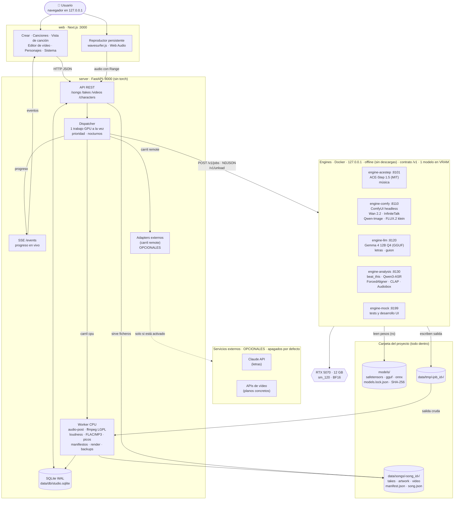
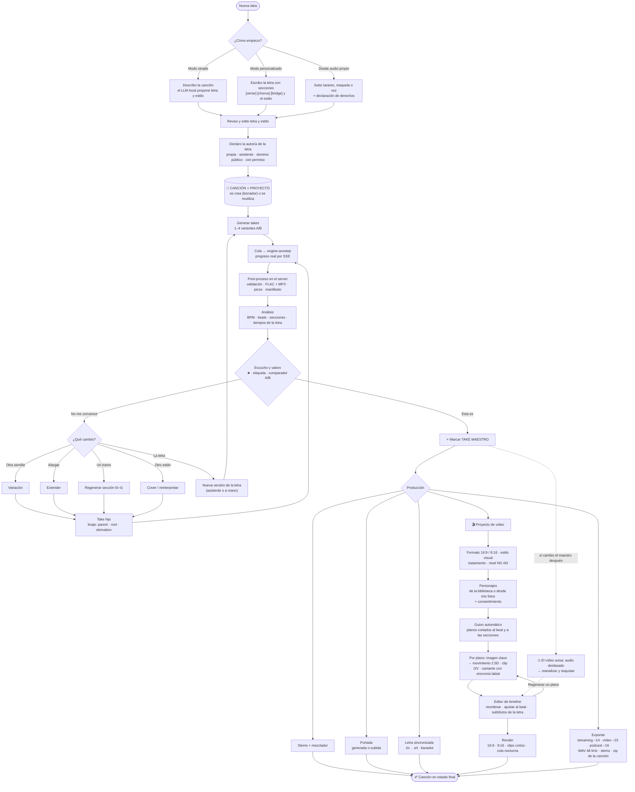

# Diagramas

## 1. Arquitectura

**Claves de diseño**

- El **server** es la única fuente de verdad y el único que escribe en la base de datos. Su **worker CPU** hace el post-proceso, los manifiestos y el render ([ADR-0017](../decisiones/ADR-0017-postproceso-y-manifiesto-en-el-server.md)); los engines solo devuelven salida cruda.
- Los **engines** no guardan estado ni tocan la base de datos. Cada familia de modelo va en su propio contenedor, porque necesitan versiones de dependencias incompatibles entre sí.
- El **dispatcher** descarga el modelo del engine activo antes de usar otro (`POST /v1/unload`), porque solo cabe uno en 12 GB.
- Lo **externo** va con línea discontinua: los adapters viven en el server (carril `remote`), están apagados de fábrica y quedan registrados en el manifiesto ([ADR-0014](../decisiones/ADR-0014-local-por-defecto.md)).

## 2. Workflow de una canción

**Lectura del diagrama**

- Todo cuelga de la **canción** ([ADR-0013](../decisiones/ADR-0013-cancion-como-proyecto.md)).
- Iterar nunca sobrescribe: siempre crea un **take hijo** en el árbol de versiones.
- El **take maestro** es la bisagra: stems, portada, vídeo y exportación trabajan sobre él.
- El vídeo es incremental por plano: se regenera solo lo que cambia ([video.md](./video.md)).
