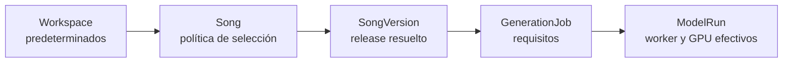
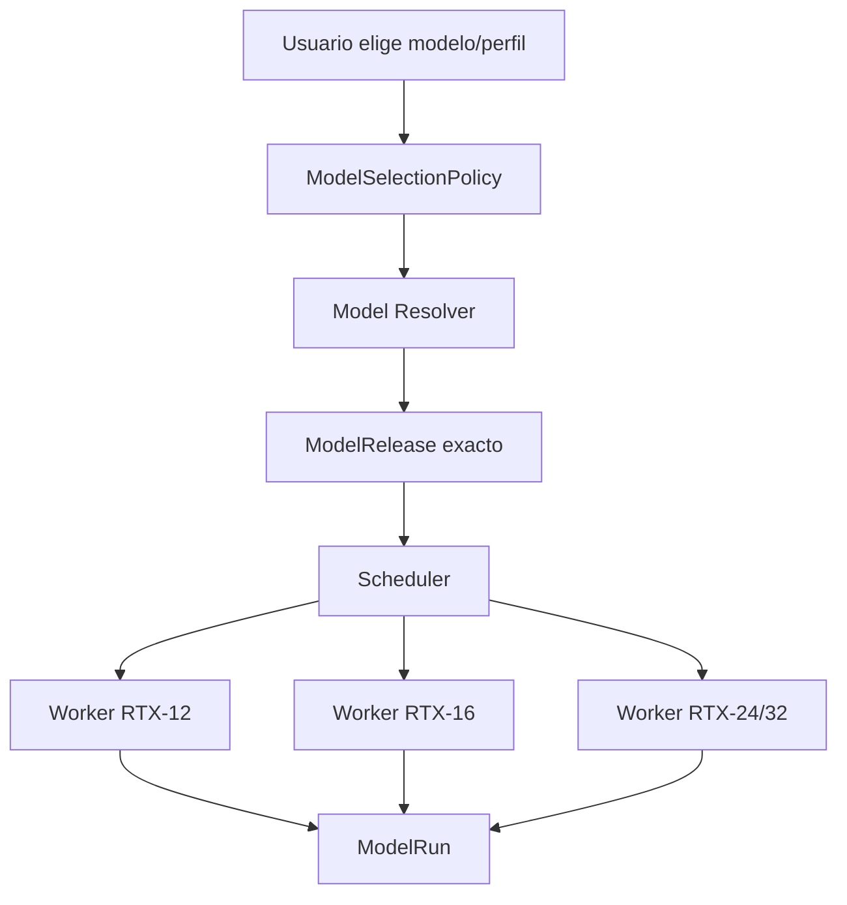
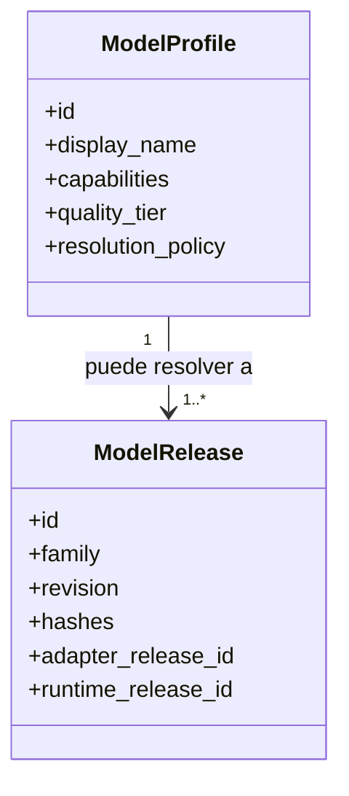
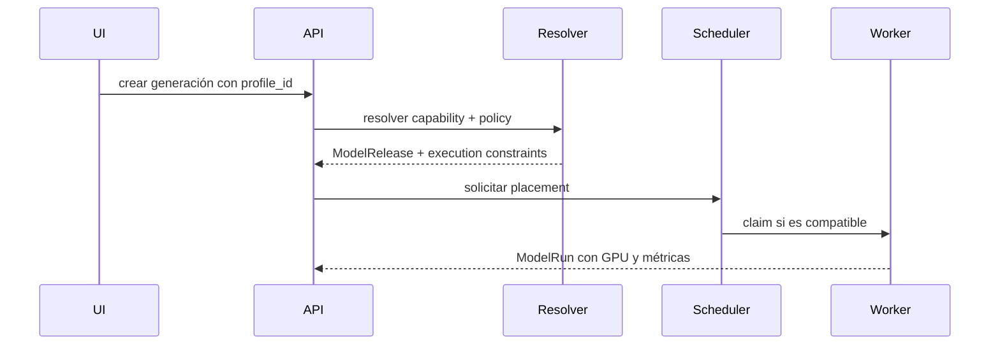
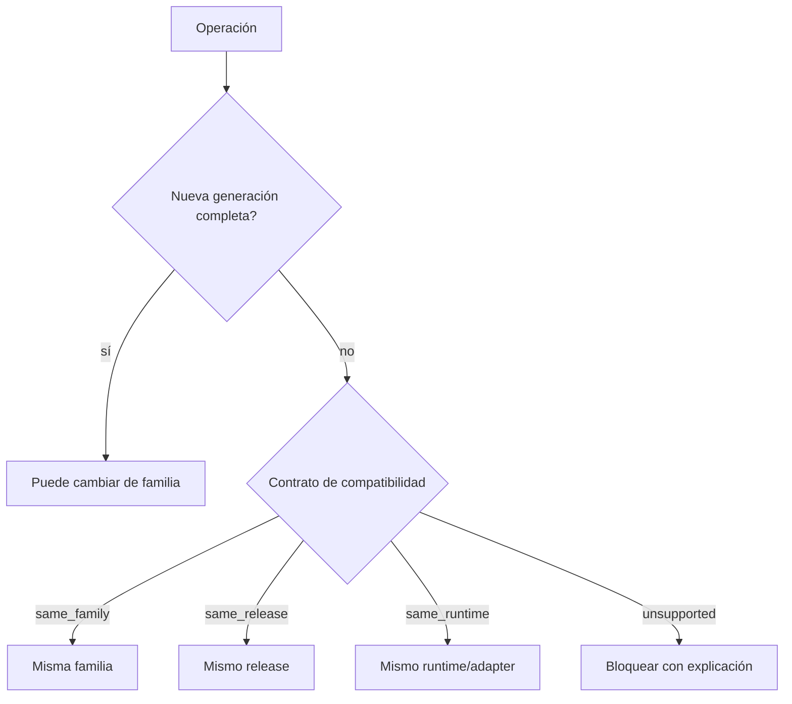
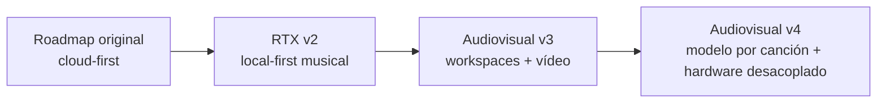

# Auditoría y redefinición del proyecto — v4

## Conclusión ejecutiva

El proyecto es un **estudio audiovisual local-first por workspaces**, no un simple clon de Suno ni una utilidad aislada de WAV a vídeo. Su unidad funcional es un workspace que conserva música, versiones, identidad visual, storyboard, planos, timeline, renders, modelos y evidencia técnica.

La v3 acertaba al separar modelos de GPUs mediante capabilities y workers, pero dejaba una ambigüedad importante: podía interpretarse que un workspace o proyecto se fijaba a un `ModelRelease` concreto y que la RTX formaba parte de la identidad del trabajo. La v4 elimina esa ambigüedad y formaliza cuatro niveles distintos:



La canción puede conservar una preferencia de modelo, como ocurre en Suno, pero nunca queda asociada a una RTX física. La RTX solo ejecuta un job y queda registrada como evidencia operativa.

## Problema corregido

### Interpretación incorrecta

```text
Song → RTX 5070 → modelo compatible
```

Esta relación produciría varios defectos:

- migración de canciones al cambiar de gráfica;
- imposibilidad de usar workers superiores;
- UI técnica y confusa;
- acoplamiento entre datos creativos e infraestructura;
- dificultad para reproducir una versión en hardware distinto;
- falsa equivalencia entre modelo y GPU.

### Relación correcta



El mismo release puede ejecutarse en diferentes GPUs si su matriz de compatibilidad lo permite. La misma canción puede crear versiones con modelos distintos. Ninguna de las dos decisiones cambia el workspace.

## Qué se conserva de v3

- estudio audiovisual local-first;
- workspaces con aislamiento lógico;
- `SongVersion`, `ShotVariant`, `TimelineVersion` y `VideoVersion` inmutables;
- `VideoProject` fijado a `song_version_id`;
- control plane separado de workers;
- adapters por capability;
- Model Packages y Release Sets;
- RTX 5070 desktop de 12 GB como baseline;
- un modelo pesado residente a la vez en RTX-12;
- PostgreSQL como estado durable y cola inicial;
- CAS para assets;
- generación de vídeo por planos;
- gates técnicos y de calidad;
- seguridad de supply chain y reverificación de licencias;
- multiworker futuro sin migrar workspaces.

## Qué añade o corrige v4

### 1. Modelo visible frente a release técnico



El usuario selecciona un `ModelProfile` legible, por ejemplo “ACE-Step 1.5 Equilibrado”. El sistema resuelve un `ModelRelease` exacto y persistible.

### 2. Política de canción

Cada `Song` puede usar:

| Política | Significado |
|---|---|
| `inherit` | hereda el perfil predeterminado del workspace |
| `auto` | utiliza el mejor perfil stable compatible |
| `pinned_profile` | conserva una experiencia/modelo visible |
| `pinned_release` | fija un release exacto para uso avanzado |

El default recomendado es `inherit` o `pinned_profile`, no `pinned_release`.

### 3. Resolución separada del placement



El resolver decide **qué modelo**. El scheduler decide **dónde ejecutarlo**.

### 4. Compatibilidad de operaciones derivadas

Cambiar de modelo es válido para una reinterpretación completa, pero no siempre para operaciones que reutilizan estado interno.



### 5. Modelo nuevo y cambio de GPU como procesos independientes

- instalar un modelo nuevo no exige una GPU nueva;
- añadir una GPU nueva no cambia los modelos seleccionados;
- ambos procesos pueden ampliar capabilities si superan benchmark.

## Diagnóstico del roadmap histórico



Los planes anteriores se mantienen únicamente como contexto histórico. Ningún estado se hereda.

## Supuestos v4

- RTX 5070 desktop con 12 GB como máquina de referencia inicial.
- Posibilidad de incorporar ordenadores con RTX superiores.
- Usuario único/local en MVP, conservando `workspace_id` en todo el dominio.
- Un trabajo GPU pesado simultáneo en RTX-12.
- Música, imagen, vídeo y lip-sync se cargan secuencialmente.
- Videoclips compuestos por planos cortos, previews y render determinista.
- 1080p como entrega inicial, con resolución interna adaptable.
- Modelos y licencias mutables: revisión exacta, hashes y `verified_at` obligatorios.
- No se promete que una ruta “cabe” hasta medirla en el hardware real.

## No-objetivos del MVP

- entrenamiento fundacional;
- editor NLE equivalente a Resolve/Premiere;
- SaaS público multiusuario;
- alta disponibilidad o Kubernetes;
- ejecución simultánea de varios modelos pesados en RTX-12;
- clonación de voz/persona sin consentimiento;
- identidad perfecta garantizada entre todos los planos;
- asociar canciones a una máquina o GPU;
- migrar outputs históricos al modelo nuevo de forma automática.

## Decisión

Adoptar v4 como única fuente canónica y ejecutar exclusivamente R0 durante el primer ciclo. El cierre de `G0-PRODUCTO` debe aprobar de forma explícita:

1. el dominio de workspaces y versiones;
2. las políticas de selección de modelos;
3. la separación resolver/scheduler;
4. las reglas de compatibilidad de operaciones;
5. el baseline RTX-12 sin acoplamiento al hardware;
6. la gobernanza de modelos, licencias y supply chain.
