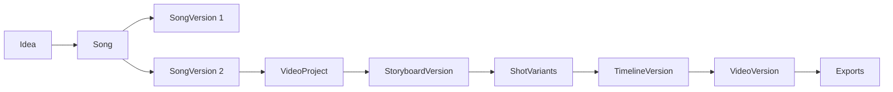
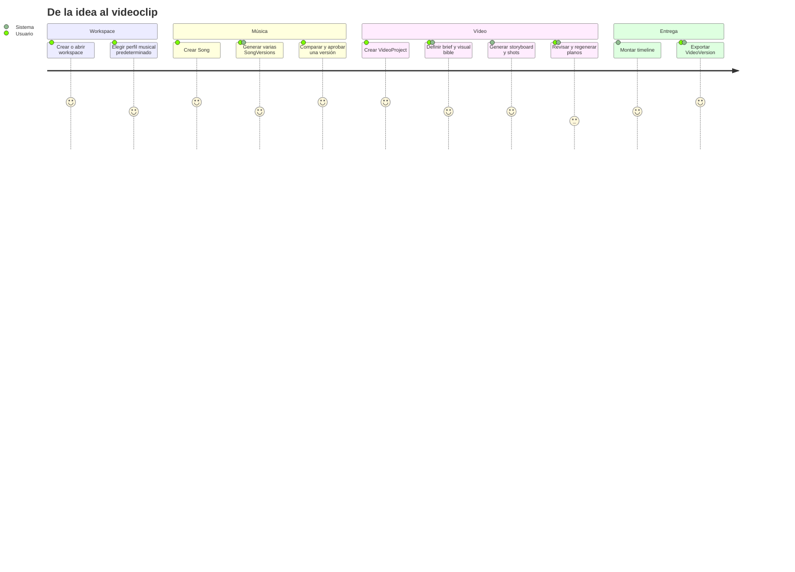
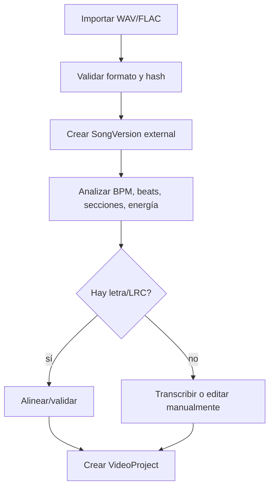
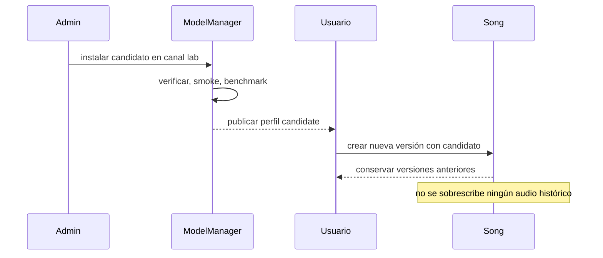
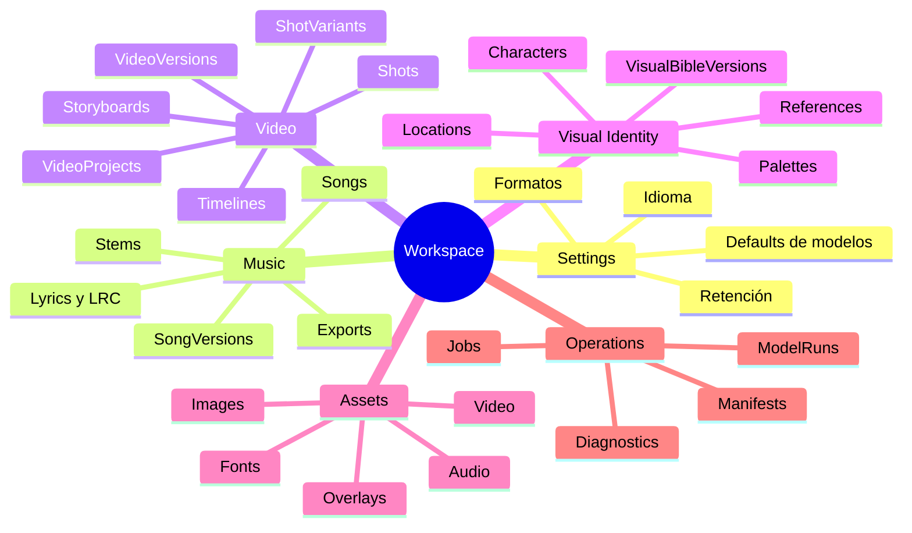
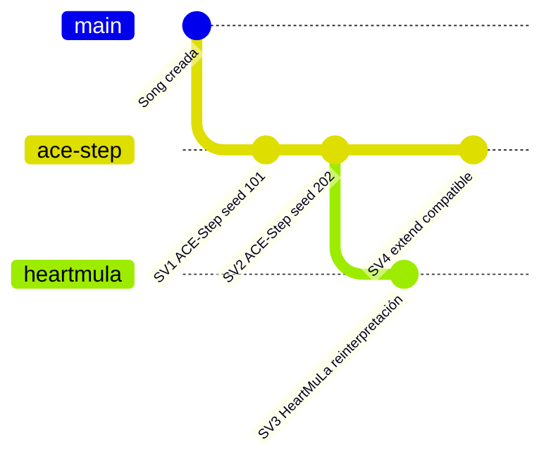

# Visión de producto y workspaces

## Propuesta de producto

Una aplicación local-first para crear canciones y videoclips dentro de una misma interfaz, organizada por workspaces, con selección de modelos similar a Suno, generación de vídeo por planos y ejecución automática sobre workers RTX compatibles.

La ventaja diferencial no es únicamente generar audio o vídeo. Es conservar el **linaje creativo completo**:



## Personas y escenarios

### Creador musical local

- escribe una letra o un prompt;
- selecciona un modelo/perfil;
- genera versiones;
- compara, fija una versión y exporta.

### Creador audiovisual

- selecciona una `SongVersion`;
- define concepto, personajes y estilo;
- genera storyboard y planos;
- revisa variantes y monta el videoclip.

### Usuario con varios equipos

- mantiene el control plane en una máquina;
- añade workers con RTX superiores;
- no mueve workspaces;
- deja que el scheduler elija el destino compatible.

## Flujo A — crear canción y videoclip



## Flujo B — importar WAV/FLAC



## Flujo C — probar un modelo nuevo



## Estructura del workspace



## Defaults del workspace

Un workspace puede definir valores iniciales, pero no restricciones físicas:

```yaml
workspace_defaults:
  music_model_profile_id: music.acestep.v15.balanced
  image_model_profile_id: image.flux2.klein4b.balanced
  video_model_profile_id: video.ltxv2b.preview
  lipsync_model_profile_id: lipsync.auto
  song_model_policy: inherit
  aspect_ratio: "16:9"
  language: es
```

No debe contener:

```yaml
# Incorrecto
required_gpu: RTX_5070
worker_id: studio-pc-01
```

## Experiencia de selección del modelo musical

La UI principal debe ser comprensible para un usuario de Suno:

```text
Modelo
[ Auto recomendado ▾ ]
  ACE-Step 1.5 — Equilibrado
  ACE-Step 1.5 — Calidad
  HeartMuLa — Candidato
  DiffRhythm 2 — Laboratorio

Calidad
[ Equilibrada ▾ ]

Más opciones
  Fijar perfil para esta canción
  Mostrar release técnico
```

El usuario selecciona un perfil. La UI no muestra por defecto hashes, contenedores ni nombre de GPU.


## Política a nivel de canción

`Song.model_selection_policy` admite:

| Modo | Uso |
|---|---|
| `inherit` | seguir el default del workspace |
| `auto` | recibir mejoras stable compatibles en futuras generaciones |
| `pinned_profile` | mantener el modelo/perfil visible elegido |
| `pinned_release` | reproducibilidad estricta o debugging avanzado |

Una política afecta **nuevas** `SongVersions`; nunca cambia las existentes.

## Versionado musical



Cada versión guarda:

- `parent_song_version_id` cuando deriva de otra;
- operación (`generate`, `reinterpret`, `extend`, `repaint`, `cover`, etc.);
- selección solicitada;
- release resuelto;
- parámetros efectivos;
- seed;
- inputs y outputs por hash;
- `ModelRun` asociado.

## Modos de vídeo

### Visualizer / lyric

Ruta determinista y disponible incluso sin modelo generativo de vídeo:

- waveform/espectro;
- fondos estáticos o generados;
- movimiento 2D;
- letras sincronizadas;
- overlays y tipografía;
- cambios por sección y beat;
- 16:9, 9:16 y 1:1.

### Cinematográfico


### Performer/personaje

- personaje ficticio o referencia autorizada;
- planos de interpretación;
- lip-sync selectivo;
- ConsentRecord obligatorio;
- combinación con escenas narrativas;
- evaluación de identidad y artefactos.

## Invariantes de producto

1. Toda entidad pertenece a un `workspace_id`.
2. `SongVersion` es inmutable.
3. `VideoProject` apunta a una versión concreta, no a una canción mutable.
4. `ShotVariant` y `TimelineVersion` son snapshots inmutables.
5. Una canción no contiene `gpu_id`, `worker_id` ni `vram_mb`.
6. Un cambio de modelo crea una versión nueva.
7. Un cambio de GPU no crea una versión nueva por sí mismo.
8. Los defaults no reescriben proyectos históricos.
9. La deduplicación física no elimina autorización por workspace.
10. Todo output debe poder explicar qué modelo y hardware se usaron.

## Criterios de éxito del MVP

- crear y archivar workspaces;
- definir defaults de modelos por workspace;
- crear canciones con selector de modelo/perfil;
- generar varias `SongVersions` con modelos iguales o distintos;
- importar WAV/FLAC;
- aprobar una versión musical;
- crear brief, visual bible, storyboard y shot list;
- generar visualizer y videoclip por planos;
- ejecutar performer con lip-sync selectivo;
- regenerar un plano sin rehacer el proyecto;
- exportar 1080p 16:9 y 9:16;
- sobrevivir a reinicios;
- añadir una RTX superior sin migrar datos;
- conservar manifests reproducibles.

## Métricas de producto y operación

| Área | Métricas |
|---|---|
| Música | tiempo hasta primera escucha, tasa de generación completada, versiones por Song |
| Modelos | perfiles elegidos, fallbacks explícitos, canary vs stable, rollback |
| Vídeo | tiempo hasta preview, variantes por shot, shots aprobados en primera iteración |
| Hardware | tiempo/VRAM/temperatura por capability y worker |
| Workspaces | almacenamiento, assets huérfanos, fallos de aislamiento |
| Calidad | evaluación humana estructurada, A/V sync, consistencia de identidad |

Las métricas automáticas no sustituyen la evaluación artística humana.
