# Arquitectura audiovisual modular

## Objetivo arquitectónico

Separar dominio creativo, gestión de modelos y ejecución GPU para que:

- una canción pueda elegir modelo sin conocer hardware;
- un modelo pueda actualizarse sin migrar proyectos;
- una GPU pueda sustituirse o añadirse sin alterar workspaces;
- música y vídeo compartan jobs, assets, manifests y políticas;
- la RTX 5070 sea baseline, no dependencia estructural.

## Vista de contexto

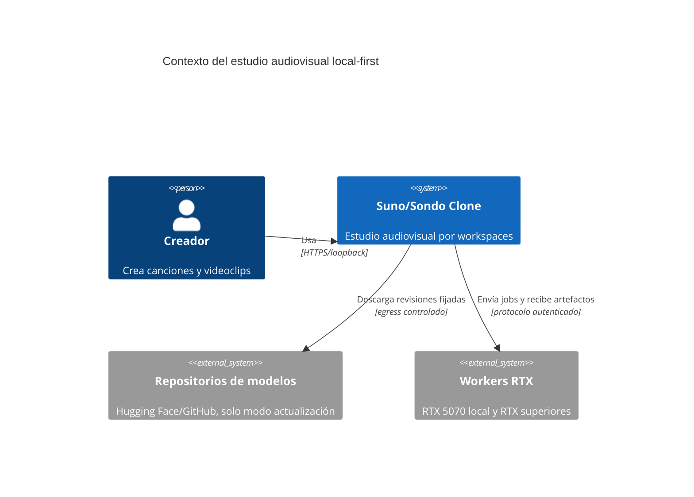

## Vista de contenedores

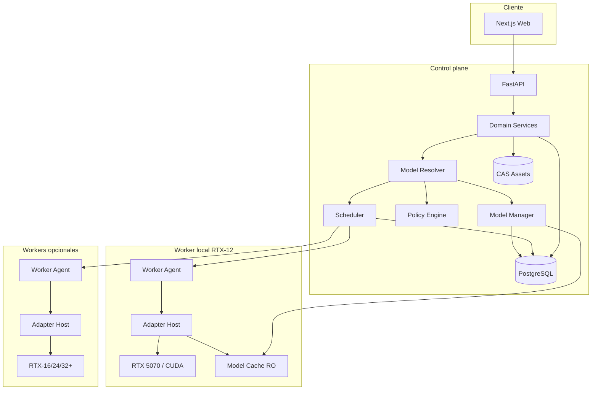

## Capas y dependencias

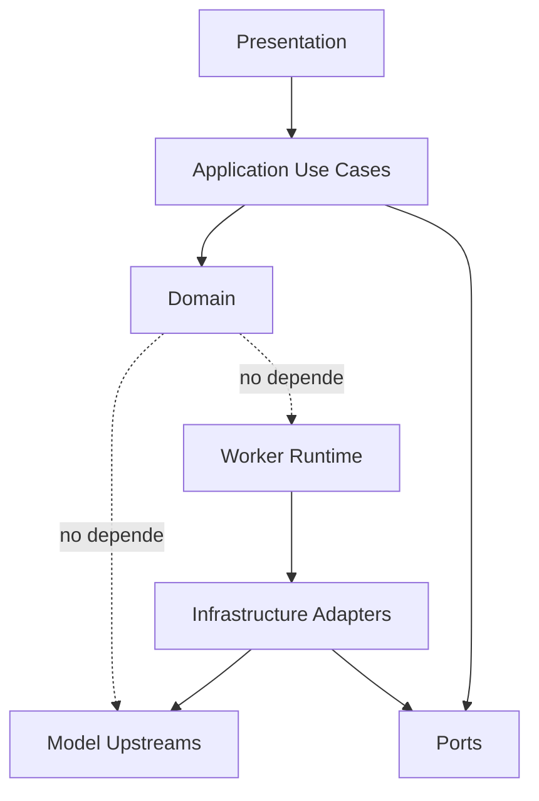

Regla: el dominio no importa librerías de ACE-Step, Diffusers, ComfyUI, LTX, PyTorch o CUDA.

## Componentes

### Web / Next.js

Responsabilidades:

- navegación por workspace;
- creación y versionado musical;
- selector de `ModelProfile`;
- edición de letras y parámetros normalizados;
- brief, visual bible, storyboard y shots;
- revisión y aprobación de variantes;
- timeline básico;
- estados y errores explicables;
- reproducción y exportación.

No debe:

- construir comandos de inferencia;
- escoger un worker/GPU;
- leer rutas físicas;
- descargar pesos;
- deducir capacidades por el nombre del modelo.

### API / Application layer

Responsabilidades:

- autenticar contexto local cuando corresponda;
- validar `workspace_id`;
- aplicar casos de uso y transacciones;
- crear versiones inmutables;
- calcular selección efectiva;
- solicitar resolución de modelo;
- crear DAGs de jobs;
- exponer eventos y progreso;
- autorizar lectura/escritura de assets.

### Domain layer

Agregados principales:

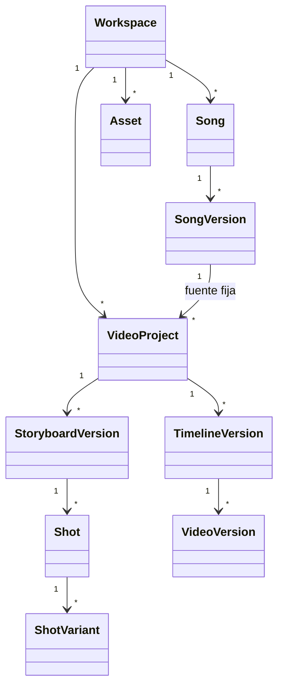

### Model Resolver

Convierte una solicitud creativa en un `ResolvedModelPlan`:

- aplica defaults y overrides;
- filtra por capability;
- comprueba canal, licencia y territorio;
- aplica compatibilidad con versión origen;
- selecciona release y perfiles de ejecución;
- no selecciona worker.

### Scheduler

Convierte un `ResolvedModelPlan` en una `PlacementDecision`:

- workers saludables;
- VRAM y RAM disponibles;
- runtime y compute capability;
- modelo instalado/cacheado;
- afinidad de assets;
- cola, temperatura y retención;
- límites de concurrencia;
- override administrativo explícito.

### Model Manager

- descubre candidatos;
- registra Model Packages;
- revisa política/licencias;
- descarga a staging;
- verifica hashes y formatos;
- ejecuta smoke y benchmark;
- publica perfiles y release sets;
- distribuye instalaciones a workers;
- promociona, depreca y revierte.

### PostgreSQL

Inicialmente contiene:

- dominio de producto;
- jobs, pasos, leases y eventos;
- model profiles, releases y políticas;
- worker registry y snapshots;
- referencias CAS;
- manifests y auditoría;
- decisiones de resolver y scheduler.

Redis se incorpora únicamente si una medición demuestra que la cola SQL o el bus de eventos no cumplen.

### Content-addressed storage

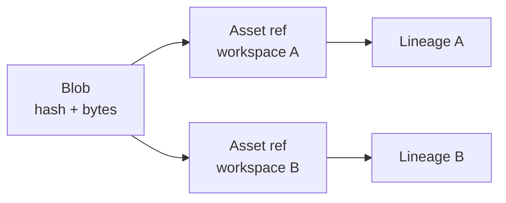

El blob puede deduplicarse, pero la autorización se comprueba sobre `Asset`, no sobre el hash.

Clases:

```text
models/      pesos y runtimes globales, no pertenecen a workspaces
masters/     WAV/FLAC, imágenes y vídeo originales
approved/    versiones aprobadas y renders
proxies/     previews y thumbnails
rejected/    variantes descartadas con retención configurable
temporary/   staging y artefactos reconstruibles
manifests/   evidencia JSON, hashes y firmas opcionales
```

### Worker Agent

Máquina de estados:

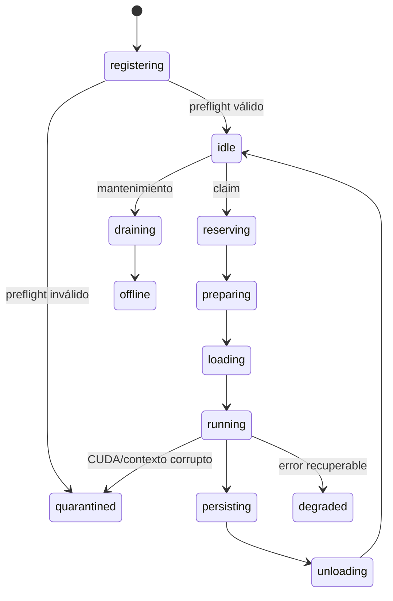

Cada claim utiliza lease y heartbeat. Un archivo parcial no completa un paso.

### Adapter Host

Proceso o contenedor supervisado por familia/runtime. Recibe:

- solicitud normalizada;
- inputs temporales autorizados;
- model release read-only;
- execution profile;
- run context y cancel token.

No recibe:

- acceso directo a PostgreSQL;
- credenciales de repositorios;
- acceso global al CAS;
- egress durante inferencia.

## Flujo de generación musical

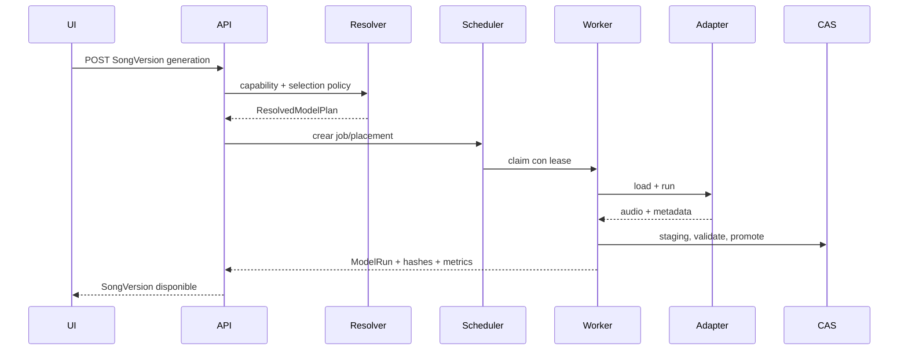

## DAG audiovisual

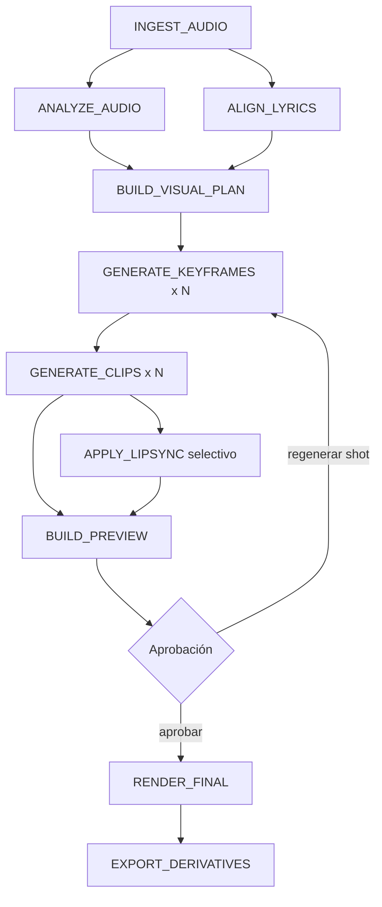

Cada `JobStep` declara:

- inputs por hash;
- capability y contract version;
- `ResolvedModelPlan` o runtime determinista;
- requisitos hardware;
- idempotency key;
- outputs esperados;
- dependencias;
- retry y cancelación;
- invalidez descendente.

## Residencia de modelos en RTX-12

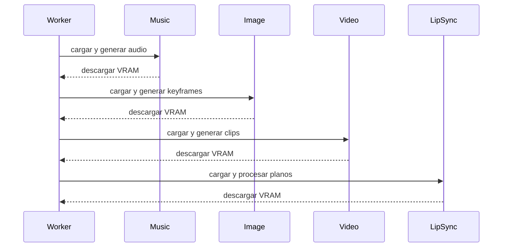

No se asume que dos modelos pesados caben simultáneamente.

## Seguridad de red

### Instalación local

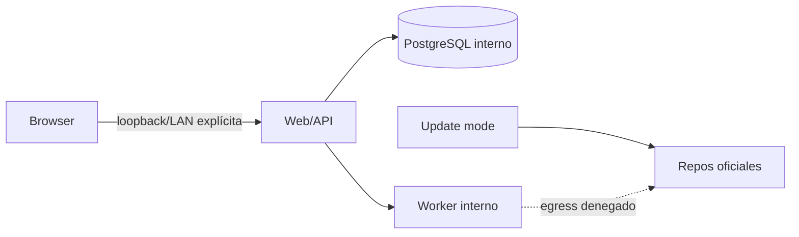

- servicios internos no se publican salvo necesidad;
- modo actualización separado del modo inferencia;
- descargas fijadas y verificadas;
- modelos montados read-only;
- secretos fuera de logs y manifests públicos.

### Multiworker

- enrolment explícito;
- mTLS o túnel autenticado equivalente;
- identidad revocable;
- worker inicia conexión cuando sea viable;
- transferencia por hashes y scopes de job;
- CAS local/cache remota sin acceso global indiscriminado.

## Recuperación e idempotencia

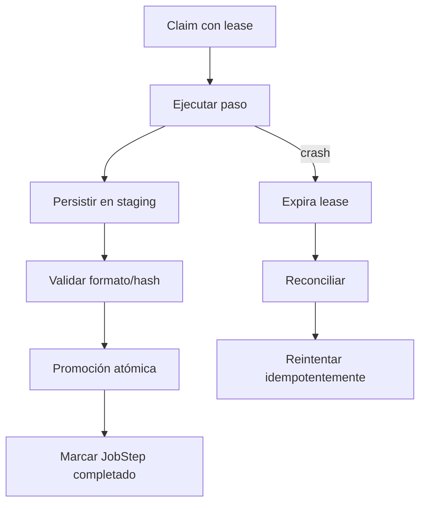

- uploads y outputs usan staging;
- pasos completados son inmutables;
- restart reconstruye DAG desde PostgreSQL;
- un adapter roto provoca reciclaje del proceso;
- el render final no sobrescribe masters;
- los jobs persistentes conservan selección solicitada, plan resuelto y placement.

## Despliegue inicial

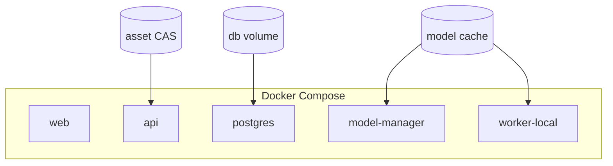

Windows hospeda el driver NVIDIA; WSL2/Docker ejecuta runtimes fijados. Los árboles I/O intensivos pueden residir en filesystem Linux/volumen dedicado si el benchmark muestra penalización en `/mnt/c`.

## Evolución

### Añadir modelo

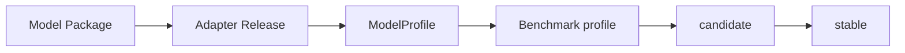

No cambia el dominio.

### Añadir o sustituir GPU

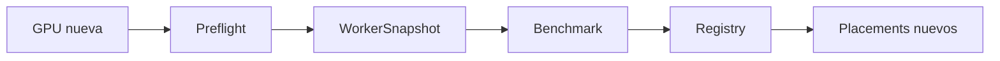

No cambia ningún workspace, Song o VideoProject.
