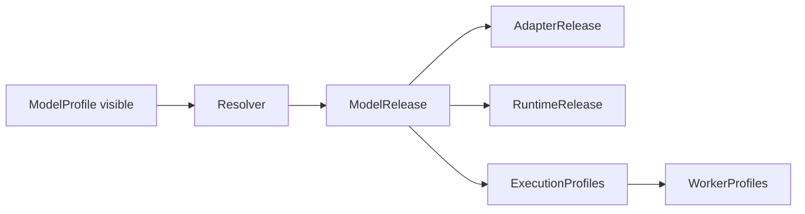
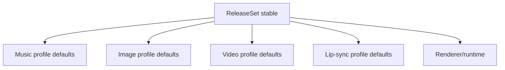
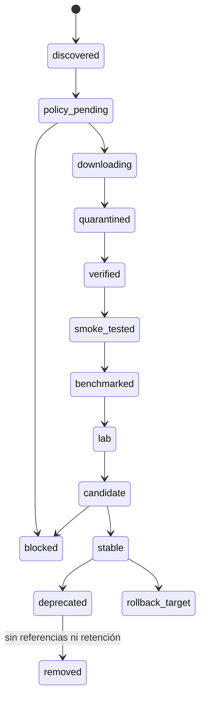
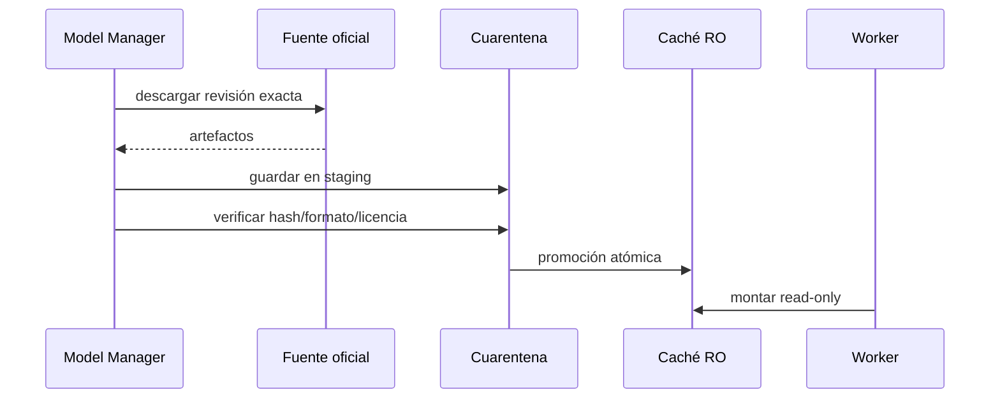
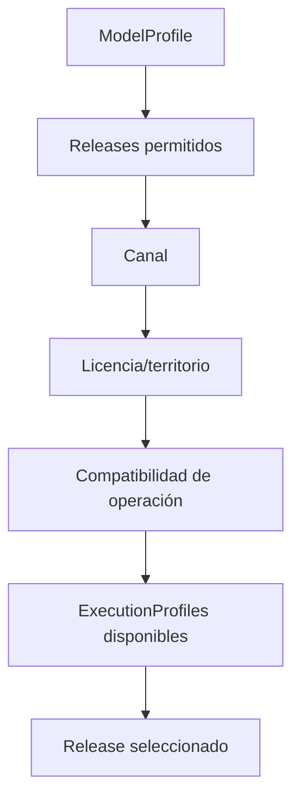
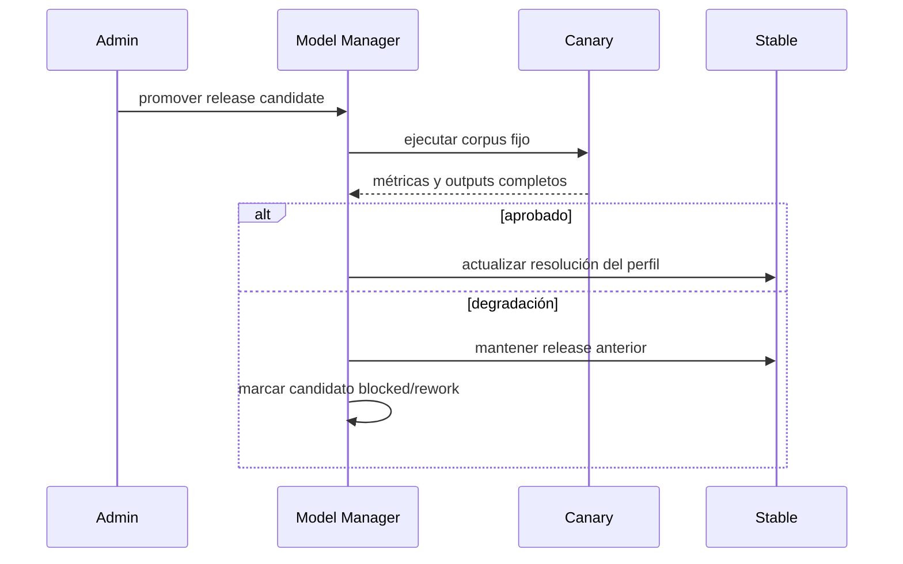
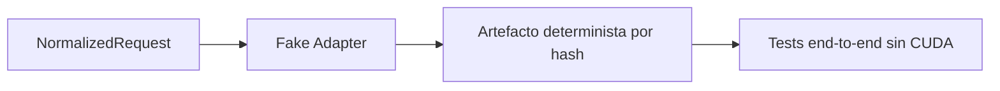

# Model Manager, perfiles y adaptadores

## Objetivo

Gestionar modelos como componentes versionados, verificables y reemplazables, separando:

- lo que ve el usuario (`ModelProfile`);
- lo que se ejecuta (`ModelRelease`);
- cómo se integra (`AdapterRelease`);
- dónde vive (`RuntimeRelease`/container);
- en qué hardware está validado (`ExecutionProfile` + benchmark).



## Capabilities normalizadas

### Música

```text
music.generate.full_song
music.generate.instrumental
music.generate.reference_audio
music.cover
music.reinterpret
music.extend
music.repaint
music.separate_stems
music.align_lyrics
music.analyze
```

### Imagen

```text
image.generate.text_to_image
image.generate.keyframe
image.edit.single_reference
image.edit.multi_reference
image.inpaint
image.character_reference
```

### Vídeo

```text
video.generate.text_to_video
video.generate.image_to_video
video.generate.video_to_video
video.generate.audio_to_video
video.extend
video.retake
video.lipsync
video.upscale.spatial
video.interpolate.temporal
video.render.timeline
```

Cada capability tiene:

- `contract_version`;
- input/output JSON Schema;
- límites;
- semántica de progreso/cancelación;
- clases de errores;
- CompatibilityContract;
- métricas mínimas.

## ModelProfile

`ModelProfile` es el contrato de producto. Ejemplo:

```yaml
profile_id: music.acestep.v15.balanced
display_name: "ACE-Step 1.5 — Equilibrado"
capability: music.generate.full_song
channel_policy: [stable]
quality_tier: balanced
resolution_policy:
  strategy: compatible_latest_within_profile
  allowed_families: [ACE-Step-1.5]
  release_constraints:
    dit_variants: [2b-turbo, 2b-sft]
    lm_variants: [0.6B, 1.7B]
compatibility:
  reinterpret: cross_family_allowed
  extend: same_family
  repaint: same_release_preferred
```

Un perfil puede actualizar su release compatible sin modificar canciones históricas. Para cambios semánticos mayores se crea un profile nuevo.

## Contrato de adapter

```python
class CapabilityAdapter:
    protocol_version: str

    def health(self) -> HealthReport: ...
    def capabilities(self) -> list[CapabilityDescriptor]: ...
    def validate(self, request: NormalizedRequest) -> ValidationReport: ...
    def estimate(self, request: NormalizedRequest, execution: ExecutionProfile) -> Estimate: ...
    def load(self, release: ModelRelease, execution: ExecutionProfile) -> LoadReport: ...
    def run(self, request: NormalizedRequest, context: RunContext) -> RunResult: ...
    def cancel(self, run_id: str) -> CancelReport: ...
    def unload(self) -> UnloadReport: ...
    def normalize_result(self, raw: object) -> NormalizedResult: ...
```

El protocolo debe ser transportable por JSON/HTTP/gRPC o proceso supervisado. Dominio y upstream no comparten objetos Python ni memoria.

## CompatibilityContract

```yaml
operation_compatibility:
  generate:
    source_required: false
    model_constraint: any_compatible
  reinterpret:
    source_required: true
    model_constraint: cross_family_allowed
  extend:
    source_required: true
    model_constraint: same_family
  repaint:
    source_required: true
    model_constraint: same_release_preferred
  continue_latent:
    source_required: true
    model_constraint: same_release_and_adapter_major
```

El adapter declara lo que soporta; la UI no lo deduce.

## Model Package

```yaml
schema_version: "1.1"
package_id: music.acestep.v15.2b-turbo-lm06
model:
  family: ACE-Step-1.5
  release_id: music.acestep.v15.2b-turbo-lm06@<revision>
  revision: <commit-or-tag>
  capabilities:
    - music.generate.full_song
    - music.generate.instrumental
source:
  repository: https://github.com/ace-step/ACE-Step-1.5
  gated: false
artifacts:
  - path: models/dit.safetensors
    sha256: <required>
runtime:
  adapter_release_id: adapter.music.acestep@1.0.0
  container_digest: sha256:<required>
hardware:
  execution_profiles:
    - acestep-rtx12-bf16-offload
license:
  status: review_required
security:
  trust_remote_code: false
  network_during_inference: false
tests:
  smoke_suite: music-basic-v1
  benchmark_suite: music-rtx12-v1
```

## Release Set

Fija defaults coordinados de la aplicación, no una elección irreversible por canción:



```yaml
release_set_id: av-studio-2026.09-candidate.1
profile_defaults:
  music: music.acestep.v15.balanced
  image: image.flux2.klein4b.balanced
  video: video.ltxv2b.preview
  lipsync: lipsync.auto.stable
components:
  adapter_music_acestep: adapter.music.acestep@1.0.0
  renderer: runtime.ffmpeg@<digest>
```

Los jobs históricos guardan el release set y los releases concretos resueltos.

## Ciclo de vida



### Reglas

- nada entra directamente en `stable`;
- los artefactos se descargan a staging;
- hashes y tamaños se verifican antes de promoción;
- formatos ejecutables/pickle se bloquean por defecto;
- `trust_remote_code=false` por defecto;
- el runtime de inferencia no tiene red;
- cada perfil hardware requiere benchmark independiente;
- cambiar de GPU invalida solo la aprobación hardware-bound del worker, no la licencia o identidad del release.

## Instalación y caché



Los modelos son globales; los workspaces solo guardan referencias a ejecuciones, no copias de pesos.

## Resolución de perfil a release



Un `ModelProfile` no debe contener un único worker ni GPU.

## Promoción y rollback



Rollback:

1. detener nuevos claims del profile afectado;
2. restaurar mapping profile → release anterior;
3. descargar modelo residente si procede;
4. ejecutar smoke test;
5. reabrir scheduling;
6. conservar jobs ya completados con el release nuevo.

## Actualización compatible e incompatible

### Compatible

- mismo contract version;
- mismas capabilities;
- semántica de parámetros preservada;
- regresión aprobada;
- perfil puede actualizarse.

### Incompatible

- cambia control de duración, seed o letra;
- elimina capability;
- cambia licencia;
- requiere otra familia o formato;
- no mantiene operaciones derivadas.

En este caso se crea otro `ModelProfile` o versión mayor.

## Adapter falso

Debe existir un adapter determinista sin GPU para probar:

- resolución;
- jobs y leases;
- cancelación;
- manifests;
- CAS;
- UI;
- errores;
- aislamiento de workspaces.



## Registro de decisiones

Cada promoción debe guardar:

- quién/qué proceso la solicitó;
- fuente y revisión;
- hash de licencias;
- artefactos y hashes;
- benchmark suite;
- hardware y runtime;
- diferencias respecto al stable;
- riesgos y excepciones;
- rollback target.
