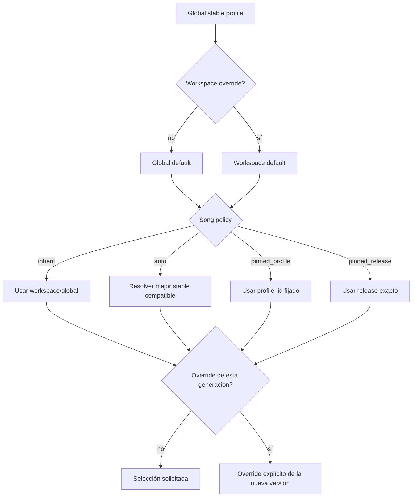
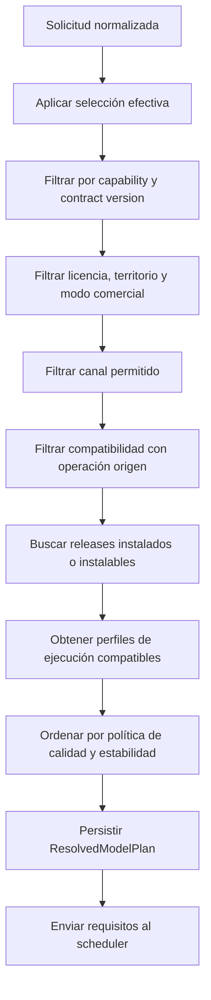
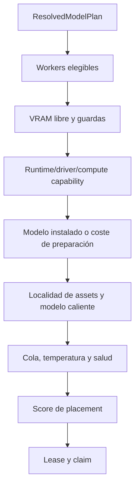
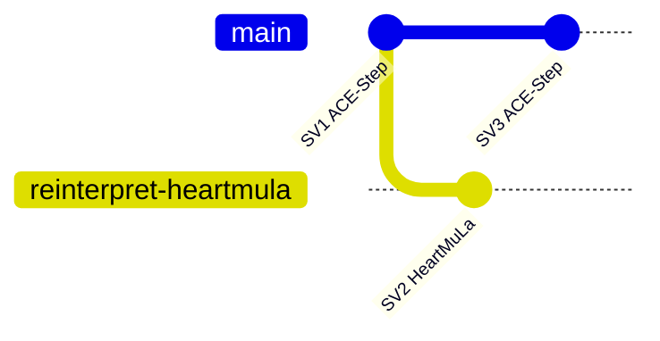
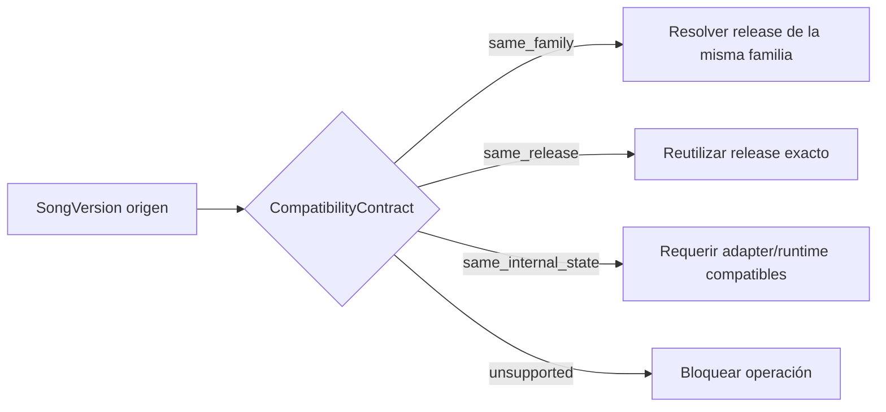
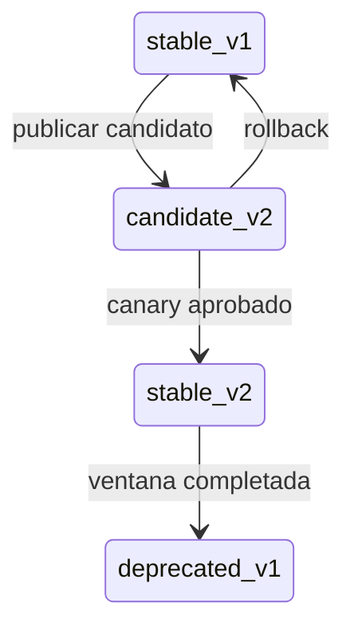
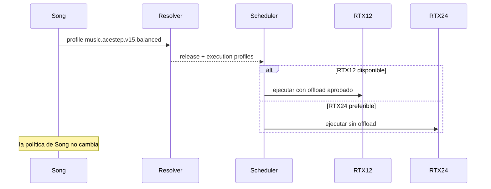

# Selección de modelos, canción y hardware

## Objetivo

Definir sin ambigüedades cómo se relacionan:

- la elección que realiza el usuario;
- los defaults de workspace;
- la preferencia de una canción;
- el release exacto de un modelo;
- el perfil de ejecución;
- el worker y la RTX que ejecutan el trabajo.

## Regla canónica

> Las entidades creativas seleccionan **modelos/perfiles**. Las entidades operativas seleccionan **workers/GPU**.


## Vocabulario

### ModelFamily

Familia upstream: `ACE-Step-1.5`, `HeartMuLa`, `DiffRhythm2`, `LTX-Video`, etc.

### ModelRelease

Combinación exacta e inmutable de:

- revisión de código;
- pesos y hashes;
- modelos auxiliares;
- adapter release;
- runtime/container digest;
- capabilities;
- ficha de licencia;
- benchmarks aprobados.

### ModelProfile

Opción visible y estable de producto. Puede resolver a uno o más releases compatibles según canal y hardware.

Ejemplos:

```text
music.auto.stable
music.acestep.v15.fast
music.acestep.v15.balanced
music.acestep.v15.quality
music.heartmula.oss3b.candidate
```

### ExecutionProfile

Configuración técnica aplicable a un release y un worker:

```yaml
precision: bf16
offload_mode: sequential_cpu_offload
quantization: null
attention_backend: sdpa
max_duration_seconds: 240
```

### WorkerProfile

Clasificación de hardware medida: `RTX-12`, `RTX-16`, `RTX-24`, `RTX-32+`.

### ModelSelectionPolicy

Política persistida en Workspace/Song/VideoProject para resolver futuras operaciones.

## Jerarquía de defaults y overrides



Prioridad:

1. override explícito de la operación actual;
2. política de la canción/proyecto;
3. default del workspace;
4. default global stable.

## Políticas disponibles

### `inherit`

- recomendado al crear una canción;
- sigue el default del workspace para nuevas versiones;
- permite que el administrador mejore el default sin alterar versiones previas.

### `auto`

- el resolver elige el perfil `stable` que cumpla capability, idioma, duración, licencia y calidad;
- no permite bajar de quality tier silenciosamente;
- cualquier fallback debe mostrarse y persistirse.

### `pinned_profile`

- experiencia equivalente a elegir un modelo en Suno;
- fija `profile_id`, no necesariamente un checkpoint;
- admite revisiones compatibles del mismo perfil;
- actualizaciones mayores requieren nueva versión de perfil o consentimiento.

### `pinned_release`

- fija `model_release_id` exacto;
- útil para reproducibilidad, debugging y operaciones derivadas;
- puede quedar temporalmente no ejecutable si ningún worker compatible está disponible;
- no se sustituye por otro release sin confirmación.

## Modelo de resolución

Entrada:

```yaml
capability: music.generate.full_song
selection:
  mode: pinned_profile
  profile_id: music.acestep.v15.balanced
constraints:
  language: es
  duration_seconds: 210
  instrumental: false
  commercial_mode: false
  territory: EU
```

Salida:

```yaml
resolved_plan:
  model_profile_id: music.acestep.v15.balanced
  model_release_id: music.acestep.v15.2b-turbo-lm06@<revision>
  adapter_release_id: adapter.music.acestep@1.0.0
  runtime_release_id: runtime.music.acestep@<digest>
  execution_profiles:
    - id: acestep-bf16-offload-rtx12
      compatible_worker_profiles: [RTX-12, RTX-16, RTX-24, RTX-32]
  compatibility_contract:
    reinterpret: cross_family_allowed
    extend: same_family
    repaint: same_release_preferred
```

## Algoritmo del resolver



El resolver no elige un `worker_id`.

## Algoritmo del scheduler



El scheduler no modifica la selección artística. Si no existe placement, el job queda bloqueado con explicación.

## Datos por nivel

### Workspace

```yaml
model_defaults:
  music: music.auto.stable
  image: image.flux2.klein4b.balanced
  video: video.ltxv2b.preview
  lipsync: lipsync.auto.stable
```

### Song

```yaml
model_selection_policy:
  mode: pinned_profile
  profile_id: music.acestep.v15.balanced
```

### SongVersion

```yaml
requested_selection:
  mode: pinned_profile
  profile_id: music.acestep.v15.balanced
resolved_model_plan_id: rmp_...
seed: 284910
```

### GenerationJob

```yaml
required_capability: music.generate.full_song
resolved_model_release_id: music.acestep...
required_execution_profile_ids:
  - acestep-bf16-offload-rtx12
placement_status: pending
```

### ModelRun

```yaml
worker_id: studio-pc-01
gpu:
  name: NVIDIA GeForce RTX 5070
  uuid: GPU-...
  vram_total_mb: 12288
runtime:
  driver: ...
  cuda: ...
  pytorch: ...
effective_execution:
  precision: bf16
  offload_mode: sequential_cpu_offload
metrics:
  peak_vram_mb: 10842
  duration_seconds: 94.6
```

## Cambiar de modelo dentro de una canción

### Reinterpretación



La nueva versión conserva `parent_song_version_id` y operación `reinterpret`, pero puede cambiar de familia.

### Extensión o repaint



La UI debe explicar la restricción antes de crear el job.

## Actualizaciones de perfiles

Un perfil puede apuntar a un release nuevo solo si:

- mantiene contrato de capabilities;
- supera regresión;
- licencia y territorio siguen permitidos;
- canary no muestra degradación;
- existe rollback;
- no cambia semántica de forma incompatible.



`pinned_profile` puede recibir `stable_v2` en futuras generaciones. `pinned_release` permanece en `v1`.

## Cambio de gráfica



La diferencia de hardware se registra en `ModelRun`. Solo debe crear un resultado diferente si el proceso generativo produce un output diferente; no cambia la identidad del modelo solicitado.

## Override manual de worker

No debe aparecer en la UI creativa normal. Puede existir en modo administrador/diagnóstico:

- para reproducir un fallo;
- para ejecutar un benchmark;
- para drenar un worker;
- para verificar determinismo.

Debe persistirse como `placement_override` y nunca trasladarse a `Song`.

## Casos de error

| Caso | Comportamiento |
|---|---|
| perfil eliminado | conservarlo como deprecated si hay historial; impedir nuevas ejecuciones si está blocked |
| release fijado no instalado | ofrecer instalación verificada o indicar que no hay placement |
| GPU insuficiente | no sustituir modelo silenciosamente; ofrecer otro perfil con confirmación |
| licencia cambia | bloquear nuevas ejecuciones, conservar manifests históricos |
| modelo superior disponible | mostrarlo como candidate/stable; no migrar canciones |
| worker desconectado | reintentar en worker compatible o dejar job pendiente |

## Criterios de aceptación del contrato

- ninguna tabla de `Song`/`Workspace` contiene FK obligatoria a Worker/GPU;
- la selección solicitada y la resolución efectiva se almacenan por separado;
- resolver y scheduler generan decisiones explicables;
- se puede ejecutar la misma canción en dos GPUs compatibles;
- se puede generar una nueva versión con otro modelo;
- no se altera una versión histórica al promover un release;
- las operaciones derivadas respetan su CompatibilityContract;
- la UI muestra modelo/perfil y oculta hardware salvo diagnóstico.
