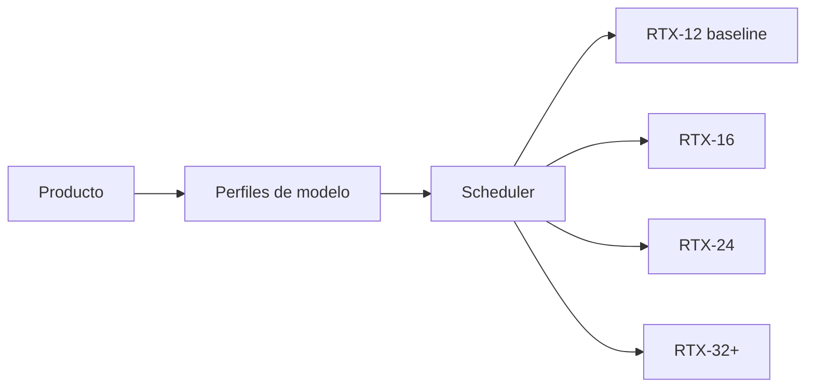
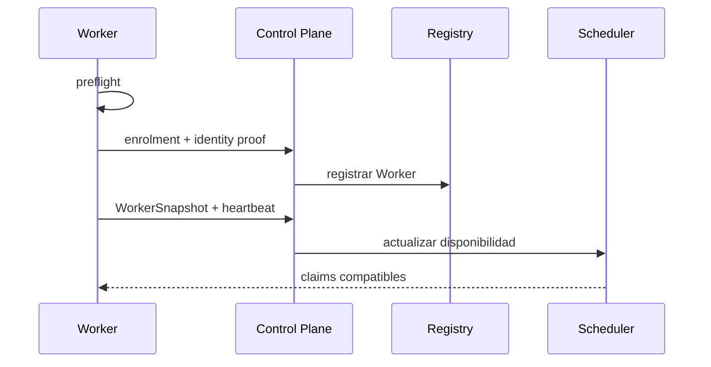
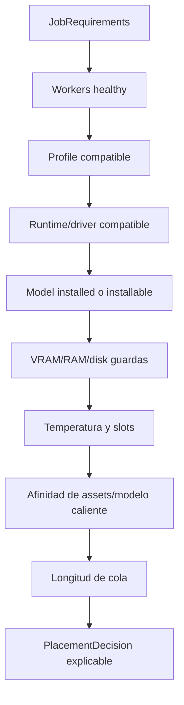
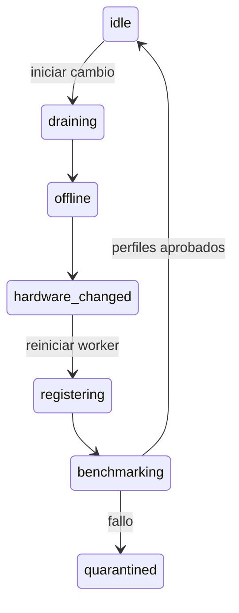
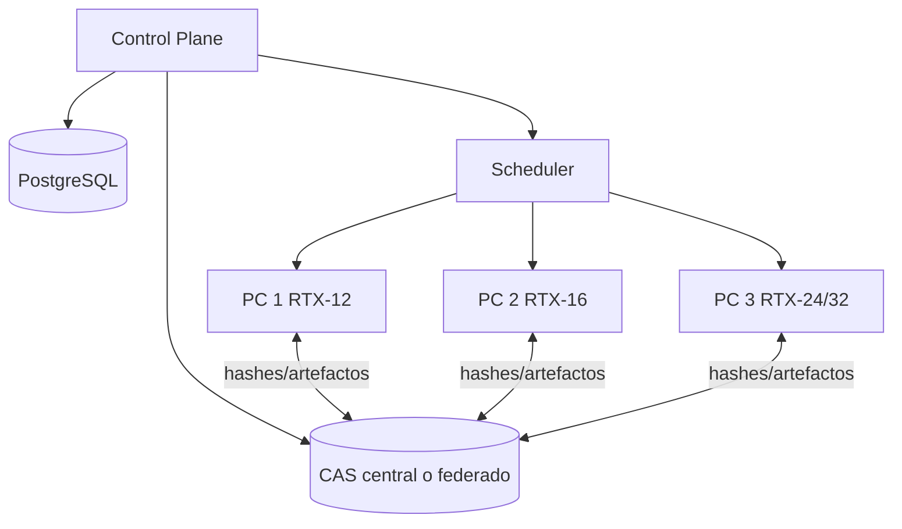
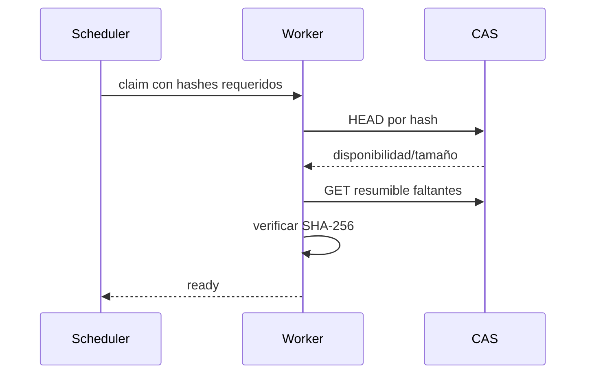
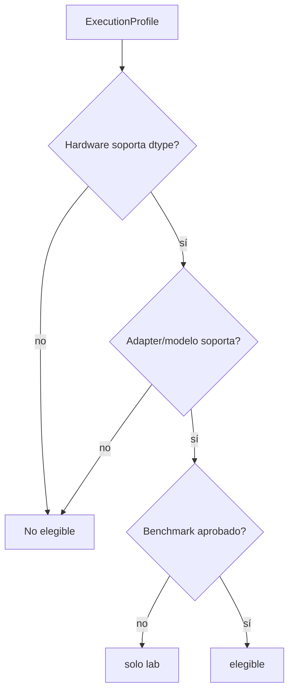
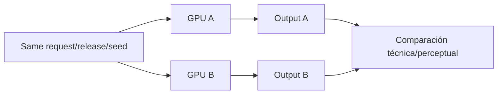

# Perfiles RTX, scheduler y multiworker

## Baseline

La referencia inicial es **GeForce RTX 5070 desktop con 12 GB GDDR7**, arquitectura Blackwell, compute capability 12.0, Tensor Cores de quinta generación y NVENC de novena generación. El producto la trata como baseline medido `RTX-12`, no como requisito de identidad para canciones o workspaces.



## Principio de clasificación

Los perfiles se asignan por capacidad medida:

- VRAM utilizable;
- compute capability;
- dtypes y kernels soportados;
- driver/runtime;
- RAM y disco;
- temperatura y potencia;
- benchmark de cada execution profile.

No basta con `gpu_name`.

## Perfiles iniciales

### RTX-12

Referencia: RTX 5070 desktop 12 GB.

- una tarea GPU pesada simultánea;
- un modelo pesado residente cada vez;
- preview antes de final;
- offloading y cuantización solo si están aprobados;
- música completa;
- keyframes ligeros;
- vídeo por planos cortos;
- lip-sync ligero;
- render NVENC.

### RTX-16

- modelos de imagen/vídeo con menos offload;
- rutas audiovisuales mayores si pasan benchmark;
- una tarea pesada por defecto;
- mayor resolución o duración de preview.

### RTX-24

- modelos musicales y de vídeo mayores;
- menor dependencia de offloading;
- lip-sync avanzado;
- posible concurrencia controlada si se mide.

### RTX-32+

- modelos audiovisuales grandes;
- batch y calidad superior;
- concurrency policy basada en benchmark;
- no implica que cualquier modelo esté autorizado.

## WorkerSnapshot

```yaml
worker_id: studio-pc-01
hostname: studio-pc-01
status: idle
gpu:
  name: NVIDIA GeForce RTX 5070
  uuid: GPU-...
  compute_capability: "12.0"
  vram_total_mb: 12288
  vram_free_mb: 11720
runtime:
  driver_version: ...
  cuda_runtime: ...
  pytorch_version: ...
  supports_fp16: true
  supports_bf16: true
  supports_tf32: true
health:
  temperature_c: 45
  disk_free_gb: 620
  heartbeat_at: ...
capacity:
  worker_profile: RTX-12
  max_heavy_gpu_jobs: 1
installed_releases: []
```

El snapshot es temporal. No se copia a `Song`; se referencia desde `PlacementDecision`/`ModelRun`.

## Registro del worker



## Requisitos de un job

```yaml
job_requirements:
  capability: video.generate.image_to_video
  resolved_model_release_id: video.ltxvideo.2b...
  allowed_execution_profiles:
    - ltxv2b-fp8-rtx12
    - ltxv2b-bf16-rtx16
  minimum_vram_free_mb: 10500
  disk_required_mb: 25000
  expected_duration_seconds: 420
  asset_hashes: []
  heavy_gpu_slots: 1
```

No contiene una GPU concreta salvo override administrativo.

## Placement



### Ejemplo de decisión

```yaml
placement_decision:
  worker_id: studio-pc-02
  reasons:
    - execution_profile_validated
    - model_already_cached
    - lower_queue_time
  rejected_workers:
    - worker_id: studio-pc-01
      reasons: [insufficient_free_vram_for_requested_profile]
```

## Afinidad sin acoplamiento

El scheduler puede preferir:

- worker con modelo ya cargado;
- worker con assets cacheados;
- worker local;
- worker más rápido;
- worker con mejor benchmark.

Preferir no significa fijar. La preferencia no se persiste en `Song`.

## Sustitución de GPU



Proceso:

1. drenar jobs;
2. apagar worker;
3. sustituir GPU/driver;
4. ejecutar preflight;
5. crear nuevo hardware snapshot;
6. invalidar benchmarks hardware-bound anteriores;
7. ejecutar smoke/benchmark de release sets;
8. publicar capabilities;
9. reabrir claims.

No se modifican workspaces ni versiones.

## Multiworker



### Protocolo

- enrolment explícito;
- identidad de dispositivo;
- mTLS;
- heartbeat;
- leases;
- transferencias resumibles;
- verificación SHA-256;
- scopes por job;
- revocación;
- caché local de modelos/assets.

## Transferencia de assets



Nunca se confía en el nombre del archivo como identidad.

## Precisión y Tensor Cores

La RTX soporta hardware moderno, pero el uso efectivo depende de adapter/modelo/runtime.

Política:

- BF16 cuando esté soportado y validado;
- FP16 como alternativa;
- TF32 solo para operaciones FP32 compatibles y medido;
- FP8/NVFP4 solo con ruta oficial/validada;
- INT8/INT4 solo si la degradación y compatibilidad son aceptables;
- ningún fallback silencioso.



## Política térmica y de recursos

- umbral preventivo;
- enfriamiento entre lotes si procede;
- cancelación ordenada;
- disco mínimo antes de claim;
- RAM/swap guardadas;
- máximo de duración;
- watchdog del contexto CUDA;
- reciclaje de adapter tras OOM severo.

## Determinismo entre GPUs

No se promete identidad bit a bit entre GPUs/runtimes distintos. Se promete:

- registrar seed y parámetros;
- fijar release/runtime;
- detectar cambios;
- medir regresión perceptual y funcional;
- conservar el output original.



## Matriz de soporte

| Worker profile | Capability | Model release | Execution profile | Estado | Evidencia |
|---|---|---|---|---|---|
| RTX-12 | music.generate.full_song | fijado | BF16/FP16 + offload | lab/candidate/stable | benchmark URI |
| RTX-12 | video.generate.image_to_video | fijado | FP8/BF16 | lab/candidate/stable | benchmark URI |
| RTX-16 | video.generate.audio_to_video | fijado | según modelo | lab/candidate | benchmark URI |
| RTX-24 | lipsync avanzado | fijado | BF16/FP16 | lab/candidate | benchmark URI |

La matriz es el producto de pruebas reales, no una declaración manual sin evidencia.
