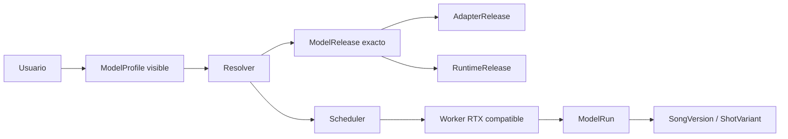
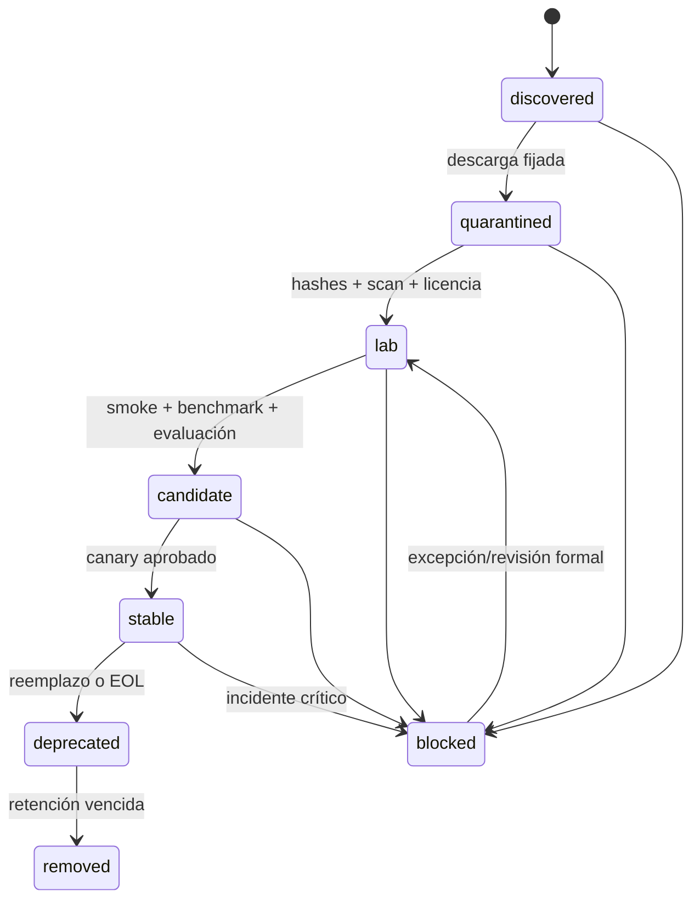
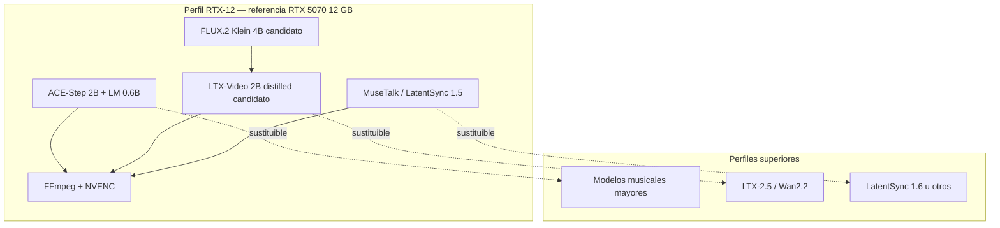
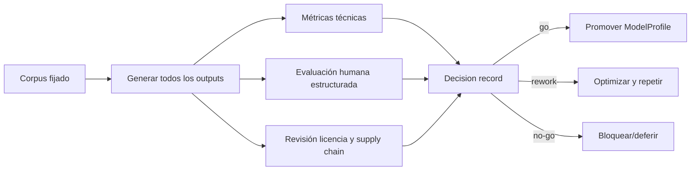
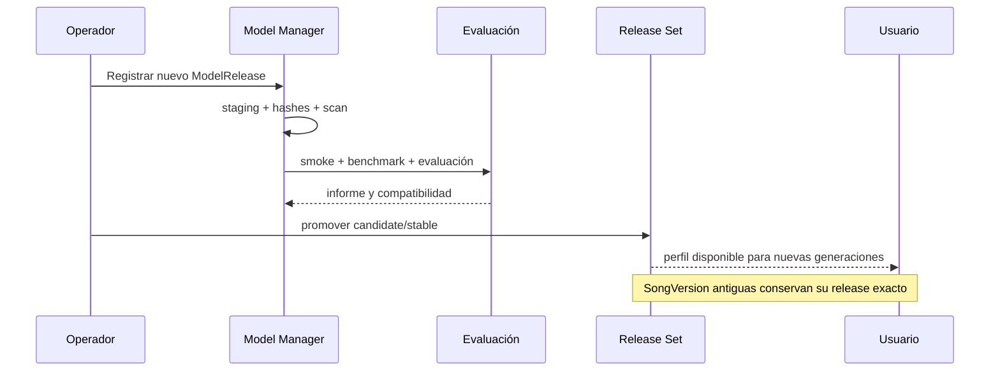

# Catálogo inicial de modelos y estrategia de evaluación — corte 2026-09-18

## 1. Propósito

Este documento define el **catálogo de candidatos**, no una lista inmutable de dependencias ni un ranking absoluto. La selección productiva debe salir de un proceso reproducible de licencia, instalación, benchmark técnico y evaluación artística sobre el hardware real.

La arquitectura v4 separa:

```text
ModelFamily   → identidad funcional: ACE-Step, HeartMuLa, LTX-Video…
ModelRelease  → revisión exacta, pesos, hashes, licencia y artefactos
ModelProfile  → opción visible al usuario: «ACE-Step equilibrado»
Adapter       → traducción del contrato común a la API del motor
Runtime       → imagen/entorno CUDA fijado
Worker        → ordenador y GPU que ejecutan el job
```

Una canción selecciona un `ModelProfile` o una política automática. **Nunca selecciona ni queda asociada a una RTX física.**



## 2. Estados del catálogo

| Estado | Significado | Seleccionable por usuarios normales |
|---|---|---:|
| `discovered` | Encontrado, sin revisión | No |
| `quarantined` | Descargado en staging, aún no confiable | No |
| `lab` | Instalación y pruebas internas | No, salvo modo laboratorio |
| `candidate` | Ha superado controles básicos y espera canary | Opcional, con aviso |
| `stable` | Aprobado por perfil de hardware y uso | Sí |
| `deprecated` | Aún reproducible, no recomendado para nuevas generaciones | Solo para historial/compatibilidad |
| `blocked` | No autorizado por seguridad, licencia, territorio o calidad | No |
| `removed` | Artefactos retirados; se conserva metadato histórico | No |



## 3. Stack de referencia para la RTX 5070 desktop de 12 GB

El siguiente stack es un **punto de partida para el bake-off**, no una promesa de compatibilidad hasta medirlo en la máquina objetivo.

| Dominio | Candidato primario RTX-12 | Challenger | Regla de adopción |
|---|---|---|---|
| Canción completa | ACE-Step 1.5, variante 2B + LM 0.6B | HeartMuLa 3B, DiffRhythm2 | Calidad, estabilidad, letra, tiempo y VRAM |
| Perfil musical frontera | ACE-Step 1.5, 2B + LM 1.7B | ACE-Step XL con offload/cuanti. | Solo si no degrada UX ni causa OOM |
| Keyframes/edición | FLUX.2 Klein 4B | alternativa ligera aprobada | Identidad, referencias, VRAM y licencia |
| Planos cortos | LTX-Video 2B distilled | otros I2V ligeros | Clips cortos, coherencia y recuperación |
| Vídeo avanzado | No requerido en RTX-12 | LTX-2.5 / Wan2.2 en perfiles superiores | Worker y benchmark específicos |
| Lip-sync | MuseTalk 1.5 | LatentSync 1.5 | Sincronía, preservación facial y licencia |
| Timeline/render | FFmpeg + NVENC | — | Determinista, reanudable y verificable |



## 4. Candidatos de música

### 4.1 ACE-Step 1.5

**Rol propuesto:** motor principal del MVP, sujeto a G1.

Capacidades que deben verificarse contra el release fijado:

- generación de canción completa condicionada por descripción y letra;
- instrumental;
- semillas y parámetros reproducibles dentro de los límites del motor;
- audio de referencia, cover, repaint, extensión, stems o LRC cuando el release lo soporte;
- API o interfaz invocable sin acoplar el dominio al proceso upstream;
- perfiles 2B y XL con requisitos diferentes.

Perfiles iniciales:

| ModelProfile | Release base | Hardware candidato | Estado inicial |
|---|---|---|---|
| `music.acestep15.fast.rtx12` | 2B + LM 0.6B | RTX-12+ | `lab` |
| `music.acestep15.balanced.rtx12` | 2B + LM 0.6B, parámetros de calidad | RTX-12+ | `lab` |
| `music.acestep15.lm17.boundary` | 2B + LM 1.7B | RTX-12 frontera / RTX-16+ | `lab` |
| `music.acestep15.xl.quality` | XL 4B | RTX-20/24+ preferido; RTX-12 solo experimento | `lab` |

No se deben inferir requisitos solo por la suma nominal de parámetros. Hay que medir:

```text
pesos residentes
+ text/lyrics encoder
+ codec/VAE
+ activaciones
+ cachés
+ buffers CUDA
+ memoria del runtime
+ fragmentación
```

**Gate para `stable`:** corpus completo, tres semillas por brief, 0 OOM en la suite soportada, cancelación y recuperación correctas, licencia/revisión fijadas y degradación de calidad documentada para cada optimización.

### 4.2 HeartMuLa

**Rol propuesto:** challenger musical.

Debe evaluarse por:

- fidelidad a letra y etiquetas;
- idiomas de interés, especialmente español e inglés;
- duración útil y estructura musical;
- calidad del codec y política de dtype;
- requisitos de VRAM reales;
- integración de cover/remix si se adopta;
- licencia de todos los pesos y componentes, no solo del repositorio.

No se implementará un segundo adaptador productivo únicamente para “tener dos motores”. Solo entrará si cubre un gap medido o aporta una mejora relevante.

### 4.3 DiffRhythm2

**Rol propuesto:** benchmark secundario de canción completa y alineación lírica.

Debe verificarse:

- compatibilidad de la revisión exacta con RTX-12;
- dependencias y modelos auxiliares;
- licencia del conjunto completo;
- manejo de idiomas y letras;
- estabilidad en canciones completas;
- calidad frente al motor primario con el mismo corpus.

### 4.4 YuE2

**Rol propuesto:** investigación no comercial, salvo que una revisión futura cambie de forma válida las condiciones.

El catálogo debe marcar los pesos actuales con política `noncommercial` y excluirlos de release sets comerciales. La licencia del código no autoriza automáticamente los pesos.

### 4.5 SongGeneration/LeVo y otros

Se podrán registrar como `discovered` o `lab` para investigación, pero no deben entrar en el camino del MVP cuando:

- la licencia excluya producción/comercialización;
- la VRAM exceda el hardware base;
- no haya API estable o aislamiento razonable;
- el coste de adaptación sea superior al valor diferencial medido.

## 5. Candidatos de imagen y keyframes

### 5.1 FLUX.2 Klein 4B

**Rol propuesto:** candidato para keyframes, conceptos, personajes, localizaciones y edición con referencias.

Pruebas obligatorias:

- texto a imagen;
- referencia única y múltiple;
- preservación de identidad en un conjunto fijo;
- inpainting/edición si se usa en el producto;
- pico de VRAM en resoluciones soportadas;
- latencia cold/warm;
- offloading y precisión;
- términos de licencia del checkpoint exacto.

El perfil visible al usuario debe expresar intención, no implementación:

```text
«Keyframe rápido»
«Keyframe equilibrado»
«Identidad consistente»
```

El resolver puede cambiar el release subyacente después de una promoción, sin alterar keyframes históricos.

## 6. Candidatos de vídeo

### 6.1 LTX-Video 2B distilled

**Rol propuesto:** primer generador de planos cortos para RTX-12.

Uso previsto:

- imagen a vídeo a partir de keyframe;
- clips breves, inicialmente 4–8 segundos;
- preview a resolución/FPS reducidos;
- render de plano final solo tras aprobación;
- un plano por job reanudable.

No se usará para generar el videoclip completo en una única inferencia.

### 6.2 LTX-2.5

**Rol propuesto:** capacidad avanzada para perfiles con más VRAM o laboratorio medido.

Puede aportar rutas audiovisuales y controles más avanzados, pero el tamaño, componentes y requisitos deben fijarse por release. No debe publicarse como perfil estable de RTX-12 por su mera disponibilidad de cuantización u offloading.

Posible perfil futuro:

```yaml
profile_id: video.cinematic.quality
selection:
  policy: auto
requirements:
  capabilities: [video.image_to_video]
  min_worker_profile: RTX-24
  allow_offload: true
```

### 6.3 Wan2.2 TI2V-5B

**Rol propuesto:** candidato de alta VRAM para texto/imagen a vídeo.

La documentación upstream actual sitúa la ruta TI2V-5B fuera de los 12 GB como configuración base. Debe asociarse a un perfil hardware medido y no al nombre de una canción o workspace.

### 6.4 Wan2.2 S2V-14B

**Rol propuesto:** investigación especializada en vídeo dirigido por audio, sobre workers de memoria muy superior. No forma parte del soporte inicial de consumo.

### 6.5 HunyuanVideo y modelos con restricciones territoriales

Cualquier release cuyas condiciones excluyan el territorio operativo se marcará `territory_blocked`. La compatibilidad técnica no modifica la política jurídica.

## 7. Candidatos de lip-sync

### 7.1 MuseTalk 1.5

**Rol propuesto:** candidato primario para planos performer en RTX-12.

Evaluar:

- sincronía fonética y audiovisual;
- preservación de identidad;
- dientes, lengua, mandíbula y parpadeos;
- movimiento de cabeza;
- resolución y reescalado;
- licencias de modelos auxiliares;
- límites de uso declarados upstream.

### 7.2 LatentSync

- **1.5:** challenger compatible con el rango de 8 GB según upstream; validar RTX-12.
- **1.6:** candidato para perfiles superiores por su memoria publicada; no asumir compatibilidad RTX-12.

## 8. Herramientas deterministas

La generación no sustituye herramientas reproducibles:

| Función | Herramienta inicial | Motivo |
|---|---|---|
| Normalización de audio | FFmpeg/ffprobe | Formatos y metadatos controlados |
| Análisis temporal | librerías fijadas + validación | BPM, beats, secciones, energía |
| Timeline | motor propio declarativo | Reanudación y versionado |
| Composición | FFmpeg filters | Determinismo y trazabilidad |
| Codificación | NVENC/CPU según perfil | Rendimiento medible |
| Hashes | SHA-256/BLAKE3 según contrato | Integridad y CAS |

## 9. Bake-off musical

### 9.1 Corpus mínimo

```text
12 briefs × 3 semillas × cada ModelProfile candidato
```

Debe incluir:

- español e inglés;
- voz masculina/femenina cuando el motor lo permita;
- instrumental;
- pop, rock, electrónica, urbano, acústico y cinematográfico;
- letras breves, densas y estructuradas;
- duraciones cortas y objetivo de canción completa;
- prompts ambiguos y adversariales razonables.

### 9.2 Evaluación

| Dimensión | Tipo | Regla |
|---|---|---|
| Fidelidad a prompt | humana + diagnóstica | evaluar todos los outputs |
| Fidelidad a letra | humana + alineación | no seleccionar solo mejores semillas |
| Calidad sonora | humana + métricas auxiliares | métricas no sustituyen escucha |
| Estructura | humana | intro/verso/estribillo/puente |
| Artefactos | humana + detección | clipping, ruido, cortes, voz |
| Latencia | automática | cold y warm |
| VRAM | automática | pico y fragmentación |
| Estabilidad | automática | OOM, crash, retry y cancelación |
| Licencia | revisión | release exacto y auxiliares |



## 10. Bake-off de imagen, vídeo y lip-sync

### Imagen

- 20 prompts fijos;
- cinco identidades/referencias autorizadas;
- consistencia entre 4–8 variantes;
- anatomía, texto no deseado, composición y editabilidad;
- latencia, VRAM y recuperación.

### Vídeo

- 10–15 planos fijos de 4–8 segundos;
- movimiento humano, cámara, objetos y entornos;
- keyframes de entrada idénticos entre candidatos;
- coherencia temporal, deformaciones, identidad, flicker y ritmo;
- preview y calidad final por separado;
- tasa de planos aceptables sin cherry-picking.

### Lip-sync

- corpus con fonemas españoles e ingleses;
- distintos encuadres y movimientos;
- audio limpio y mezcla musical;
- sincronía, identidad y artefactos faciales;
- comparación ciega cuando sea viable.

## 11. Regla de sustitución

Un modelo nuevo no sustituye al estable hasta que:

1. su release esté fijado por revisión y hashes;
2. sus licencias y territorios estén aprobados;
3. el adaptador pase tests de contrato;
4. tenga benchmark en cada perfil anunciado;
5. supere o complemente al estable en el criterio declarado;
6. pase canary;
7. exista rollback;
8. el cambio del alias/perfil quede auditado.



## 12. Política frente a una GPU nueva

Cambiar de gráfica no modifica el catálogo lógico ni las canciones. Genera nuevas evidencias de compatibilidad:

```text
mismo ModelProfile
+ mismo ModelRelease
+ nuevo WorkerProfile/driver/runtime
= nuevo benchmark y nueva aprobación hardware
```

Los perfiles podrán desbloquear releases más grandes, pero el usuario seguirá eligiendo modelos/perfiles, no dispositivos físicos.

## 13. Fuentes oficiales mínimas

Las URLs canónicas y reglas de reverificación se mantienen en [17-REFERENCIAS-OFICIALES.md](17-REFERENCIAS-OFICIALES.md). El catálogo máquina-legible inicial se encuentra en [model-catalog.example.yaml](model-catalog.example.yaml).
