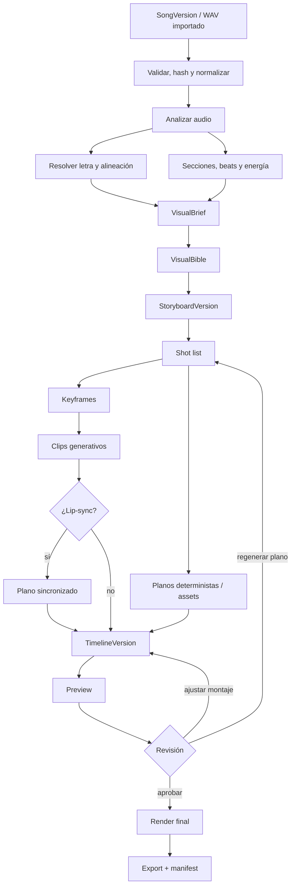
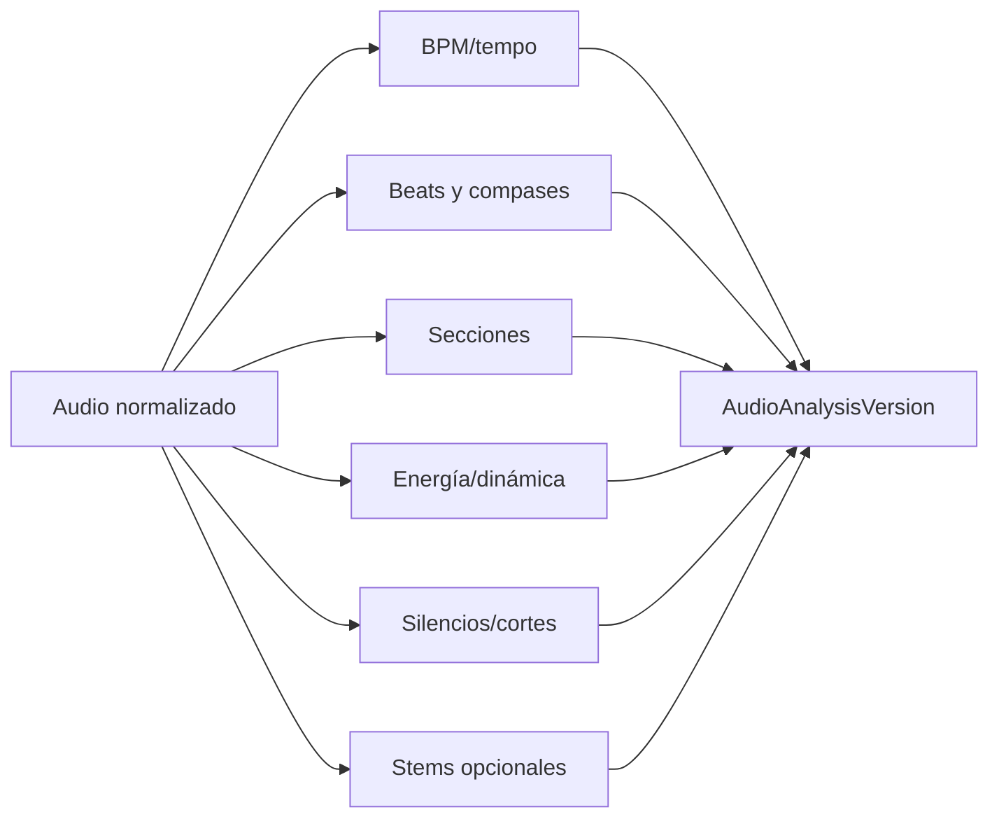
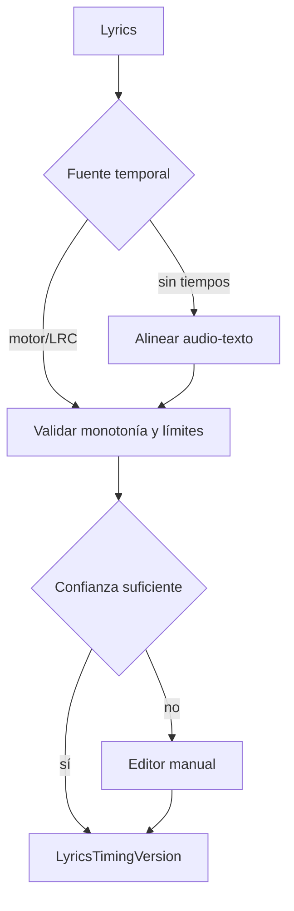
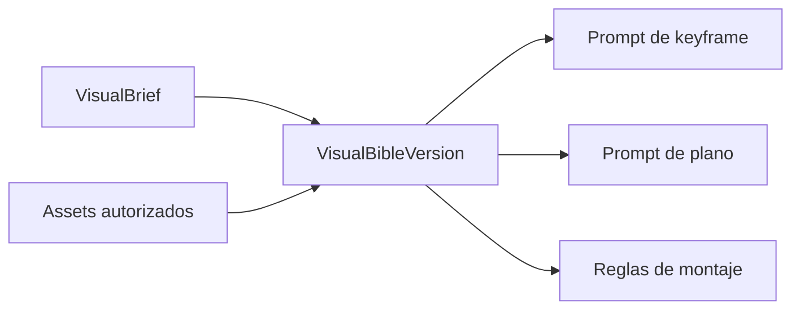
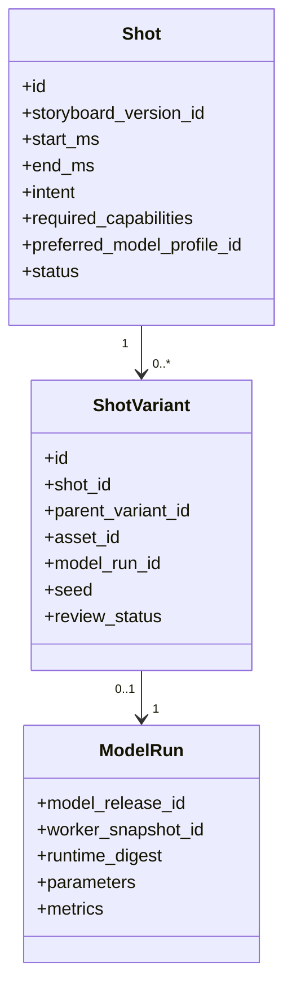
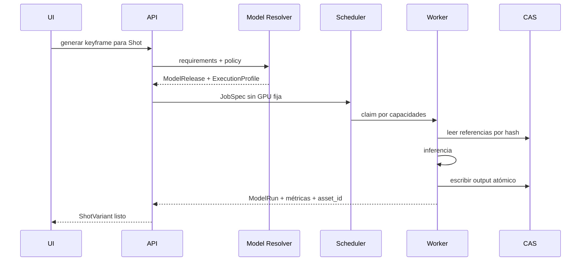
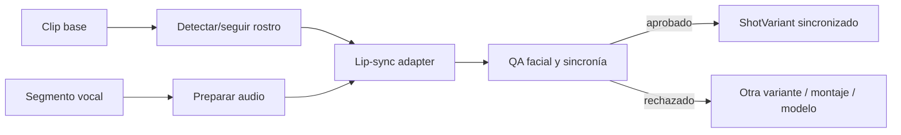
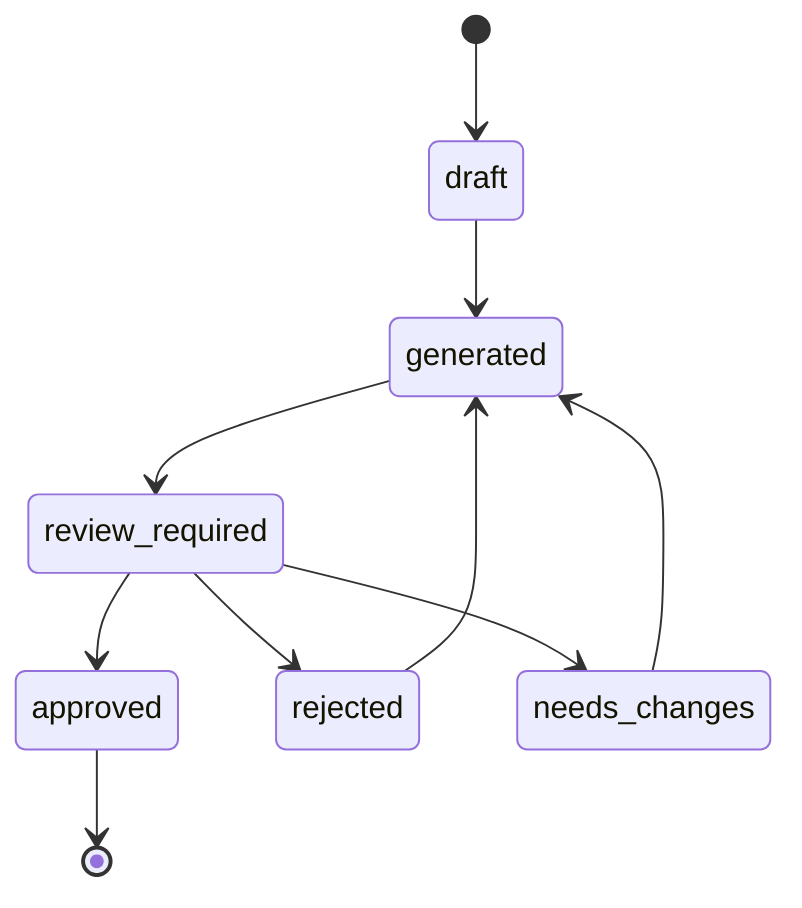
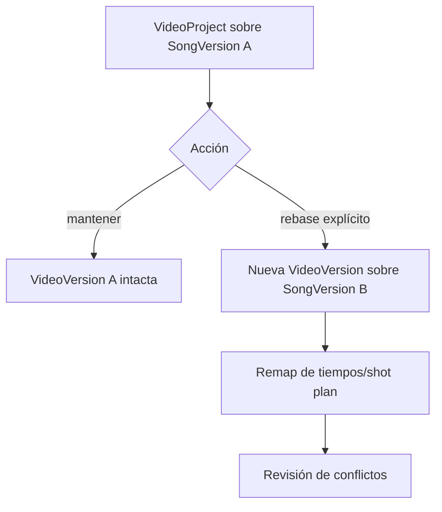

# Pipeline audiovisual — desde SongVersion o WAV hasta videoclip

## 1. Objetivo

Convertir una versión inmutable de canción o un WAV importado en un proyecto audiovisual **editable, reanudable, versionado y reproducible**. El sistema no delega un videoclip completo de varios minutos a una única inferencia; combina análisis temporal, dirección visual, keyframes, planos breves, lip-sync selectivo y montaje determinista.

La unidad de trabajo creativa es el `Workspace`. La fuente musical es siempre una `SongVersion` inmutable:


> `VideoProject` debe apuntar a `song_version_id`, nunca a una canción mutable ni a una RTX.

## 2. Entradas admitidas

### 2.1 Canción generada dentro de la aplicación

Se usa una `SongVersion` ya registrada con:

- WAV/FLAC maestro;
- prompt, letra y estructura;
- seed y parámetros;
- `ModelRun` y `ModelRelease` exactos;
- hashes y duración;
- LRC/timestamps si existen;
- stems si fueron generados o derivados.

### 2.2 WAV importado

El sistema crea una `Song` y una `SongVersion` de tipo `imported` sin fingir que fue generada. Debe registrar:

- hash del original;
- propietario/procedencia declarada;
- formato y metadatos;
- consentimiento/autorización cuando proceda;
- copia normalizada derivada, sin destruir el original;
- resultados de análisis.

### 2.3 Restricciones

- La fuente debe pertenecer al mismo workspace o importarse mediante un flujo explícito.
- No se aceptan rutas arbitrarias del host en jobs.
- Los assets se resuelven por IDs y hashes en el CAS.
- Una nueva versión de canción crea una rama audiovisual nueva o un rebase explícito; nunca cambia silenciosamente el vídeo existente.

## 3. DAG completo



Cada nodo del DAG debe ser idempotente y guardar su estado. Un fallo en un plano no invalida todos los planos aprobados.

## 4. Fase 0 — validación, normalización y hash

### Entradas verificadas

```yaml
source:
  workspace_id: ws_...
  song_version_id: sv_...
  master_asset_id: asset_...
  expected_sha256: ...
```

### Acciones

1. Resolver el asset por ID.
2. Verificar workspace y autorización.
3. Comprobar hash e integridad.
4. Inspeccionar con `ffprobe`.
5. Rechazar streams inesperados, duraciones/tamaños fuera de límites o archivos corruptos.
6. Conservar original de solo lectura.
7. Crear PCM/WAV normalizado como asset derivado.
8. Registrar la receta exacta de normalización.

### Salida

```yaml
NormalizedAudio:
  source_asset_id: asset_original
  output_asset_id: asset_pcm
  sample_rate: 48000
  channels: 2
  duration_ms: 203412
  recipe_version: audio-normalize-v1
  source_hash: sha256:...
  output_hash: sha256:...
```

## 5. Fase 1 — análisis temporal y semántico

El análisis debe producir datos versionados, no escribir campos sueltos sobre la canción.



Datos mínimos:

- duración exacta;
- BPM estimado y confianza;
- beats/downbeats;
- compases;
- secciones candidatas: intro, verso, pre-coro, coro, puente, outro;
- curva de energía;
- transitorios y silencios;
- loudness y true peak;
- tonalidad/chroma si aporta valor;
- timestamps de letra y confianza;
- versión de cada algoritmo.

Los resultados automáticos deben ser editables por el usuario. Una corrección crea `AudioAnalysisVersion` nueva.

## 6. Fase 2 — letra y alineación

Orden de confianza:

1. timestamps producidos por el motor musical, si el contrato y evaluación los consideran fiables;
2. LRC importado y validado;
3. alineación forzada/transcripción sobre voz aislada;
4. edición manual;
5. aproximación por secciones, marcada como baja confianza.



Nunca se debe mostrar una alineación estimada como exacta sin su nivel de confianza.

## 7. Fase 3 — VisualBrief y VisualBible

### 7.1 VisualBrief

Define la intención del videoclip:

```yaml
visual_brief:
  concept: "..."
  narrative_mode: cinematic
  tone: [melancholic, nocturnal]
  audience: "..."
  aspect_ratios: ["16:9", "9:16"]
  target_duration_ms: 203412
  performer_mode: false
  forbidden_elements: []
  mandatory_elements: []
  references: [asset_ref_1]
```

### 7.2 VisualBible

Es una versión inmutable y reutilizable que contiene:

- paleta y contraste;
- fotografía/iluminación;
- lenguaje de cámara;
- textura/medio;
- personajes y hojas de referencia;
- vestuario;
- localizaciones;
- props;
- reglas negativas;
- tipografía y overlays;
- IDs/hashes de referencias;
- consentimiento y procedencia.



El modelo de imagen o vídeo es sustituible. La VisualBible pertenece al dominio del proyecto, no al modelo.

## 8. Fase 4 — storyboard temporal

El storyboard transforma la estructura musical en intención visual:

| Campo | Ejemplo |
|---|---|
| Inicio/fin | `00:42.000–00:49.000` |
| Sección musical | coro 1 |
| Objetivo narrativo | revelar personaje |
| Energía | 0.82 |
| Tipo de plano | primer plano performer |
| Movimiento | dolly-in lento |
| Fuente | generado/importado/determinista |
| Lip-sync | requerido |
| Referencias | personaje A, localización B |

Reglas:

- cubrir toda la duración sin huecos no intencionados;
- limitar cambios excesivos de plano;
- alinear cortes relevantes con beats/secciones;
- permitir solapes y transiciones explícitas;
- mantener zonas seguras para 16:9/9:16 si se exportan ambos;
- versionar cualquier modificación.

## 9. Fase 5 — shot list

Cada `Shot` representa intención; cada `ShotVariant` es una materialización posible.



Campos clave de `Shot`:

- duración objetivo;
- aspecto y resolución de preview/final;
- prompt positivo/negativo;
- referencias;
- cámara y movimiento;
- continuidad con planos anteriores/siguientes;
- capacidad requerida;
- `ModelProfile` preferido opcional;
- política `inherit|auto|pinned_profile|pinned_release`;
- coste/VRAM estimados;
- necesidad de lip-sync.

## 10. Fase 6 — keyframes

Secuencia:

1. Resolver política de modelo de imagen.
2. Validar referencias y consentimiento.
3. Generar variantes de baja resolución.
4. Revisar/seleccionar.
5. Refinar o editar.
6. Congelar `KeyframeVersion` aprobado.
7. Guardar `ModelRun`, seed, release, runtime, worker y hashes.



## 11. Fase 7 — clips generativos

Estrategia RTX-12:

- planos de 4–8 segundos inicialmente;
- preview-first;
- una tarea GPU pesada por worker RTX-12;
- descarga del modelo anterior antes de cargar otra familia;
- I2V desde keyframe cuando sea posible;
- regeneración por plano;
- interpolación o retiming solo mediante pasos explícitos;
- no ocultar reducciones de resolución/FPS/duración.

El job debe contener requisitos, no un hostname:

```yaml
job_spec:
  capability: video.image_to_video
  model_selection:
    policy: inherit
    inherited_from: shot
  requirements:
    duration_ms: 6000
    aspect_ratio: "16:9"
    preview: true
    min_vram_mb: 10500
  scheduling:
    worker_id: null
    allow_compatible_fallback: true
```

## 12. Fase 8 — lip-sync selectivo

Solo se ejecuta sobre planos donde aporta valor. No se aplica indiscriminadamente a todo el vídeo.

Pipeline:



Controles:

- consentimiento para personas reales;
- rango temporal exacto del audio;
- no alterar el master musical;
- conservar clip base y variante sincronizada;
- revisión de rostro, dientes, parpadeo y estabilidad;
- fallback a planos sin boca visible.

## 13. Fase 9 — timeline determinista

La timeline es una estructura declarativa versionada:

```yaml
timeline_version:
  song_version_id: sv_...
  duration_ms: 203412
  tracks:
    - type: video
      clips:
        - shot_variant_id: shv_...
          in_ms: 0
          out_ms: 6000
          start_ms: 0
    - type: titles
      clips: []
    - type: audio_master
      asset_id: asset_master_wav
  render_recipe_version: timeline-v1
```

Debe soportar:

- trims no destructivos;
- crop/pan/zoom;
- transiciones;
- still motion;
- overlays y tipografía;
- letras/LRC;
- color simple y LUT declarada;
- múltiples aspectos;
- sustitución de una variante sin rehacer las demás.

## 14. Fase 10 — preview y revisión

El preview debe ser barato y rápido:

- resolución/FPS menores;
- watermark opcional;
- todos los planos presentes;
- audio completo;
- marcadores de shots pendientes o low-confidence;
- manifiesto de los assets usados.

Estados de revisión por plano:

```text
draft → generated → review_required → approved
                       ├→ rejected
                       └→ needs_changes
```



## 15. Fase 11 — render final

El render final no llama a modelos generativos si todos los assets están aprobados. Debe ser determinista respecto de:

- `TimelineVersion`;
- assets por hash;
- receta FFmpeg;
- fuentes tipográficas autorizadas;
- encoder y parámetros;
- master de audio.

Salidas iniciales:

| Preset | Contenedor | Vídeo | Audio |
|---|---|---|---|
| Master 16:9 | MP4/MKV según política | H.264/HEVC | AAC + referencia al WAV master |
| Social 9:16 | MP4 | H.264/HEVC | AAC |
| Preview | MP4 | H.264 | AAC |
| Archivo técnico | definido por release | alta calidad | PCM/FLAC si procede |

NVENC acelera la codificación, pero el manifiesto debe registrar encoder, driver y parámetros. Debe existir fallback CPU validado para portabilidad, aunque sea más lento.

## 16. Modos de producto

### 16.1 Visualizer/lyric

Ruta garantizada y determinista:

- fondos o keyframes;
- animación de cámara;
- waveform/espectro opcional;
- tipografía y letras sincronizadas;
- partículas/transiciones;
- cambios por sección/energía.

### 16.2 Cinematográfico

Combina planos generativos, still motion, material importado y montaje. La coherencia se obtiene mediante VisualBible, referencias, dirección y edición; no mediante una promesa imposible de continuidad perfecta.

### 16.3 Performer

Añade personaje/cantante, planos de interpretación y lip-sync. Exige procedencia y consentimiento reforzados.

## 17. Reanudación, idempotencia y fallos

Cada paso debe tener:

```yaml
step:
  input_fingerprint: sha256:...
  attempt: 1
  lease_owner: worker_...
  lease_expires_at: ...
  status: running
  checkpoint: ...
  outputs: []
```

Reglas:

- repetir el mismo comando/idempotency key no duplica entidades;
- outputs se publican solo tras escritura y hash correctos;
- un lease vencido permite recuperación;
- un OOM descarga modelo, limpia estado CUDA y clasifica el fallo;
- un retry no cambia silenciosamente modelo, precisión o duración;
- cualquier fallback crea una nueva decisión registrada.

## 18. Cambio de canción o modelo

### Cambio de `SongVersion`



No se cambia la fuente musical de una versión ya renderizada.

### Cambio de modelo

- Una nueva variante puede usar otro `ModelProfile`.
- Las variantes anteriores conservan release y worker históricos.
- Operaciones como extend/repaint pueden exigir misma familia/release según `CompatibilityContract`.
- El cambio de GPU no crea una versión creativa por sí mismo; queda en `ModelRun`.

## 19. Manifiesto de render

```yaml
render_manifest:
  workspace_id: ws_...
  video_project_id: vp_...
  video_version_id: vv_...
  song_version_id: sv_...
  timeline_version_id: tl_...
  source_audio_hash: sha256:...
  assets:
    - asset_id: ...
      sha256: ...
      shot_variant_id: ...
      model_run_id: ...
  render:
    recipe_version: timeline-v1
    ffmpeg_build: ...
    encoder: hevc_nvenc
    arguments_hash: sha256:...
  output:
    asset_id: ...
    sha256: ...
    duration_ms: 203412
```

Este manifiesto demuestra trazabilidad técnica. No sustituye autorizaciones jurídicas ni prueba por sí solo titularidad sobre la música, imágenes o personas.
