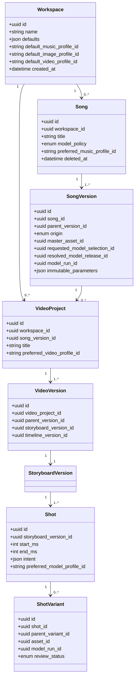
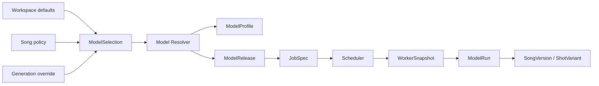
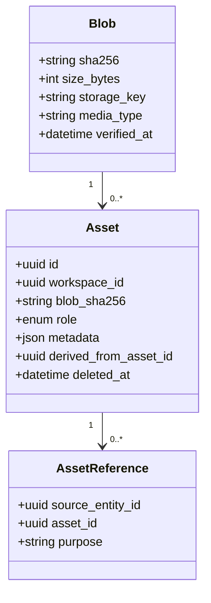
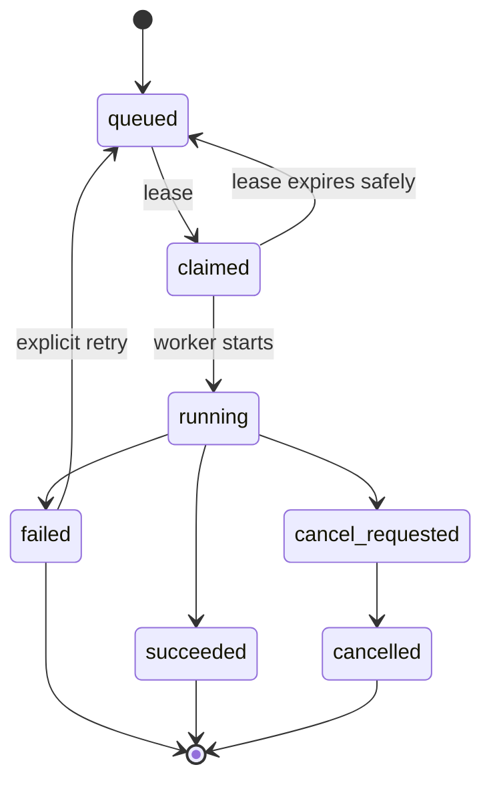

# Modelo de datos, contratos y API

## 1. Objetivo

Este documento define el modelo conceptual que permite:

- organizar todo por workspaces;
- seleccionar modelos como experiencia de producto;
- conservar versiones creativas inmutables;
- ejecutar trabajos en cualquier RTX compatible;
- cambiar modelos o hardware sin migrar canciones;
- reconstruir cómo se produjo cada asset;
- separar intención, resolución de modelo y ejecución física.

La invariante principal es:

> **Workspace y Song guardan preferencias o políticas; SongVersion/ShotVariant guardan el resultado y el release exacto; Job/ModelRun guardan el worker y la RTX efectivos.**

## 2. Vista de dominio



## 3. Separación intención–resolución–ejecución



| Capa | Qué guarda | Mutable | Hardware físico |
|---|---|---:|---:|
| Workspace | defaults visibles | Sí, versionable/auditable | No |
| Song | política/preferencia | Sí | No |
| ModelSelection | solicitud de una generación | No tras submit | No |
| ModelProfile | alias/capacidad/calidad | Sí mediante versión/promoción | No |
| ModelRelease | checkpoint exacto | Inmutable | Requisitos, no dispositivo |
| JobSpec | requisitos y operación | Inmutable por intento | No worker fijo por defecto |
| WorkerSnapshot | capacidad en el claim | Inmutable | Sí |
| ModelRun | ejecución efectiva | Inmutable | Sí |
| SongVersion/ShotVariant | output creativo | Inmutable | Solo referencia al ModelRun |

## 4. Entidades de producto

### 4.1 Workspace

Campos mínimos:

```yaml
Workspace:
  id: uuid
  name: string
  slug: string
  owner_id: uuid|null
  settings_version: integer
  default_music_profile_id: string|null
  default_image_profile_id: string|null
  default_video_profile_id: string|null
  default_lipsync_profile_id: string|null
  default_render_preset_id: string|null
  locale: es-ES
  created_at: timestamp
  updated_at: timestamp
  deleted_at: timestamp|null
```

Invariantes:

- todos los assets y proyectos tienen contexto de workspace;
- el default no reescribe canciones existentes;
- cambiar un default solo afecta selecciones futuras con `inherit`;
- el borrado es lógico mientras existan referencias o retención.

### 4.2 Song

Representa la identidad creativa continua, no un archivo concreto.

```yaml
Song:
  id: uuid
  workspace_id: uuid
  title: string
  description: string|null
  model_policy: inherit|auto|pinned_profile|pinned_release
  preferred_music_profile_id: string|null
  pinned_music_release_id: uuid|null
  tags: [string]
  created_at: timestamp
  deleted_at: timestamp|null
```

Restricciones:

- `pinned_profile` exige `preferred_music_profile_id`;
- `pinned_release` exige privilegio y `pinned_music_release_id`;
- la canción no contiene `worker_id`, `gpu_name` ni `vram`;
- el cambio de política se audita, pero no altera versiones anteriores.

### 4.3 SongVersion

Resultado musical inmutable:

```yaml
SongVersion:
  id: uuid
  song_id: uuid
  parent_version_id: uuid|null
  origin: generated|imported|derived|remix|cover|extend|repaint
  master_asset_id: uuid
  lyrics_version_id: uuid|null
  source_song_version_id: uuid|null
  requested_selection_id: uuid|null
  resolved_model_release_id: uuid|null
  model_run_id: uuid|null
  generation_parameters: json
  seed: integer|string|null
  duration_ms: integer
  content_hash: string
  created_at: timestamp
```

Una importación puede no tener `ModelRun`; una generación sí debe tenerlo.

### 4.4 VideoProject y VideoVersion

```yaml
VideoProject:
  id: uuid
  workspace_id: uuid
  song_version_id: uuid
  title: string
  mode: visualizer|lyric|cinematic|performer
  model_policy: inherit|auto|pinned_profile|mixed
  preferred_video_profile_id: string|null

VideoVersion:
  id: uuid
  video_project_id: uuid
  parent_version_id: uuid|null
  visual_bible_version_id: uuid
  storyboard_version_id: uuid
  timeline_version_id: uuid
  status: draft|review|approved|rendered
```

`VideoProject.song_version_id` es obligatorio e inmutable. Para otra versión musical se crea un proyecto nuevo o un rebase explícito que genera nueva identidad/versionado.

### 4.5 Shot y ShotVariant

`Shot` guarda intención; `ShotVariant` guarda una materialización.

```yaml
Shot:
  id: uuid
  storyboard_version_id: uuid
  ordinal: integer
  start_ms: integer
  end_ms: integer
  intent: json
  required_capabilities: [string]
  model_policy: inherit|auto|pinned_profile|pinned_release
  preferred_model_profile_id: string|null
  continuity_group_id: uuid|null

ShotVariant:
  id: uuid
  shot_id: uuid
  parent_variant_id: uuid|null
  asset_id: uuid
  model_run_id: uuid|null
  variant_kind: generated|imported|deterministic|lipsynced
  review_status: generated|review_required|approved|rejected|needs_changes
  created_at: timestamp
```

## 5. Entidades de selección de modelos

### 5.1 ModelFamily

Agrupación humana/técnica:

```yaml
ModelFamily:
  id: string
  domain: music|image|video|lipsync|analysis
  display_name: string
  provider: string
  upstream_url: uri
```

No basta para reproducir una inferencia.

### 5.2 ModelRelease

```yaml
ModelRelease:
  id: uuid
  family_id: string
  release_name: string
  upstream_revision: string
  package_manifest_hash: string
  artifact_set_hash: string
  license_record_id: uuid
  channel: discovered|quarantined|lab|candidate|stable|deprecated|blocked|removed
  capabilities: json
  compatibility_contract: json
  created_at: timestamp
  immutable: true
```

No se permiten revisiones flotantes como `main`, `latest` o una URL sin hash.

### 5.3 ModelProfile

Opción de producto visible:

```yaml
ModelProfile:
  id: string
  domain: music|image|video|lipsync
  display_name: string
  description: string
  quality_tier: fast|balanced|quality|experimental
  required_capabilities: [string]
  resolver_rule: json
  default_execution_profile_id: string
  visibility: hidden|lab|candidate|public|deprecated
  version: integer
```

Ejemplo:

```yaml
id: music.acestep15.balanced
resolver_rule:
  prefer:
    family: ACE-Step-1.5
    channel: stable
  require:
    capabilities: [music.full_song, music.lyrics_conditioned]
  allow_fallback:
    same_family_only: true
    lower_quality_tier: false
```

### 5.4 ModelSelection

Captura la intención exacta al enviar una generación:

```yaml
ModelSelection:
  id: uuid
  policy: inherit|auto|pinned_profile|pinned_release
  inherited_from: workspace|song|video_project|shot|null
  requested_profile_id: string|null
  requested_release_id: uuid|null
  required_capabilities: [string]
  quality_tier: string|null
  constraints: json
  created_at: timestamp
```

Tras resolver, se registra una decisión:

```yaml
ModelResolution:
  id: uuid
  selection_id: uuid
  profile_version: integer|null
  resolved_release_id: uuid
  adapter_release_id: uuid
  runtime_release_id: uuid
  execution_profile_id: string
  decision_trace: json
  resolved_at: timestamp
```

### 5.5 CompatibilityContract

Define operaciones derivadas:

```yaml
CompatibilityContract:
  operation: music.extend
  requires_same_family: true
  requires_same_release: false
  requires_same_adapter_major: true
  requires_source_state: false
  compatible_release_ranges: [">=1.5,<2.0"]
  incompatible_quantizations: []
```

No debe hardcodearse en la UI ni inferirse por nombre.

## 6. Entidades de ejecución

### 6.1 Job y JobStep

```yaml
Job:
  id: uuid
  workspace_id: uuid
  kind: music.generate|image.generate|video.generate|lipsync.run|render.timeline
  target_entity_type: string
  target_entity_id: uuid
  selection_id: uuid|null
  resolution_id: uuid|null
  status: queued|claimed|running|cancel_requested|succeeded|failed|cancelled
  priority: integer
  idempotency_key: string
  created_at: timestamp

JobStep:
  id: uuid
  job_id: uuid
  name: string
  status: pending|running|succeeded|failed|skipped
  input_fingerprint: string
  attempt: integer
  lease_owner: uuid|null
  lease_expires_at: timestamp|null
  checkpoint: json|null
```

### 6.2 Worker y WorkerSnapshot

`Worker` es mutable/operacional; `WorkerSnapshot` preserva el estado durante el claim.

```yaml
Worker:
  id: uuid
  hostname: string
  status: online|draining|offline|quarantined
  labels: json
  last_seen_at: timestamp

WorkerSnapshot:
  id: uuid
  worker_id: uuid
  captured_at: timestamp
  gpu_name: string
  gpu_uuid: string
  compute_capability: string
  vram_total_mb: integer
  driver_version: string
  cuda_runtime: string
  pytorch_version: string
  supported_dtypes: [string]
  installed_model_release_ids: [uuid]
  free_disk_bytes: integer
```

### 6.3 ModelRun

```yaml
ModelRun:
  id: uuid
  job_step_id: uuid
  model_resolution_id: uuid
  model_release_id: uuid
  adapter_release_id: uuid
  runtime_release_id: uuid
  worker_snapshot_id: uuid
  seed: string|null
  effective_parameters: json
  precision: string
  quantization: string|null
  offload_mode: string|null
  started_at: timestamp
  ended_at: timestamp
  peak_vram_mb: integer|null
  gpu_time_ms: integer|null
  result_manifest_hash: string
```

Es el lugar correcto para registrar la RTX. No hay FK directa de Song a Worker.

## 7. Assets y almacenamiento content-addressed



- `Blob` deduplica contenido por hash.
- `Asset` aporta contexto de workspace y dominio.
- Deduplicar físicamente no permite cruzar autorización entre workspaces.
- Publicación atómica: tmp → hash → fsync → rename → DB.
- Borrado físico solo tras reachability + retención + política.

## 8. Invariantes de base de datos

1. Ninguna `Song`, `SongVersion`, `VideoProject` o `Shot` tiene `gpu_id` obligatorio.
2. Toda `SongVersion` generada referencia un `ModelRun` terminado correctamente.
3. Todo `ModelRun` referencia un `WorkerSnapshot` y releases inmutables.
4. `VideoProject.song_version_id` no cambia.
5. Una `ShotVariant` aprobada no se sobrescribe; se crea otra.
6. Un `ModelRelease` `blocked` no puede resolverse para un job nuevo.
7. Un `ModelProfile` no apunta a `latest`; su regla resuelve solo canales autorizados.
8. Todo asset usado en un output final es alcanzable desde el manifiesto.
9. `workspace_id` se comprueba en cada relación de dominio.
10. El retry no modifica `ModelResolution`; un fallback distinto crea resolución/intento explícito.
11. La promoción de un alias/perfil no cambia la resolución histórica.
12. Los borrados no rompen manifiestos bajo retención.

## 9. Índices y constraints recomendados

```sql
-- Ejemplos conceptuales, ajustar al ORM/migraciones reales.
UNIQUE (workspace_id, slug) WHERE deleted_at IS NULL;
UNIQUE (job_id, name, attempt);
UNIQUE (workspace_id, idempotency_key);
UNIQUE (family_id, upstream_revision, artifact_set_hash);
CHECK (end_ms > start_ms);
CHECK (model_policy <> 'pinned_profile' OR preferred_music_profile_id IS NOT NULL);
CHECK (model_policy <> 'pinned_release' OR pinned_music_release_id IS NOT NULL);
```

Índices:

- jobs por `status, priority, created_at`;
- worker heartbeats por `status, last_seen_at`;
- assets por `workspace_id, deleted_at`;
- blobs por hash;
- model releases por `family_id, channel`;
- model runs por release/worker/fecha;
- song/video lineage por `parent_version_id`.

## 10. API orientativa

Base: `/api/v1`. Todas las mutaciones aceptan `Idempotency-Key` cuando puedan repetirse.

### 10.1 Workspaces

```http
POST   /workspaces
GET    /workspaces
GET    /workspaces/{workspace_id}
PATCH  /workspaces/{workspace_id}
GET    /workspaces/{workspace_id}/settings
PUT    /workspaces/{workspace_id}/settings
GET    /workspaces/{workspace_id}/activity
```

Ejemplo de actualización de defaults:

```json
{
  "default_music_profile_id": "music.acestep15.balanced",
  "default_image_profile_id": "image.keyframe.balanced",
  "default_video_profile_id": "video.shortshot.balanced",
  "expected_settings_version": 4
}
```

### 10.2 Modelos visibles y selección

```http
GET  /model-profiles?domain=music&workspace_id=...
GET  /model-profiles/{profile_id}
POST /model-selections/preview-resolution
GET  /model-releases/{release_id}
```

`preview-resolution` explica la decisión sin ejecutar:

```json
{
  "selection": {
    "policy": "pinned_profile",
    "profile_id": "music.acestep15.balanced"
  },
  "requirements": {
    "capabilities": ["music.full_song", "music.lyrics_conditioned"],
    "duration_seconds": 210
  }
}
```

Respuesta:

```json
{
  "resolved_model_release_id": "mr_...",
  "execution_profile_id": "acestep15-rtx12-bf16-offload",
  "compatible_worker_profiles": ["RTX-12", "RTX-16", "RTX-24", "RTX-32"],
  "warnings": [],
  "decision_trace": ["profile stable", "license allowed", "benchmark approved"]
}
```

No devuelve ni fija un worker concreto; eso corresponde al scheduler al reclamar el job.

### 10.3 Canciones

```http
POST   /workspaces/{workspace_id}/songs
GET    /workspaces/{workspace_id}/songs
GET    /songs/{song_id}
PATCH  /songs/{song_id}
POST   /songs/{song_id}/generations
POST   /songs/{song_id}/imports
GET    /songs/{song_id}/versions
GET    /song-versions/{song_version_id}
POST   /song-versions/{song_version_id}/derive
```

Crear generación:

```json
{
  "model_selection": {
    "policy": "inherit"
  },
  "prompt": "pop electrónico nocturno...",
  "lyrics": "...",
  "duration_seconds": 210,
  "seed": 284910,
  "quality_tier": "balanced"
}
```

La respuesta inicial devuelve `job_id` y selección/resolución; `SongVersion` se publica al finalizar.

### 10.4 Vídeo

```http
POST /song-versions/{song_version_id}/video-projects
GET  /video-projects/{video_project_id}
POST /video-projects/{video_project_id}/versions
POST /video-versions/{video_version_id}/analyze
POST /video-versions/{video_version_id}/storyboards
POST /shots/{shot_id}/variants
POST /shot-variants/{variant_id}/review
POST /video-versions/{video_version_id}/previews
POST /video-versions/{video_version_id}/renders
```

### 10.5 Jobs

```http
GET  /jobs/{job_id}
GET  /jobs/{job_id}/events
POST /jobs/{job_id}/cancel
POST /jobs/{job_id}/retry
GET  /jobs/{job_id}/manifest
```

Retry:

```json
{
  "mode": "same_resolution",
  "reason": "transient_worker_failure"
}
```

Para cambiar modelo debe crearse una generación/variante nueva, no un retry silencioso.

### 10.6 Model Manager (operador)

```http
POST /admin/model-releases/discover
POST /admin/model-releases/{id}/stage
POST /admin/model-releases/{id}/verify
POST /admin/model-releases/{id}/benchmark
POST /admin/model-releases/{id}/promote
POST /admin/model-releases/{id}/deprecate
POST /admin/release-sets
POST /admin/release-sets/{id}/activate
POST /admin/release-sets/{id}/rollback
GET  /admin/model-compatibility
```

### 10.7 Workers (operador)

```http
POST /internal/workers/register
POST /internal/workers/{id}/heartbeat
POST /internal/workers/{id}/claim
POST /internal/job-steps/{id}/events
POST /internal/job-steps/{id}/complete
POST /internal/job-steps/{id}/fail
POST /admin/workers/{id}/drain
POST /admin/workers/{id}/quarantine
```

Las rutas internas deben autenticarse con identidad de worker y no exponerse al navegador.

## 11. Máquina de estados de jobs



Un lease vencido no debe producir dos publicaciones del mismo output. La finalización usa compare-and-swap/transacción y manifiesto/hash.

## 12. Eventos y progreso

Eventos append-only:

```yaml
JobEvent:
  sequence: 42
  job_id: uuid
  step_id: uuid|null
  type: progress|log|warning|metric|checkpoint|state_change
  payload: json
  created_at: timestamp
```

El progreso debe ser monotónico por step, pero no inventar porcentajes cuando el adaptador no pueda estimarlos. Se admiten fases nominales:

```text
resolving → waiting_worker → loading_model → preprocessing
→ inferencing → postprocessing → publishing → complete
```

## 13. Errores normalizados

```yaml
error:
  code: GPU_OOM
  class: resource|validation|policy|model|runtime|storage|cancelled|unknown
  retryable: true
  safe_to_fallback: false
  message_user: "La configuración excedió la memoria disponible."
  details_operator:
    requested_vram_mb: 11800
    peak_vram_mb: 12150
    model_release_id: mr_...
    worker_snapshot_id: wsnap_...
```

Códigos mínimos:

- `MODEL_POLICY_BLOCKED`
- `MODEL_PROFILE_UNRESOLVABLE`
- `NO_COMPATIBLE_WORKER`
- `MODEL_NOT_INSTALLED`
- `GPU_OOM`
- `CUDA_RUNTIME_ERROR`
- `ASSET_HASH_MISMATCH`
- `WORKSPACE_BOUNDARY_VIOLATION`
- `CONSENT_REQUIRED`
- `LICENSE_NOT_ALLOWED`
- `JOB_CANCELLED`
- `WORKER_LEASE_LOST`

## 14. Concurrencia e idempotencia

- `Idempotency-Key` se limita por workspace y operación.
- Optimistic locking para settings y editores (`version`/ETag).
- Jobs se reclaman con `FOR UPDATE SKIP LOCKED` o mecanismo equivalente.
- Publicación de outputs mediante transacción y CAS.
- Un `SongVersion` no se crea hasta que asset y manifiesto estén íntegros.
- Los comandos editoriales crean versiones nuevas en vez de mutar aprobadas.

## 15. Versionado de API y schemas

- API mayor en URL (`/v1`).
- Eventos y manifiestos con `schema_version`.
- Cambios aditivos compatibles dentro de versión.
- Campos desconocidos no deben reinterpretarse silenciosamente.
- Migraciones forward y rollback ensayados.
- Adaptadores negocian `protocol_version` y contratos de capabilities.

Los esquemas máquina-legibles complementarios son:

- [model-package.schema.json](model-package.schema.json)
- [adapter-manifest.schema.json](adapter-manifest.schema.json)
- [model-profile.schema.json](model-profile.schema.json)
- [model-selection.schema.json](model-selection.schema.json)
