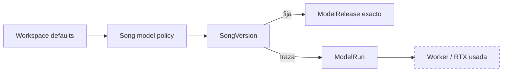
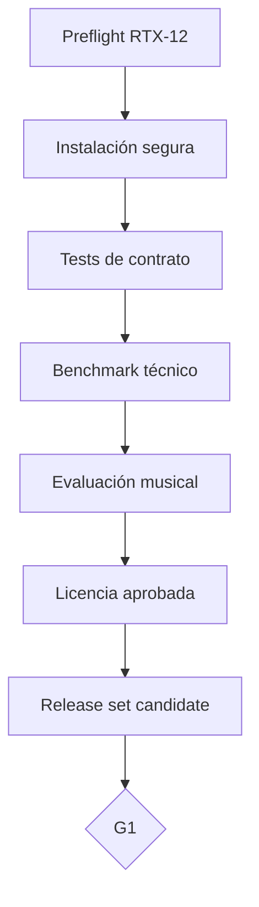
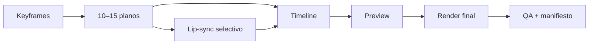
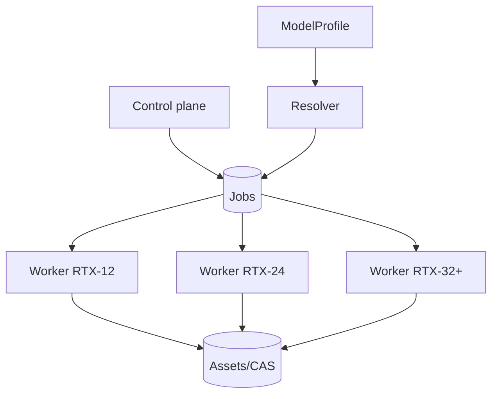
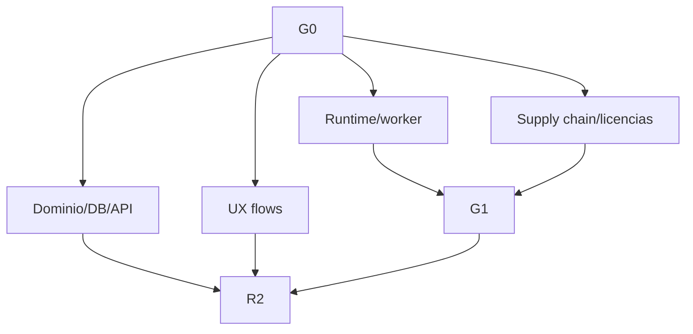

# Roadmap RTX audiovisual v4

Fecha de corte: **2026-09-18**  
Estado inicial: **todo pendiente**  
Hardware de referencia: **NVIDIA GeForce RTX 5070 desktop, 12 GB**  
Ledger canónico: [10-TASKS-RTX-AV-V4.md](10-TASKS-RTX-AV-V4.md)

## 1. Objetivo

Construir un estudio audiovisual local-first por workspaces que permita:

1. generar o importar canciones;
2. elegir un modelo/perfil musical como en una experiencia tipo Suno;
3. conservar versiones inmutables y su linaje;
4. crear visualizers, lyric videos y videoclips por planos;
5. ejecutar cada job en cualquier RTX compatible;
6. instalar, evaluar, promover y revertir modelos sin migrar proyectos;
7. añadir ordenadores con RTX superiores mediante workers.

## 2. Principio rector



La canción no está asociada a la RTX. El usuario selecciona modelo o perfil; resolver y scheduler seleccionan release y hardware.

## 3. Resumen de fases

| Fase | Objetivo | Tareas | Horas base | Gate |
|---|---|---:|---:|---|
| R0 | Contrato de producto, dominio y gobernanza | 8 | 52 h | `G0-PRODUCTO` |
| R1 | Runtime RTX, Model Manager, resolver y bake-off musical | 14 | 166 h | `G1-MODELOS-RTX12` |
| R2 | Workspace musical y selección de modelos | 14 | 166 h | `G2-MUSICA-WORKSPACE` |
| R3 | Análisis audiovisual y planificación | 10 | 122 h | `G3-PLANIFICACION-VISUAL` |
| R4 | Viabilidad de vídeo en RTX-12 | 13 | 194 h | `G4-VIDEO-RTX12` |
| R5 | MVP audiovisual integrado | 13 | 182 h | `G5-MVP-AUDIOVISUAL` |
| R6 | Multiworker, RTX superiores y evolución de modelos | 10 | 152 h | `G6-MULTIWORKER` |
| R7 | Hardening y beta local | 12 | 178 h | `G7-BETA` |
| **Total** |  | **94** | **1.212 h** |  |

**MVP hasta R5: 882 h base.** Aplicar una reserva explícita de riesgo; estas horas no son un compromiso contractual.

## 4. Ruta crítica

```mermaid
flowchart LR
    R0[R0 Contrato] --> G0{G0}
    G0 -->|go| R1[R1 Runtime + modelos]
    R1 --> G1{G1}
    G1 -->|go| R2[R2 Workspace musical]
    R2 --> G2{G2}
    G2 -->|go| R3[R3 Planificación visual]
    R3 --> G3{G3}
    G3 -->|go| R4[R4 Vídeo RTX-12]
    R4 --> G4{G4}
    G4 -->|go| R5[R5 MVP integrado]
    R5 --> G5{G5}
    G5 -->|go| R6[R6 Multiworker/evolución]
    R6 --> G6{G6}
    G6 -->|go| R7[R7 Hardening/beta]
    R7 --> G7{G7}
```



Cada gate termina en `go`, `rework` o `no-go`. No se salta un gate mediante mocks, código existente o tareas marcadas previamente como completadas.

## 5. R0 — contrato de producto, dominio y gobernanza

### Resultado

Una especificación aprobada antes de implementar el producto.

### Incluye

- declarar v4 como única fuente canónica;
- visión, usuarios y modos audiovisuales;
- hardware/runtime inicial;
- política de licencias y supply chain;
- dominio de workspaces y versionado;
- contrato de selección de modelos independiente del hardware;
- ADRs y cierre del gate.

### Gate `G0-PRODUCTO`

Debe probar que:

- `Song` no contiene FK a GPU/worker;
- la selección `inherit|auto|pinned_profile|pinned_release` está definida;
- `SongVersion` y `ModelRun` tienen responsabilidades separadas;
- el alcance MVP y fuera de alcance están aprobados;
- existe política de modelos/licencias/territorios;
- la arquitectura control-plane/worker está decidida.

## 6. R1 — runtime RTX, Model Manager, resolver y bake-off

### Resultado

Capacidad de instalar releases de forma segura, resolver perfiles, ejecutar adaptadores sobre RTX-12 y seleccionar el motor musical inicial mediante evidencia.

### Incluye

- preflight RTX/CUDA;
- worker y snapshot de capacidades;
- protocolo de adaptadores;
- Model Manager, staging, hashes y runtime aislado;
- `ModelProfile` registry;
- `Model Resolver` y `CompatibilityContract`;
- fake adapters y tests de contrato;
- integración de candidatos musicales;
- benchmark técnico y evaluación artística;
- promoción mediante release set y rollback.

### Gate `G1-MODELOS-RTX12`



No se considera superado si solo existe una demo favorable. Deben evaluarse todos los outputs del corpus.

## 7. R2 — workspace musical y selección de modelos

### Resultado

Flujo extremo a extremo:

```text
Workspace → Song → elegir/heredar modelo → Job → RTX compatible
→ SongVersion → reproducir, comparar, descargar y trazar
```

### Incluye

- CRUD de workspaces;
- defaults de modelo por workspace;
- canción y política de modelo;
- selector de modelos/perfiles;
- generaciones e importaciones;
- cola durable, cancelación y reintentos;
- CAS y manifiestos;
- linaje entre versiones y ramas cross-model;
- historial y comparación;
- API/UI mínima;
- gate de reproducibilidad y aislamiento.

### Gate `G2-MUSICA-WORKSPACE`

- crear dos workspaces aislados;
- generar canción con `inherit`;
- generar otra versión con perfil distinto;
- ejecutar en worker compatible sin selección manual de RTX;
- reiniciar aplicación/worker y recuperar estado;
- verificar manifiesto, modelo y GPU efectivos;
- importar WAV sin atribuirle un modelo falso.

## 8. R3 — análisis audiovisual y planificación

### Resultado

Una `SongVersion` puede convertirse en un plan audiovisual editable antes de gastar cómputo de vídeo.

### Incluye

- normalización y análisis de audio;
- beats, compases, secciones y energía;
- letra/timestamps y edición;
- VisualBrief y VisualBible;
- storyboard versionado;
- shot list y validación temporal;
- estimación de recursos/coste;
- UI de planificación.

### Gate `G3-PLANIFICACION-VISUAL`

Un proyecto de prueba debe cubrir toda la canción con un storyboard consistente, shots válidos, referencias autorizadas y estimaciones sin ejecutar todavía el generador de vídeo final.

## 9. R4 — viabilidad de vídeo en RTX-12

### Resultado

Demostrar en la RTX 5070 real que el producto puede generar y montar planos cortos con una UX aceptable y recuperación robusta.

### Incluye

- adaptador de imagen/keyframes;
- benchmark de identidad y referencias;
- adaptador I2V de planos cortos;
- preview-first;
- lip-sync challengers;
- timeline y FFmpeg/NVENC;
- campañas OOM/cancelación/reinicio;
- vertical slice de unos 60 segundos;
- decisión `go/rework/no-go` del modo cinematográfico/performer.

### Gate `G4-VIDEO-RTX12`



El visualizer/lyric puede avanzar aunque un modelo cinematográfico no supere el gate; la aplicación debe degradar por producto explícito, no de forma silenciosa.

## 10. R5 — MVP audiovisual integrado

### Resultado

Aplicación utilizable localmente para:

- crear workspaces;
- generar/importar música;
- seleccionar modelos;
- crear visualizers y lyric videos;
- crear videoclip por storyboard/planos;
- revisar/regenerar shots;
- renderizar 16:9 y 9:16;
- exportar audio/vídeo y manifiestos;
- actualizar/rollback del release set.

### Gate `G5-MVP-AUDIOVISUAL`

Debe completarse un flujo real de principio a fin, tras reinicios controlados, sin intervención manual en base de datos ni rutas internas.

## 11. R6 — multiworker, RTX superiores y evolución

### Resultado

Añadir un segundo ordenador/GPU y nuevos modelos sin cambiar entidades de producto.

### Incluye

- identidad y autenticación de workers;
- transferencia/verificación de assets;
- scheduler por capabilities y snapshots;
- instalación distribuida de release sets;
- perfiles RTX-16/24/32+;
- benchmark por nueva GPU/runtime;
- modelos mayores detrás de perfiles;
- canary/rollback multiworker;
- prueba explícita de sustitución de GPU sin migrar workspaces.



### Gate `G6-MULTIWORKER`

Una canción creada antes del segundo worker debe poder generar una nueva versión en la GPU nueva manteniendo:

- mismo workspace/song;
- selección de modelo explícita;
- nuevo `ModelRun` y `WorkerSnapshot`;
- versiones antiguas intactas;
- resultados y benchmark trazables.

## 12. R7 — hardening y beta local

### Resultado

Beta instalable, recuperable y operable.

### Incluye

- soak tests y campañas de fallos;
- aislamiento de workspaces;
- backup/restore;
- SBOM y scans;
- retención y garbage collection segura;
- export de diagnósticos;
- límites térmicos/disco;
- actualización y rollback de app/modelos;
- runbooks;
- matriz de hardware beta;
- cierre de riesgos.

### Gate `G7-BETA`

No basta con “funciona en la máquina de desarrollo”. Debe existir evidencia de instalación limpia, restauración, actualización, rollback y operación prolongada.

## 13. Paralelización permitida

Tras G0:



Puede avanzarse en mocks/UI y contratos mientras se hace el bake-off, pero no declarar modelos productivos ni cerrar R2 sin G1.

## 14. Prohibiciones de secuencia

No se debe:

- construir cloud/Kubernetes antes del MVP local;
- vincular canciones a workers/GPU;
- promover modelos antes de hash, licencia, smoke, benchmark y evaluación;
- implementar varios motores productivos sin gap medido;
- iniciar entrenamiento/LoRA antes de definir dataset, consentimiento y objetivo;
- generar videoclips monolíticos de varios minutos;
- ocultar fallbacks de modelo/calidad;
- considerar `done` un código que no tiene evidencia del gate.

## 15. Backlog fuera de la ruta crítica

- SaaS público y facturación;
- SSO/TOTP empresarial;
- alta disponibilidad;
- Kubernetes;
- entrenamiento fundacional;
- clonación de voz;
- marketplace de modelos;
- edición colaborativa en tiempo real;
- C2PA/WORM completos;
- publicación directa a plataformas;
- app móvil nativa.

Cada elemento requiere decisión y plan propios; no entra por arrastre en el MVP.

## 16. Definición global de terminado

Una tarea solo está completada cuando:

1. cumple todos los criterios de aceptación;
2. tiene pruebas y evidencia enlazada;
3. no viola las invariantes v4;
4. actualiza documentación/schemas cuando corresponda;
5. no deja secretos, revisiones flotantes ni licencias sin revisar;
6. pasa revisión;
7. el gate correspondiente acepta el resultado.
