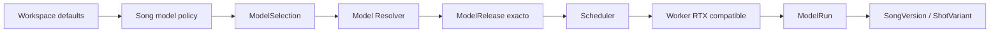

# Ledger canónico — tareas RTX audiovisual v4

Fecha: **2026-09-18**  
Estado inicial: **todas las tareas `pendiente`**

> Este ledger sustituye el progreso de todos los planes anteriores. La existencia de código, tests o documentación previa no completa una tarea. Cada criterio requiere evidencia nueva sobre la arquitectura v4.

## Resumen

| Fase | Tareas | Horas | Gate | Estado inicial |
|---|---:|---:|---|---|
| R0 | 8 | 52 h | `G0-PRODUCTO` | pendiente |
| R1 | 14 | 166 h | `G1-MODELOS-RTX12` | pendiente |
| R2 | 14 | 166 h | `G2-MUSICA-WORKSPACE` | pendiente |
| R3 | 10 | 122 h | `G3-PLANIFICACION-VISUAL` | pendiente |
| R4 | 13 | 194 h | `G4-VIDEO-RTX12` | pendiente |
| R5 | 13 | 182 h | `G5-MVP-AUDIOVISUAL` | pendiente |
| R6 | 10 | 152 h | `G6-MULTIWORKER` | pendiente |
| R7 | 12 | 178 h | `G7-BETA` | pendiente |

**Total base: 1212 h. Total hasta MVP R5: 882 h.**

## Invariante transversal



- Workspace y Song expresan preferencia o política de modelo.
- Una versión fija el release realmente resuelto.
- Job/ModelRun registran worker, GPU y runtime.
- Ninguna entidad creativa se vincula a una RTX concreta.
- Cambiar de GPU o añadir workers no requiere migrar workspaces, canciones ni vídeos.

## Estados

```text
pendiente → en-progreso → en-revision → completado
```

Un gate termina en `go`, `rework` o `no-go`. `completado` exige criterios marcados y evidencia enlazada.

## R0 · Reset, contrato de producto y gobernanza

**Objetivo:** Aprobar el alcance audiovisual, los workspaces, la política de modelos y las fronteras de seguridad antes de programar el producto.

**Gate:** `G0-PRODUCTO`

### AV-001 · Declarar v4 canónico y archivar roadmaps anteriores

| Campo | Valor |
|---|---|
| Estado | `pendiente` |
| Tipo | `docs` |
| Estimación base | 3 h |
| Dependencias | — |

**Propósito:** Establecer una única fuente de verdad sin borrar el histórico.

**Criterios de aceptación**

- [ ] Marcar los roadmaps original, v2 y v3 como `superseded` sin heredar progreso.
- [ ] Actualizar el índice de roadmap y `CLAUDE.md` para apuntar al ledger v4.
- [ ] Verificar que ninguna automatización consume los `tasks.md` anteriores como estado vigente.

**Evidencia obligatoria:** diff/commit, comandos o procedimiento, resultados de pruebas, métricas relevantes y enlaces a artefactos/manifests.

### AV-002 · Fijar visión, usuarios y modos del estudio audiovisual

| Campo | Valor |
|---|---|
| Estado | `pendiente` |
| Tipo | `product` |
| Estimación base | 8 h |
| Dependencias | AV-001 |

**Propósito:** Definir el producto como estudio local-first de música y videoclips por workspaces.

**Criterios de aceptación**

- [ ] Documentar los flujos de canción generada, WAV importado y vídeo derivado.
- [ ] Definir los modos visualizer/lyric, cinematográfico y performer.
- [ ] Declarar fuera de alcance del MVP: entrenamiento fundacional, SaaS público, clonación de voz y render monolítico de una canción completa.

**Evidencia obligatoria:** diff/commit, comandos o procedimiento, resultados de pruebas, métricas relevantes y enlaces a artefactos/manifests.

### AV-003 · Contrato de hardware y runtime Windows/WSL2/Docker/RTX

| Campo | Valor |
|---|---|
| Estado | `pendiente` |
| Tipo | `architecture` |
| Estimación base | 6 h |
| Dependencias | AV-001 |

**Propósito:** Fijar RTX 5070 desktop de 12 GB como referencia sin impedir RTX superiores.

**Criterios de aceptación**

- [ ] Definir Windows 11, WSL2/Linux, Docker y NVIDIA Container Toolkit como ruta soportada inicial.
- [ ] Documentar que el driver NVIDIA se administra en Windows y el runtime CUDA queda fijado en contenedores.
- [ ] Definir perfiles por capacidad/VRAM y no por nombre comercial de GPU.

**Evidencia obligatoria:** diff/commit, comandos o procedimiento, resultados de pruebas, métricas relevantes y enlaces a artefactos/manifests.

### AV-004 · Política de modelos, licencias y territorios

| Campo | Valor |
|---|---|
| Estado | `pendiente` |
| Tipo | `legal-mlops` |
| Estimación base | 8 h |
| Dependencias | AV-001, AV-002 |

**Propósito:** Impedir que un checkpoint se use por popularidad sin una ficha jurídica y técnica.

**Criterios de aceptación**

- [ ] Separar licencias de código, pesos, datasets, componentes auxiliares y outputs.
- [ ] Definir estados `allowed`, `review_required`, `noncommercial`, `territory_blocked` y `prohibited`.
- [ ] Exigir reverificación de licencia y territorio antes de cada promoción o release.

**Evidencia obligatoria:** diff/commit, comandos o procedimiento, resultados de pruebas, métricas relevantes y enlaces a artefactos/manifests.

### AV-005 · Política de cadena de suministro y ejecución segura

| Campo | Valor |
|---|---|
| Estado | `pendiente` |
| Tipo | `security` |
| Estimación base | 6 h |
| Dependencias | AV-003, AV-004 |

**Propósito:** Controlar descargas, código remoto, formatos de pesos y conectividad de inferencia.

**Criterios de aceptación**

- [ ] Definir hashes, staging atómico, cuarentena y formatos permitidos; rechazar artefactos no declarados.
- [ ] Deshabilitar `trust_remote_code` y pickle por defecto con proceso formal de excepción.
- [ ] Separar modo actualización con egress de modo inferencia offline/sin red.

**Evidencia obligatoria:** diff/commit, comandos o procedimiento, resultados de pruebas, métricas relevantes y enlaces a artefactos/manifests.

### AV-006 · Contrato de dominio, workspaces y versionado inmutable

| Campo | Valor |
|---|---|
| Estado | `pendiente` |
| Tipo | `architecture` |
| Estimación base | 8 h |
| Dependencias | AV-002 |

**Propósito:** Definir entidades y reglas que sobrevivan a cambios de modelos y GPUs.

**Criterios de aceptación**

- [ ] Definir Workspace, Song, SongVersion, VideoProject, VideoVersion, Shot, Asset, Job, Worker y ModelRelease.
- [ ] Obligar a que VideoProject apunte a `song_version_id`, no a una canción mutable.
- [ ] Definir linaje, hashes, borrado lógico y referencias por workspace sobre almacenamiento deduplicado.

**Evidencia obligatoria:** diff/commit, comandos o procedimiento, resultados de pruebas, métricas relevantes y enlaces a artefactos/manifests.

### AV-007 · ADR de arquitectura y cierre G0-PRODUCTO

| Campo | Valor |
|---|---|
| Estado | `pendiente` |
| Tipo | `architecture` |
| Estimación base | 5 h |
| Dependencias | AV-003, AV-004, AV-005, AV-006, AV-008 |

**Propósito:** Aprobar una arquitectura control-plane/worker antes de iniciar implementación.

**Criterios de aceptación**

- [ ] Publicar ADRs para cola SQL, CAS, adaptadores, Model Manager, aislamiento y multiworker.
- [ ] Registrar decisiones abiertas, riesgos y propietario de cada una.
- [ ] Cerrar G0 como `go`, `rework` o `no-go` con acta y evidencias enlazadas.

**Evidencia obligatoria:** diff/commit, comandos o procedimiento, resultados de pruebas, métricas relevantes y enlaces a artefactos/manifests.


### AV-008 · Contrato de selección de modelos independiente del hardware

| Campo | Valor |
|---|---|
| Estado | `pendiente` |
| Tipo | `architecture-product` |
| Estimación base | 8 h |
| Dependencias | AV-002, AV-003, AV-006 |

**Propósito:** Formalizar que el usuario selecciona un modelo/perfil y que el scheduler asigna automáticamente una RTX compatible.

**Criterios de aceptación**

- [ ] Definir `ModelFamily`, `ModelRelease`, `ModelProfile`, `ExecutionProfile`, `WorkerProfile` y `ModelSelectionPolicy` sin solapamientos.
- [ ] Definir las políticas `inherit`, `auto`, `pinned_profile` y `pinned_release`, su precedencia Workspace → Song → generación/Shot y sus permisos.
- [ ] Prohibir `worker_id`, `gpu_id` o nombre de GPU como identidad o dependencia obligatoria de Workspace, Song, SongVersion, VideoProject o Shot.
- [ ] Documentar que `SongVersion` fija el release resuelto y `ModelRun` registra worker/GPU/runtime efectivos.
- [ ] Definir qué operaciones derivadas requieren misma familia, release o adapter mediante `CompatibilityContract`.
- [ ] Añadir diagramas Mermaid y ejemplos de API/DB que permitan a agentes implementar sin reinterpretar la regla.

**Evidencia obligatoria:** ADR aprobado, schemas, pruebas estructurales de invariantes y enlaces a documentación canónica.

## R1 · Runtime RTX, Model Manager y bake-off musical

**Objetivo:** Disponer de workers detectables, modelos instalables de forma segura, adaptadores sustituibles y una selección musical reproducible sobre RTX 5070.

**Gate:** `G1-MODELOS-RTX12`

### AV-010 · Herramienta de preflight RTX/CUDA

| Campo | Valor |
|---|---|
| Estado | `pendiente` |
| Tipo | `devops` |
| Estimación base | 8 h |
| Dependencias | AV-003, AV-005 |

**Propósito:** Detectar la capacidad real del host y fallar con diagnósticos accionables.

**Criterios de aceptación**

- [ ] Emitir JSON con GPU/UUID, compute capability, VRAM, driver, CUDA, PyTorch, cuDNN, BF16/FP16/TF32 y disco.
- [ ] Probar acceso GPU desde WSL y desde un contenedor fijado por digest.
- [ ] Distinguir errores bloqueantes de advertencias mediante códigos de salida estables y fixtures de varias GPUs.

**Evidencia obligatoria:** diff/commit, comandos o procedimiento, resultados de pruebas, métricas relevantes y enlaces a artefactos/manifests.

### AV-011 · Protocolo y agente de worker GPU

| Campo | Valor |
|---|---|
| Estado | `pendiente` |
| Tipo | `backend` |
| Estimación base | 10 h |
| Dependencias | AV-003, AV-006, AV-007 |

**Propósito:** Crear una unidad de ejecución que pueda vivir en la máquina local o en otro ordenador.

**Criterios de aceptación**

- [ ] Registrar identidad, hardware, runtime, modelos instalados, capacidad libre y heartbeat.
- [ ] Implementar claim, progreso, cancelación, finalización y recuperación de trabajos.
- [ ] No exponer directamente el proceso de inferencia a la red de usuario.

**Evidencia obligatoria:** diff/commit, comandos o procedimiento, resultados de pruebas, métricas relevantes y enlaces a artefactos/manifests.

### AV-012 · Resolver de capacidades y scheduler inicial

| Campo | Valor |
|---|---|
| Estado | `pendiente` |
| Tipo | `backend` |
| Estimación base | 12 h |
| Dependencias | AV-010, AV-011 |

**Propósito:** Asignar cada trabajo según capacidad, no según un hostname o modelo de GPU fijo.

**Criterios de aceptación**

- [ ] Resolver capability, versión de modelo, VRAM, dtype, licencia, disco y afinidad de assets.
- [ ] Explicar por qué un trabajo fue asignado o rechazado mediante una decisión persistida.
- [ ] Garantizar una sola tarea GPU pesada simultánea en el perfil RTX-12.

**Evidencia obligatoria:** diff/commit, comandos o procedimiento, resultados de pruebas, métricas relevantes y enlaces a artefactos/manifests.

### AV-013 · Esquema de Model Package y Adapter Manifest

| Campo | Valor |
|---|---|
| Estado | `pendiente` |
| Tipo | `mlops` |
| Estimación base | 8 h |
| Dependencias | AV-004, AV-005, AV-006 |

**Propósito:** Convertir cada modelo y adaptador en unidades versionadas, verificables y sustituibles.

**Criterios de aceptación**

- [ ] Validar manifiestos contra JSON Schema versionado.
- [ ] Incluir origen, revisión, hashes, runtime, hardware, licencia, capacidades, seguridad y pruebas.
- [ ] Prohibir identificadores flotantes como `latest` en release sets productivos.

**Evidencia obligatoria:** diff/commit, comandos o procedimiento, resultados de pruebas, métricas relevantes y enlaces a artefactos/manifests.

### AV-014 · Descargador seguro, caché global y montaje read-only

| Campo | Valor |
|---|---|
| Estado | `pendiente` |
| Tipo | `mlops` |
| Estimación base | 10 h |
| Dependencias | AV-005, AV-013 |

**Propósito:** Descargar una vez, verificar y compartir modelos entre workspaces sin duplicarlos.

**Criterios de aceptación**

- [ ] Implementar descarga reanudable a staging y promoción atómica tras validar tamaño y SHA-256.
- [ ] Montar artefactos de modelos como solo lectura durante inferencia.
- [ ] Probar modo offline y garbage collection que respete release sets y trabajos históricos.

**Evidencia obligatoria:** diff/commit, comandos o procedimiento, resultados de pruebas, métricas relevantes y enlaces a artefactos/manifests.

### AV-015 · SDK y contrato de adaptadores por capability

| Campo | Valor |
|---|---|
| Estado | `pendiente` |
| Tipo | `backend` |
| Estimación base | 12 h |
| Dependencias | AV-006, AV-013 |

**Propósito:** Evitar que dominio, API y UI conozcan detalles de ACE-Step, LTX u otro upstream.

**Criterios de aceptación**

- [ ] Definir health, capabilities, validate, estimate, load, run, cancel, unload y normalize_result.
- [ ] Versionar schemas de parámetros y resultados por capability.
- [ ] Crear adapter falso determinista para pruebas sin GPU.

**Evidencia obligatoria:** diff/commit, comandos o procedimiento, resultados de pruebas, métricas relevantes y enlaces a artefactos/manifests.

### AV-016 · Registro de modelos y release sets reproducibles

| Campo | Valor |
|---|---|
| Estado | `pendiente` |
| Tipo | `mlops` |
| Estimación base | 8 h |
| Dependencias | AV-013, AV-014 |

**Propósito:** Fijar combinaciones exactas de modelos, adapters y runtimes por release.

**Criterios de aceptación**

- [ ] Persistir ModelFamily, ModelRelease, AdapterRelease, RuntimeRelease y ReleaseSet.
- [ ] Registrar canal `lab`, `candidate`, `stable`, `deprecated` o `blocked`.
- [ ] Permitir mantener varias versiones instaladas y seleccionar una versión antigua para reproducir proyectos.

**Evidencia obligatoria:** diff/commit, comandos o procedimiento, resultados de pruebas, métricas relevantes y enlaces a artefactos/manifests.

### AV-017 · Ciclo instalar–verificar–benchmark–promover–rollback

| Campo | Valor |
|---|---|
| Estado | `pendiente` |
| Tipo | `mlops` |
| Estimación base | 12 h |
| Dependencias | AV-014, AV-016 |

**Propósito:** Hacer que una actualización de modelo sea reversible y basada en evidencia.

**Criterios de aceptación**

- [ ] Implementar estados de instalación, cuarentena, smoke test, benchmark, promoción, deprecación y rollback.
- [ ] Impedir promoción sin ficha de licencia, hashes y resultados del perfil objetivo.
- [ ] Conservar la versión anterior hasta superar ventana de observación y prueba de rollback.

**Evidencia obligatoria:** diff/commit, comandos o procedimiento, resultados de pruebas, métricas relevantes y enlaces a artefactos/manifests.

### AV-018 · Telemetría GPU y guardas de recursos

| Campo | Valor |
|---|---|
| Estado | `pendiente` |
| Tipo | `observability` |
| Estimación base | 8 h |
| Dependencias | AV-010, AV-011 |

**Propósito:** Evitar OOM, sobrecalentamiento, disco agotado y fallos silenciosos.

**Criterios de aceptación**

- [ ] Medir VRAM pico, utilización, temperatura, potencia cuando esté disponible, RAM, disco y duración por paso.
- [ ] Aplicar límites configurables con cancelación ordenada y enfriamiento.
- [ ] Persistir configuración efectiva y motivo de cualquier fallback.

**Evidencia obligatoria:** diff/commit, comandos o procedimiento, resultados de pruebas, métricas relevantes y enlaces a artefactos/manifests.

### AV-019 · Adaptador musical ACE-Step fijado

| Campo | Valor |
|---|---|
| Estado | `pendiente` |
| Tipo | `mlops` |
| Estimación base | 16 h |
| Dependencias | AV-014, AV-015, AV-016, AV-018 |

**Propósito:** Integrar el candidato principal sin fork profundo ni acoplamiento al dominio.

**Criterios de aceptación**

- [ ] Fijar revisión de código, pesos, LM, imagen y dependencias en un Model Package.
- [ ] Soportar al menos texto/letra a canción, instrumental, semillas y descarga/cancelación si el upstream lo permite.
- [ ] Validar perfiles 0.6B y 1.7B por benchmark real en la RTX 5070 antes de declarar compatibilidad.

**Evidencia obligatoria:** diff/commit, comandos o procedimiento, resultados de pruebas, métricas relevantes y enlaces a artefactos/manifests.

### AV-020 · Spikes musicales HeartMuLa y DiffRhythm2

| Campo | Valor |
|---|---|
| Estado | `pendiente` |
| Tipo | `mlops` |
| Estimación base | 20 h |
| Dependencias | AV-014, AV-015, AV-016, AV-018 |

**Propósito:** Comparar challengers sin convertirlos prematuramente en dependencias productivas.

**Criterios de aceptación**

- [ ] Crear adapters de laboratorio o harness equivalentes con revisiones y licencias fijadas.
- [ ] Medir calidad, español/inglés, letra, tiempo, VRAM, estabilidad y formatos de salida.
- [ ] Documentar incompatibilidades de dependencias y decidir integrar, mantener en lab o descartar.

**Evidencia obligatoria:** diff/commit, comandos o procedimiento, resultados de pruebas, métricas relevantes y enlaces a artefactos/manifests.

### AV-021 · Bake-off musical y cierre G1-MODELOS-RTX12

| Campo | Valor |
|---|---|
| Estado | `pendiente` |
| Tipo | `quality` |
| Estimación base | 16 h |
| Dependencias | AV-017, AV-018, AV-019, AV-020, AV-022, AV-023 |

**Propósito:** Seleccionar configuración musical por corpus reproducible y no por demos elegidas.

**Criterios de aceptación**

- [ ] Ejecutar 12 briefs × 3 semillas por candidato/configuración y conservar todos los outputs.
- [ ] Aplicar evaluación técnica y escucha estructurada sin cherry-picking.
- [ ] Publicar matriz soportada, configuración estable RTX-12 y decisión `go/rework/no-go`.

**Evidencia obligatoria:** diff/commit, comandos o procedimiento, resultados de pruebas, métricas relevantes y enlaces a artefactos/manifests.


### AV-022 · Registro de ModelProfiles y resolver explicable

| Campo | Valor |
|---|---|
| Estado | `pendiente` |
| Tipo | `mlops-domain` |
| Estimación base | 14 h |
| Dependencias | AV-012, AV-013, AV-015, AV-016 |

**Propósito:** Convertir perfiles visibles al usuario en releases exactos compatibles, autorizados y medidos sin fijar el worker físico.

**Criterios de aceptación**

- [ ] Persistir `ModelProfile` versionado con display name, capabilities, quality tier, reglas de resolución, visibilidad y execution profile por defecto.
- [ ] Implementar precedencia de selección y resolución determinista sobre canales, licencia, territorio, capabilities y benchmarks.
- [ ] Producir `decision_trace` y endpoint dry-run/preview que expliquen por qué se eligió o rechazó un release.
- [ ] Impedir revisiones flotantes y fallbacks silenciosos de familia, calidad, duración, resolución o precisión.
- [ ] Separar completamente la resolución del modelo de la asignación posterior de worker.
- [ ] Cubrir con unit tests, property tests y fake catalog los casos `inherit`, `auto`, `pinned_profile`, `pinned_release`, deprecated y blocked.

**Evidencia obligatoria:** migrations/schemas, tests del resolver, ejemplos de trazas y prueba de que el resultado no contiene `worker_id`.

### AV-023 · Contratos de compatibilidad para operaciones derivadas

| Campo | Valor |
|---|---|
| Estado | `pendiente` |
| Tipo | `architecture-mlops` |
| Estimación base | 12 h |
| Dependencias | AV-015, AV-022 |

**Propósito:** Evitar que extend, repaint, cover, LoRA, lip-sync o continuaciones crucen modelos incompatibles por suposición.

**Criterios de aceptación**

- [ ] Modelar `CompatibilityContract` por capability/operación con requisitos de familia, release, adapter major, estados internos y artefactos fuente.
- [ ] Validar compatibilidad antes de crear el Job; rechazar con error normalizado y alternativas explícitas.
- [ ] Permitir reinterpretación cross-model como nueva rama cuando la operación no requiera continuidad interna.
- [ ] Guardar versión del contrato y decisión en `ModelResolution`/manifest.
- [ ] Añadir contract tests para compatibilidad positiva, negativa y cambios de release.

**Evidencia obligatoria:** schema, matriz de operaciones, tests y ejemplos de error/ramificación.

## R2 · Workspace musical vertical

**Objetivo:** Crear, versionar, reproducir, exportar y recuperar canciones dentro de un workspace sin depender del futuro pipeline de vídeo.

**Gate:** `G2-MUSICA-WORKSPACE`

### AV-030 · Persistencia de workspaces y aislamiento lógico

| Campo | Valor |
|---|---|
| Estado | `pendiente` |
| Tipo | `backend` |
| Estimación base | 12 h |
| Dependencias | AV-006, AV-007 |

**Propósito:** Crear la frontera organizativa principal de toda la aplicación.

**Criterios de aceptación**

- [ ] Implementar CRUD, archivado y configuración del workspace.
- [ ] Exigir `workspace_id` en toda entidad y consulta de negocio.
- [ ] Añadir pruebas negativas que impidan referencias cruzadas entre workspaces.

**Evidencia obligatoria:** diff/commit, comandos o procedimiento, resultados de pruebas, métricas relevantes y enlaces a artefactos/manifests.

### AV-031 · Almacén CAS de assets y referencias por workspace

| Campo | Valor |
|---|---|
| Estado | `pendiente` |
| Tipo | `storage` |
| Estimación base | 12 h |
| Dependencias | AV-005, AV-030 |

**Propósito:** Deduplicar archivos sin perder propiedad lógica ni linaje.

**Criterios de aceptación**

- [ ] Ingerir mediante staging, hash, validación MIME y promoción atómica.
- [ ] Separar blob físico de Asset/AssetReference y metadatos de workspace.
- [ ] Implementar cuotas, referencias, borrado seguro y verificación de integridad.

**Evidencia obligatoria:** diff/commit, comandos o procedimiento, resultados de pruebas, métricas relevantes y enlaces a artefactos/manifests.

### AV-032 · Songs y SongVersions inmutables

| Campo | Valor |
|---|---|
| Estado | `pendiente` |
| Tipo | `backend` |
| Estimación base | 10 h |
| Dependencias | AV-030, AV-031 |

**Propósito:** Conservar cada audio y parámetros como una versión estable.

**Criterios de aceptación**

- [ ] Crear Song como identidad y SongVersion como snapshot inmutable.
- [ ] Registrar padre, seed, prompts, letra, modelo, release set y hashes.
- [ ] Impedir sobrescritura del audio o parámetros de una versión usada por un vídeo.

**Evidencia obligatoria:** diff/commit, comandos o procedimiento, resultados de pruebas, métricas relevantes y enlaces a artefactos/manifests.

### AV-033 · Motor de trabajos durable sobre PostgreSQL

| Campo | Valor |
|---|---|
| Estado | `pendiente` |
| Tipo | `backend` |
| Estimación base | 12 h |
| Dependencias | AV-011, AV-012, AV-030 |

**Propósito:** Persistir ejecución y recuperación sin introducir Redis antes de necesitarlo.

**Criterios de aceptación**

- [ ] Implementar estados, leasing, heartbeat, idempotencia, retry y dead-letter.
- [ ] Recuperar trabajos huérfanos tras reiniciar API, worker o máquina.
- [ ] Registrar JobSteps y eventos ordenados para progreso y diagnóstico.

**Evidencia obligatoria:** diff/commit, comandos o procedimiento, resultados de pruebas, métricas relevantes y enlaces a artefactos/manifests.

### AV-034 · API de workspaces, canciones y generaciones

| Campo | Valor |
|---|---|
| Estado | `pendiente` |
| Tipo | `api` |
| Estimación base | 12 h |
| Dependencias | AV-032, AV-033 |

**Propósito:** Exponer un contrato estable para web y futuros clientes.

**Criterios de aceptación**

- [ ] Implementar endpoints versionados con idempotency key y validación estricta.
- [ ] No exponer rutas físicas, comandos ni parámetros internos de adapters.
- [ ] Generar OpenAPI y pruebas de contrato de errores y paginación.

**Evidencia obligatoria:** diff/commit, comandos o procedimiento, resultados de pruebas, métricas relevantes y enlaces a artefactos/manifests.

### AV-035 · Ejecución musical end-to-end en worker

| Campo | Valor |
|---|---|
| Estado | `pendiente` |
| Tipo | `backend` |
| Estimación base | 14 h |
| Dependencias | AV-019, AV-022, AV-033, AV-034 |

**Propósito:** Conectar un trabajo de dominio con el adapter y persistir el resultado.

**Criterios de aceptación**

- [ ] Resolver release set y perfil efectivo antes de claim.
- [ ] Generar, verificar y almacenar audio/metadata de forma atómica.
- [ ] Liberar GPU y dejar el worker saludable después de éxito, cancelación u OOM.

**Evidencia obligatoria:** diff/commit, comandos o procedimiento, resultados de pruebas, métricas relevantes y enlaces a artefactos/manifests.

### AV-036 · UI musical del workspace

| Campo | Valor |
|---|---|
| Estado | `pendiente` |
| Tipo | `frontend` |
| Estimación base | 16 h |
| Dependencias | AV-034, AV-035 |

**Propósito:** Permitir crear y revisar canciones desde el workspace.

**Criterios de aceptación**

- [ ] Implementar selector de workspace, formulario, cola, progreso e historial.
- [ ] Mostrar modelo/configuración efectiva y errores accionables.
- [ ] Mantener navegación y reproductor sin mezclar datos de otros workspaces.

**Evidencia obligatoria:** diff/commit, comandos o procedimiento, resultados de pruebas, métricas relevantes y enlaces a artefactos/manifests.

### AV-037 · Editor de letra, estilo, presets y modo instrumental

| Campo | Valor |
|---|---|
| Estado | `pendiente` |
| Tipo | `frontend-backend` |
| Estimación base | 10 h |
| Dependencias | AV-032, AV-034 |

**Propósito:** Dar control musical sin filtrar parámetros no soportados al motor.

**Criterios de aceptación**

- [ ] Definir esquema normalizado de letra, secciones, estilo y restricciones.
- [ ] Validar cada parámetro contra capabilities del ModelRelease seleccionado.
- [ ] Guardar presets por workspace y separar instrumental de letra vacía accidental.

**Evidencia obligatoria:** diff/commit, comandos o procedimiento, resultados de pruebas, métricas relevantes y enlaces a artefactos/manifests.

### AV-038 · Reproductor, postproceso y exportación de audio

| Campo | Valor |
|---|---|
| Estado | `pendiente` |
| Tipo | `audio` |
| Estimación base | 12 h |
| Dependencias | AV-031, AV-035 |

**Propósito:** Entregar audio reproducible y exportable sin destruir el master.

**Criterios de aceptación**

- [ ] Conservar master WAV/FLAC y producir derivados MP3/WAV con FFmpeg fijado.
- [ ] Registrar resampling, normalización y hashes de entrada/salida.
- [ ] Probar reproducción por rangos y descarga con nombres seguros.

**Evidencia obligatoria:** diff/commit, comandos o procedimiento, resultados de pruebas, métricas relevantes y enlaces a artefactos/manifests.

### AV-039 · Linaje y manifiesto técnico de generación

| Campo | Valor |
|---|---|
| Estado | `pendiente` |
| Tipo | `provenance` |
| Estimación base | 10 h |
| Dependencias | AV-016, AV-032, AV-035 |

**Propósito:** Saber exactamente cómo se produjo cada SongVersion.

**Criterios de aceptación**

- [ ] Registrar código, contenedor, modelos, GPU, runtime, precisión, seed, parámetros, tiempos y hashes.
- [ ] Diferenciar trazabilidad técnica de acreditación jurídica.
- [ ] Proporcionar export JSON validado contra esquema versionado.

**Evidencia obligatoria:** diff/commit, comandos o procedimiento, resultados de pruebas, métricas relevantes y enlaces a artefactos/manifests.

### AV-040 · Cancelación, reintento y recuperación musical

| Campo | Valor |
|---|---|
| Estado | `pendiente` |
| Tipo | `reliability` |
| Estimación base | 12 h |
| Dependencias | AV-033, AV-035 |

**Propósito:** Evitar duplicados y workers rotos ante fallos reales.

**Criterios de aceptación**

- [ ] Cancelar cooperativamente y forzar terminación con timeout controlado.
- [ ] Reintentar solo errores clasificados como recuperables y conservar intentos.
- [ ] Probar reinicio durante descarga, carga, inferencia y persistencia.

**Evidencia obligatoria:** diff/commit, comandos o procedimiento, resultados de pruebas, métricas relevantes y enlaces a artefactos/manifests.

### AV-041 · Vertical slice musical y cierre G2-MUSICA-WORKSPACE

| Campo | Valor |
|---|---|
| Estado | `pendiente` |
| Tipo | `gate` |
| Estimación base | 8 h |
| Dependencias | AV-021, AV-036, AV-037, AV-038, AV-039, AV-040, AV-042, AV-043 |

**Propósito:** Aceptar la primera entrega de producto antes de añadir vídeo.

**Criterios de aceptación**

- [ ] Demostrar workspace → canción → versión → reproducción → export → repetición por seed.
- [ ] Superar pruebas de aislamiento, reinicio y manifiesto en RTX 5070.
- [ ] Cerrar G2 con evidencias, limitaciones conocidas y decisión formal.

**Evidencia obligatoria:** diff/commit, comandos o procedimiento, resultados de pruebas, métricas relevantes y enlaces a artefactos/manifests.


### AV-042 · Selector de modelos y políticas Workspace/Song/generación

| Campo | Valor |
|---|---|
| Estado | `pendiente` |
| Tipo | `product-fullstack` |
| Estimación base | 14 h |
| Dependencias | AV-022, AV-030, AV-032, AV-034, AV-036 |

**Propósito:** Ofrecer una experiencia tipo Suno donde el usuario elige modelo/perfil sin gestionar GPUs.

**Criterios de aceptación**

- [ ] Mostrar perfiles disponibles con nombre, estado, capabilities, quality tier y advertencias, sin exponer releases bloqueados.
- [ ] Permitir default por Workspace, política por Song y override por generación con precedencia visible.
- [ ] Mostrar antes de submit el perfil solicitado y, después, el release resuelto; la RTX solo aparece en detalles técnicos del run.
- [ ] Solicitar confirmación explícita al cambiar de familia cuando pueda variar voz, estructura, seed o compatibilidad.
- [ ] Tratar perfiles deprecated como históricos y no como opción predeterminada para nuevas canciones.
- [ ] Añadir accesibilidad, estados vacíos/error y tests UI/API de las cuatro políticas.

**Evidencia obligatoria:** capturas/video de flujo, tests e2e, payloads y prueba de ausencia de selector de GPU en la creación normal.

### AV-043 · Ramas cross-model, linaje y comparador de versiones

| Campo | Valor |
|---|---|
| Estado | `pendiente` |
| Tipo | `domain-fullstack` |
| Estimación base | 12 h |
| Dependencias | AV-023, AV-032, AV-035, AV-039 |

**Propósito:** Permitir probar un modelo nuevo en la misma canción sin sobrescribir versiones ni perder trazabilidad.

**Criterios de aceptación**

- [ ] Crear una `SongVersion` hija para reinterpretación con otro ModelProfile/Release y preservar la fuente.
- [ ] Distinguir retry técnico, nueva semilla, derivación compatible y reinterpretación cross-model.
- [ ] Comparar audio, modelo/perfil, parámetros, seed, duración, latencia y métricas sin declarar ganador automáticamente.
- [ ] Mantener disponibles versiones históricas aunque el release pase a deprecated/removed, según retención.
- [ ] Impedir que una promoción de perfil cambie metadata de versiones ya creadas.

**Evidencia obligatoria:** árbol de linaje, tests de inmutabilidad y e2e de rama entre dos fake adapters/modelos.

## R3 · Análisis audiovisual y planificación

**Objetivo:** Transformar una versión de canción inmutable en brief visual, visual bible, storyboard, shot list y timeline editable.

**Gate:** `G3-PLANIFICACION-VISUAL`

### AV-050 · Importación segura de WAV/FLAC y vínculo a SongVersion

| Campo | Valor |
|---|---|
| Estado | `pendiente` |
| Tipo | `audio` |
| Estimación base | 8 h |
| Dependencias | AV-031, AV-032 |

**Propósito:** Permitir iniciar vídeo desde audio generado o externo con el mismo modelo de dominio.

**Criterios de aceptación**

- [ ] Validar formato, duración, canales, frecuencia, tamaño y contenido real.
- [ ] Crear SongVersion importada con hash y declaración de origen/derechos.
- [ ] Normalizar solo derivados de trabajo; conservar el master original intacto.

**Evidencia obligatoria:** diff/commit, comandos o procedimiento, resultados de pruebas, métricas relevantes y enlaces a artefactos/manifests.

### AV-051 · Análisis temporal de audio

| Campo | Valor |
|---|---|
| Estado | `pendiente` |
| Tipo | `audio-ml` |
| Estimación base | 16 h |
| Dependencias | AV-050 |

**Propósito:** Obtener la estructura necesaria para sincronizar storyboard y montaje.

**Criterios de aceptación**

- [ ] Extraer duración, BPM estimado, beats, compases, energía, silencios y secciones con confianza.
- [ ] Versionar algoritmo y parámetros; permitir corrección manual.
- [ ] Probar estilos con tempo variable y degradar con advertencia, no con datos inventados.

**Evidencia obligatoria:** diff/commit, comandos o procedimiento, resultados de pruebas, métricas relevantes y enlaces a artefactos/manifests.

### AV-052 · Letras sincronizadas y alineación temporal

| Campo | Valor |
|---|---|
| Estado | `pendiente` |
| Tipo | `audio-ml` |
| Estimación base | 12 h |
| Dependencias | AV-050, AV-051 |

**Propósito:** Relacionar letra y tiempo para lyric videos y planificación de performance.

**Criterios de aceptación**

- [ ] Importar LRC cuando exista y generar alineación candidata cuando no.
- [ ] Guardar confianza y permitir edición manual sin modificar el audio.
- [ ] Distinguir palabra, línea, sección y segmentos sin letra.

**Evidencia obligatoria:** diff/commit, comandos o procedimiento, resultados de pruebas, métricas relevantes y enlaces a artefactos/manifests.

### AV-053 · VisualBrief y VisualBible por workspace

| Campo | Valor |
|---|---|
| Estado | `pendiente` |
| Tipo | `product-backend` |
| Estimación base | 12 h |
| Dependencias | AV-030, AV-032 |

**Propósito:** Mantener coherencia visual entre proyectos, versiones y planos.

**Criterios de aceptación**

- [ ] Definir concepto, narrativa, estilo, paleta, restricciones, referencias y negativos.
- [ ] Versionar la visual bible y fijar qué versión utiliza cada VideoProject.
- [ ] Permitir valores globales del workspace y overrides explícitos por vídeo/plano.

**Evidencia obligatoria:** diff/commit, comandos o procedimiento, resultados de pruebas, métricas relevantes y enlaces a artefactos/manifests.

### AV-054 · Personajes, localizaciones y assets de referencia

| Campo | Valor |
|---|---|
| Estado | `pendiente` |
| Tipo | `backend` |
| Estimación base | 10 h |
| Dependencias | AV-031, AV-053 |

**Propósito:** Gestionar identidad visual y material autorizado como entidades reutilizables.

**Criterios de aceptación**

- [ ] Crear Character, Location y ReferenceAsset con consentimientos y restricciones.
- [ ] Guardar versiones, embeddings solo si se autorizan y referencias de origen.
- [ ] Impedir que borrar una referencia rompa proyectos ya fijados.

**Evidencia obligatoria:** diff/commit, comandos o procedimiento, resultados de pruebas, métricas relevantes y enlaces a artefactos/manifests.

### AV-055 · Storyboard versionado

| Campo | Valor |
|---|---|
| Estado | `pendiente` |
| Tipo | `backend-ai` |
| Estimación base | 16 h |
| Dependencias | AV-051, AV-052, AV-053, AV-054 |

**Propósito:** Traducir canción y brief en una propuesta editable, no en ejecución irreversible.

**Criterios de aceptación**

- [ ] Definir StoryboardVersion con secciones, intención, texto y referencias.
- [ ] Permitir generación asistida y edición humana antes de crear trabajos de vídeo.
- [ ] Registrar modelo de planificación y conservar alternativas.

**Evidencia obligatoria:** diff/commit, comandos o procedimiento, resultados de pruebas, métricas relevantes y enlaces a artefactos/manifests.

### AV-056 · Shot list sincronizada con la canción

| Campo | Valor |
|---|---|
| Estado | `pendiente` |
| Tipo | `backend-ai` |
| Estimación base | 12 h |
| Dependencias | AV-051, AV-055 |

**Propósito:** Descomponer el videoclip en unidades pequeñas regenerables.

**Criterios de aceptación**

- [ ] Definir inicio, fin, propósito, prompt, cámara, personajes, assets y transición por shot.
- [ ] Validar cobertura temporal, solapes y huecos de la canción.
- [ ] Limitar duración generativa inicial a rangos configurables, orientativamente 4–8 segundos.

**Evidencia obligatoria:** diff/commit, comandos o procedimiento, resultados de pruebas, métricas relevantes y enlaces a artefactos/manifests.

### AV-057 · Timeline determinista y grafo de composición

| Campo | Valor |
|---|---|
| Estado | `pendiente` |
| Tipo | `video` |
| Estimación base | 12 h |
| Dependencias | AV-031, AV-056 |

**Propósito:** Separar montaje reproducible de inferencia generativa.

**Criterios de aceptación**

- [ ] Representar clips, imágenes, overlays, texto, audio, transiciones y transformaciones.
- [ ] Versionar el timeline y calcular un hash canónico.
- [ ] Renderizar una composición sintética sin modelos para probar el contrato.

**Evidencia obligatoria:** diff/commit, comandos o procedimiento, resultados de pruebas, métricas relevantes y enlaces a artefactos/manifests.

### AV-058 · UI de brief, storyboard, shots y timeline

| Campo | Valor |
|---|---|
| Estado | `pendiente` |
| Tipo | `frontend` |
| Estimación base | 16 h |
| Dependencias | AV-055, AV-056, AV-057 |

**Propósito:** Permitir revisión humana antes de consumir GPU.

**Criterios de aceptación**

- [ ] Editar estructura, duración, prompts, referencias y orden de planos.
- [ ] Mostrar cobertura de canción, warnings y coste/tiempo estimado por capability.
- [ ] Crear snapshots y comparar versiones sin sobreescritura destructiva.

**Evidencia obligatoria:** diff/commit, comandos o procedimiento, resultados de pruebas, métricas relevantes y enlaces a artefactos/manifests.

### AV-059 · Cierre G3-PLANIFICACION-VISUAL

| Campo | Valor |
|---|---|
| Estado | `pendiente` |
| Tipo | `gate` |
| Estimación base | 8 h |
| Dependencias | AV-050, AV-051, AV-052, AV-053, AV-054, AV-055, AV-056, AV-057, AV-058 |

**Propósito:** Confirmar que una canción puede convertirse en un plan audiovisual completo y editable.

**Criterios de aceptación**

- [ ] Crear un proyecto de prueba con brief, bible, storyboard, 10–15 shots y timeline válido.
- [ ] Demostrar que cambiar SongVersion requiere una nueva versión/reesincronización explícita.
- [ ] Cerrar el gate con criterios y evidencias antes de integrar modelos de vídeo.

**Evidencia obligatoria:** diff/commit, comandos o procedimiento, resultados de pruebas, métricas relevantes y enlaces a artefactos/manifests.

## R4 · Viabilidad de vídeo en RTX-12

**Objetivo:** Demostrar keyframes, clips cortos, lip-sync selectivo, visualizer y montaje reproducible dentro de 12 GB de VRAM.

**Gate:** `G4-VIDEO-RTX12`

### AV-070 · Adaptador de imagen y keyframes FLUX.2 Klein 4B

| Campo | Valor |
|---|---|
| Estado | `pendiente` |
| Tipo | `mlops` |
| Estimación base | 16 h |
| Dependencias | AV-014, AV-015, AV-016, AV-018, AV-054 |

**Propósito:** Generar keyframes y editar referencias dentro del perfil RTX-12.

**Criterios de aceptación**

- [ ] Fijar paquete, revisión, licencia, runtime y ruta de precisión probada.
- [ ] Soportar texto a imagen y referencias simples/múltiples solo donde el checkpoint lo permita.
- [ ] Medir VRAM/tiempo/calidad y descargar completamente el modelo antes de la siguiente etapa pesada.

**Evidencia obligatoria:** diff/commit, comandos o procedimiento, resultados de pruebas, métricas relevantes y enlaces a artefactos/manifests.

### AV-071 · Benchmark de consistencia visual e identidad

| Campo | Valor |
|---|---|
| Estado | `pendiente` |
| Tipo | `quality` |
| Estimación base | 16 h |
| Dependencias | AV-054, AV-070 |

**Propósito:** Medir hasta dónde puede mantenerse un personaje o estilo sin prometer continuidad perfecta.

**Criterios de aceptación**

- [ ] Crear corpus fijo con personajes, planos, iluminación y ángulos variados.
- [ ] Evaluar identidad, vestuario, paleta, anatomía, prompt adherence y fallos.
- [ ] Documentar estrategias aceptadas y casos en que se requiere regeneración/manual.

**Evidencia obligatoria:** diff/commit, comandos o procedimiento, resultados de pruebas, métricas relevantes y enlaces a artefactos/manifests.

### AV-072 · Adaptador de vídeo ligero LTX-Video 2B

| Campo | Valor |
|---|---|
| Estado | `pendiente` |
| Tipo | `mlops` |
| Estimación base | 20 h |
| Dependencias | AV-014, AV-015, AV-016, AV-018, AV-056 |

**Propósito:** Contar con un generador de planos corto compatible con el objetivo de 12 GB.

**Criterios de aceptación**

- [ ] Fijar variante 2B/distilled/precisión tras medirla en RTX 5070.
- [ ] Soportar al menos image-to-video y los parámetros normalizados necesarios.
- [ ] Registrar restricciones de resolución, frames, seed, duración y licencia en capabilities.

**Evidencia obligatoria:** diff/commit, comandos o procedimiento, resultados de pruebas, métricas relevantes y enlaces a artefactos/manifests.

### AV-073 · Pipeline de generación de planos cortos

| Campo | Valor |
|---|---|
| Estado | `pendiente` |
| Tipo | `video-ml` |
| Estimación base | 16 h |
| Dependencias | AV-056, AV-070, AV-072 |

**Propósito:** Convertir shots en variantes de clip trazables y regenerables.

**Criterios de aceptación**

- [ ] Generar keyframe, clip, thumbnail, metadata y manifiesto por ShotVariant.
- [ ] Mantener seed, prompt efectivo, inputs y release set de cada variante.
- [ ] No bloquear el proyecto si falla un plano; permitir reintento o sustitución independiente.

**Evidencia obligatoria:** diff/commit, comandos o procedimiento, resultados de pruebas, métricas relevantes y enlaces a artefactos/manifests.

### AV-074 · Adaptadores de lip-sync MuseTalk y LatentSync 1.5

| Campo | Valor |
|---|---|
| Estado | `pendiente` |
| Tipo | `mlops` |
| Estimación base | 18 h |
| Dependencias | AV-014, AV-015, AV-016, AV-018, AV-050 |

**Propósito:** Evaluar sincronización labial selectiva para planos performer en RTX-12.

**Criterios de aceptación**

- [ ] Crear contrato común y dos candidatos con licencias/dependencias fijadas.
- [ ] Medir sincronía, preservación facial, jitter, dientes, resolución, tiempo y VRAM.
- [ ] Aplicar lip-sync solo a planos aprobados y conservar original/derivado.

**Evidencia obligatoria:** diff/commit, comandos o procedimiento, resultados de pruebas, métricas relevantes y enlaces a artefactos/manifests.

### AV-075 · Renderer determinista FFmpeg/NVENC

| Campo | Valor |
|---|---|
| Estado | `pendiente` |
| Tipo | `video` |
| Estimación base | 12 h |
| Dependencias | AV-018, AV-031, AV-057 |

**Propósito:** Ensamblar timeline y codificar sin delegar montaje básico a modelos generativos.

**Criterios de aceptación**

- [ ] Fijar build/versión de FFmpeg y detectar disponibilidad de NVENC.
- [ ] Implementar audio master, overlays, subtítulos, transiciones y perfiles de encode.
- [ ] Registrar comandos normalizados, hashes y fallback software explícito.

**Evidencia obligatoria:** diff/commit, comandos o procedimiento, resultados de pruebas, métricas relevantes y enlaces a artefactos/manifests.

### AV-076 · Modo visualizer y lyric video

| Campo | Valor |
|---|---|
| Estado | `pendiente` |
| Tipo | `video` |
| Estimación base | 16 h |
| Dependencias | AV-051, AV-052, AV-075 |

**Propósito:** Garantizar una salida de vídeo útil incluso cuando los modelos generativos fallen.

**Criterios de aceptación**

- [ ] Renderizar waveform/espectro, fondos, tipografía, letras, secciones y transiciones sincronizadas.
- [ ] Soportar assets generados o aportados y no requerir identidad de personaje.
- [ ] Producir preview y final reproducibles en los formatos objetivo.

**Evidencia obligatoria:** diff/commit, comandos o procedimiento, resultados de pruebas, métricas relevantes y enlaces a artefactos/manifests.

### AV-077 · Pipeline de preview de baja resolución

| Campo | Valor |
|---|---|
| Estado | `pendiente` |
| Tipo | `video` |
| Estimación base | 12 h |
| Dependencias | AV-073, AV-075 |

**Propósito:** Reducir coste antes del render final y facilitar revisión.

**Criterios de aceptación**

- [ ] Generar proxies, thumbnails y audio sincronizado con parámetros fijados.
- [ ] Distinguir claramente preview de master/final en UI y almacenamiento.
- [ ] Invalidar solo previews afectados cuando cambia un plano o timeline.

**Evidencia obligatoria:** diff/commit, comandos o procedimiento, resultados de pruebas, métricas relevantes y enlaces a artefactos/manifests.

### AV-078 · Variantes, selección y regeneración por plano

| Campo | Valor |
|---|---|
| Estado | `pendiente` |
| Tipo | `backend-frontend` |
| Estimación base | 14 h |
| Dependencias | AV-073, AV-077 |

**Propósito:** Dar control granular sobre el resultado y evitar rehacer el videoclip completo.

**Criterios de aceptación**

- [ ] Crear varias ShotVariants, marcar candidata/aprobada/rechazada y conservar linaje.
- [ ] Regenerar con seed, prompt o modelo diferentes sin mutar la variante previa.
- [ ] Actualizar timeline de forma transaccional al seleccionar una variante.

**Evidencia obligatoria:** diff/commit, comandos o procedimiento, resultados de pruebas, métricas relevantes y enlaces a artefactos/manifests.

### AV-079 · Residencia de modelos y descarga de VRAM

| Campo | Valor |
|---|---|
| Estado | `pendiente` |
| Tipo | `mlops` |
| Estimación base | 12 h |
| Dependencias | AV-018, AV-070, AV-072, AV-074 |

**Propósito:** Operar varios tipos de modelo secuencialmente en 12 GB sin fugas acumulativas.

**Criterios de aceptación**

- [ ] Implementar load/unload, limpieza, sincronización CUDA y verificación de memoria recuperada.
- [ ] Bloquear dos modelos pesados simultáneos en RTX-12 salvo excepción medida.
- [ ] Reciclar el proceso de worker cuando una fuga supere el umbral definido.

**Evidencia obligatoria:** diff/commit, comandos o procedimiento, resultados de pruebas, métricas relevantes y enlaces a artefactos/manifests.

### AV-080 · Benchmark visual, temporal y lip-sync

| Campo | Valor |
|---|---|
| Estado | `pendiente` |
| Tipo | `quality` |
| Estimación base | 20 h |
| Dependencias | AV-071, AV-073, AV-074, AV-076 |

**Propósito:** Comparar modelos/configuraciones sobre el mismo material sin selección oportunista.

**Criterios de aceptación**

- [ ] Usar un extracto fijo de 60 segundos y 10–15 shots con todas las variantes conservadas.
- [ ] Evaluar coherencia, movimiento, deformaciones, cámara, beat sync, lip-sync, tiempo y VRAM.
- [ ] Publicar perfiles soportados y limitaciones por modo de vídeo.

**Evidencia obligatoria:** diff/commit, comandos o procedimiento, resultados de pruebas, métricas relevantes y enlaces a artefactos/manifests.

### AV-081 · Campaña OOM, térmica y de recuperación de vídeo

| Campo | Valor |
|---|---|
| Estado | `pendiente` |
| Tipo | `reliability` |
| Estimación base | 14 h |
| Dependencias | AV-073, AV-074, AV-075, AV-079 |

**Propósito:** Asegurar que un fallo de vídeo no deja GPU, cola o proyecto en estado corrupto.

**Criterios de aceptación**

- [ ] Inyectar OOM, cancelación, disco lleno, asset ausente y fallo de encoder.
- [ ] Verificar recuperación de GPU y reanudación/reintento idempotente.
- [ ] Definir límites térmicos y pausa/enfriamiento sin perder trabajos.

**Evidencia obligatoria:** diff/commit, comandos o procedimiento, resultados de pruebas, métricas relevantes y enlaces a artefactos/manifests.

### AV-082 · Cierre G4-VIDEO-RTX12

| Campo | Valor |
|---|---|
| Estado | `pendiente` |
| Tipo | `gate` |
| Estimación base | 8 h |
| Dependencias | AV-077, AV-078, AV-080, AV-081 |

**Propósito:** Confirmar viabilidad real de vídeo en la RTX 5070 antes de construir todo el MVP.

**Criterios de aceptación**

- [ ] Demostrar visualizer y un montaje generativo de 10–15 planos con revisión individual.
- [ ] Aprobar matriz de calidad/tiempo/VRAM y rutas de fallback.
- [ ] Cerrar G4 como `go/rework/no-go` con limitaciones visibles para producto.

**Evidencia obligatoria:** diff/commit, comandos o procedimiento, resultados de pruebas, métricas relevantes y enlaces a artefactos/manifests.

## R5 · MVP audiovisual integrado

**Objetivo:** Completar los tres modos de vídeo, revisión por plano, timeline básico, formatos sociales y exportación final dentro del workspace.

**Gate:** `G5-MVP-AUDIOVISUAL`

### AV-090 · Navegación y panel completo de workspace

| Campo | Valor |
|---|---|
| Estado | `pendiente` |
| Tipo | `frontend` |
| Estimación base | 14 h |
| Dependencias | AV-030, AV-041 |

**Propósito:** Unificar música, vídeos, assets y actividad en una experiencia coherente.

**Criterios de aceptación**

- [ ] Implementar secciones Música, Vídeos, Assets, Visual Bible, Trabajos y Ajustes.
- [ ] Mantener filtros, paginación y estado por workspace.
- [ ] Mostrar uso de disco, worker activo y capabilities disponibles.

**Evidencia obligatoria:** diff/commit, comandos o procedimiento, resultados de pruebas, métricas relevantes y enlaces a artefactos/manifests.

### AV-091 · VideoProject fijado a SongVersion

| Campo | Valor |
|---|---|
| Estado | `pendiente` |
| Tipo | `backend` |
| Estimación base | 10 h |
| Dependencias | AV-032, AV-055, AV-059 |

**Propósito:** Garantizar que cada videoclip parte de un audio inmutable.

**Criterios de aceptación**

- [ ] Crear VideoProject y VideoVersion con `song_version_id` obligatorio.
- [ ] Detectar y explicar cuando existe una SongVersion posterior sin cambiar automáticamente el vídeo.
- [ ] Ofrecer clonación/reesincronización explícita hacia otra versión de canción.

**Evidencia obligatoria:** diff/commit, comandos o procedimiento, resultados de pruebas, métricas relevantes y enlaces a artefactos/manifests.

### AV-092 · Flujo de videoclip cinematográfico

| Campo | Valor |
|---|---|
| Estado | `pendiente` |
| Tipo | `product-fullstack` |
| Estimación base | 18 h |
| Dependencias | AV-073, AV-078, AV-091 |

**Propósito:** Crear un videoclip por storyboard y planos generativos.

**Criterios de aceptación**

- [ ] Guiar brief → storyboard → shots → keyframes → clips → revisión → timeline.
- [ ] Permitir combinar clips generados, imágenes animadas y assets aportados.
- [ ] Conservar cada decisión como versión sin sobrescritura destructiva.

**Evidencia obligatoria:** diff/commit, comandos o procedimiento, resultados de pruebas, métricas relevantes y enlaces a artefactos/manifests.

### AV-093 · Flujo performer/personaje con consentimiento

| Campo | Valor |
|---|---|
| Estado | `pendiente` |
| Tipo | `product-fullstack` |
| Estimación base | 20 h |
| Dependencias | AV-074, AV-078, AV-091 |

**Propósito:** Crear planos de interpretación con identidad y lip-sync de forma controlada.

**Criterios de aceptación**

- [ ] Exigir referencia, consentimiento/declaración y restricciones antes de ejecutar.
- [ ] Permitir aplicar lip-sync a planos seleccionados, no al vídeo entero por defecto.
- [ ] Mostrar límites de identidad y conservar originales, derivados y modelo utilizado.

**Evidencia obligatoria:** diff/commit, comandos o procedimiento, resultados de pruebas, métricas relevantes y enlaces a artefactos/manifests.

### AV-094 · Flujo visualizer/lyric de un clic revisable

| Campo | Valor |
|---|---|
| Estado | `pendiente` |
| Tipo | `product-fullstack` |
| Estimación base | 14 h |
| Dependencias | AV-076, AV-091 |

**Propósito:** Ofrecer una ruta fiable y rápida desde cualquier SongVersion a vídeo.

**Criterios de aceptación**

- [ ] Proponer tema visual, sincronización y plantilla editables.
- [ ] Permitir cambiar tipografía, colores, assets, formato y densidad de letra.
- [ ] Generar preview antes de encolar el final.

**Evidencia obligatoria:** diff/commit, comandos o procedimiento, resultados de pruebas, métricas relevantes y enlaces a artefactos/manifests.

### AV-095 · Editor básico de timeline

| Campo | Valor |
|---|---|
| Estado | `pendiente` |
| Tipo | `frontend-video` |
| Estimación base | 20 h |
| Dependencias | AV-057, AV-077, AV-091 |

**Propósito:** Dar control de montaje suficiente sin construir inicialmente un NLE completo.

**Criterios de aceptación**

- [ ] Mover, recortar y sustituir planos; editar transiciones, overlays, letra y cámara 2D.
- [ ] Validar duración, huecos, colisiones y sincronía con audio master.
- [ ] Guardar versiones, undo/redo de sesión y snapshot persistente.

**Evidencia obligatoria:** diff/commit, comandos o procedimiento, resultados de pruebas, métricas relevantes y enlaces a artefactos/manifests.

### AV-096 · Revisión y aprobación por plano

| Campo | Valor |
|---|---|
| Estado | `pendiente` |
| Tipo | `frontend` |
| Estimación base | 14 h |
| Dependencias | AV-078, AV-095 |

**Propósito:** Formalizar el ciclo humano de selección y regeneración.

**Criterios de aceptación**

- [ ] Mostrar variantes lado a lado con metadata técnica y preview sincronizada.
- [ ] Permitir aprobar, rechazar, comentar y regenerar con cambios controlados.
- [ ] Bloquear render final o advertir sobre shots no aprobados según política.

**Evidencia obligatoria:** diff/commit, comandos o procedimiento, resultados de pruebas, métricas relevantes y enlaces a artefactos/manifests.

### AV-097 · Formatos 16:9, 9:16 y 1:1

| Campo | Valor |
|---|---|
| Estado | `pendiente` |
| Tipo | `video` |
| Estimación base | 12 h |
| Dependencias | AV-075, AV-095 |

**Propósito:** Adaptar composición a horizontal, vertical y cuadrado sin recortes silenciosos.

**Criterios de aceptación**

- [ ] Definir safe areas, resolución, crop/reframe y reglas de texto por formato.
- [ ] Permitir variantes de timeline vinculadas a una misma VideoVersion.
- [ ] Probar assets y subtítulos en los tres aspectos.

**Evidencia obligatoria:** diff/commit, comandos o procedimiento, resultados de pruebas, métricas relevantes y enlaces a artefactos/manifests.

### AV-098 · Exportación final 1080p y derivados

| Campo | Valor |
|---|---|
| Estado | `pendiente` |
| Tipo | `video` |
| Estimación base | 16 h |
| Dependencias | AV-075, AV-097 |

**Propósito:** Generar masters y entregables reproducibles con audio correcto.

**Criterios de aceptación**

- [ ] Renderizar master y perfiles de distribución con parámetros versionados.
- [ ] Verificar duración, A/V sync, loudness, frames corruptos y hash.
- [ ] Conservar logs de render y permitir reexportar sin regenerar planos.

**Evidencia obligatoria:** diff/commit, comandos o procedimiento, resultados de pruebas, métricas relevantes y enlaces a artefactos/manifests.

### AV-099 · Versionado audiovisual y manifiesto final

| Campo | Valor |
|---|---|
| Estado | `pendiente` |
| Tipo | `provenance` |
| Estimación base | 12 h |
| Dependencias | AV-039, AV-091, AV-095 |

**Propósito:** Rastrear de canción a cada plano y al archivo final.

**Criterios de aceptación**

- [ ] Registrar SongVersion, StoryboardVersion, ShotVariants, TimelineVersion y modelos.
- [ ] Incluir hashes de inputs, intermediarios aprobados y outputs.
- [ ] Exportar manifiesto verificable sin afirmar derechos que no estén acreditados.

**Evidencia obligatoria:** diff/commit, comandos o procedimiento, resultados de pruebas, métricas relevantes y enlaces a artefactos/manifests.

### AV-100 · Pausa, reanudación y recuperación del pipeline

| Campo | Valor |
|---|---|
| Estado | `pendiente` |
| Tipo | `reliability` |
| Estimación base | 12 h |
| Dependencias | AV-040, AV-092, AV-093, AV-094 |

**Propósito:** Continuar proyectos largos sin repetir pasos completados.

**Criterios de aceptación**

- [ ] Persistir un DAG de JobSteps con checkpoints y outputs verificados.
- [ ] Reanudar tras reinicio desde el último paso válido.
- [ ] Invalidar únicamente descendientes afectados por un cambio.

**Evidencia obligatoria:** diff/commit, comandos o procedimiento, resultados de pruebas, métricas relevantes y enlaces a artefactos/manifests.

### AV-101 · Cuotas, retención y limpieza de artefactos

| Campo | Valor |
|---|---|
| Estado | `pendiente` |
| Tipo | `storage` |
| Estimación base | 10 h |
| Dependencias | AV-031, AV-099 |

**Propósito:** Controlar el crecimiento de modelos, previews, variantes y renders.

**Criterios de aceptación**

- [ ] Separar política de modelos, masters, proxies, temporales y outputs rechazados.
- [ ] Calcular referencias antes de borrar y ofrecer dry-run/restauración temporal.
- [ ] Mostrar impacto por workspace y proteger artefactos incluidos en manifests/releases.

**Evidencia obligatoria:** diff/commit, comandos o procedimiento, resultados de pruebas, métricas relevantes y enlaces a artefactos/manifests.

### AV-102 · Cierre G5-MVP-AUDIOVISUAL

| Campo | Valor |
|---|---|
| Estado | `pendiente` |
| Tipo | `gate` |
| Estimación base | 10 h |
| Dependencias | AV-082, AV-090, AV-091, AV-092, AV-093, AV-094, AV-095, AV-096, AV-097, AV-098, AV-099, AV-100, AV-101 |

**Propósito:** Aceptar el MVP integrado sobre una sola RTX 5070.

**Criterios de aceptación**

- [ ] Demostrar canción generada/importada y los tres modos de vídeo en un workspace.
- [ ] Superar reinicio, cancelación, regeneración por plano, export y verificación de manifiesto.
- [ ] Publicar lista explícita de hardware/modelos soportados y no soportados.

**Evidencia obligatoria:** diff/commit, comandos o procedimiento, resultados de pruebas, métricas relevantes y enlaces a artefactos/manifests.

## R6 · Multiworker, RTX superiores y evolución de modelos

**Objetivo:** Añadir ordenadores y perfiles RTX-16/24/32+ sin migrar workspaces ni acoplar el producto a una GPU o checkpoint.

**Gate:** `G6-MULTIWORKER`

### AV-110 · Emparejamiento autenticado de workers remotos

| Campo | Valor |
|---|---|
| Estado | `pendiente` |
| Tipo | `security-backend` |
| Estimación base | 16 h |
| Dependencias | AV-005, AV-011, AV-102 |

**Propósito:** Añadir otros ordenadores sin abrir una API GPU insegura.

**Criterios de aceptación**

- [ ] Implementar enrolment explícito, identidad rotatoria y revocación.
- [ ] Cifrar canal y limitar cada worker a las operaciones del protocolo.
- [ ] Registrar propietario, ubicación lógica y políticas de datos permitidas.

**Evidencia obligatoria:** diff/commit, comandos o procedimiento, resultados de pruebas, métricas relevantes y enlaces a artefactos/manifests.

### AV-111 · Transferencia verificada y cache-aware de assets

| Campo | Valor |
|---|---|
| Estado | `pendiente` |
| Tipo | `storage-network` |
| Estimación base | 16 h |
| Dependencias | AV-031, AV-110 |

**Propósito:** Mover inputs/outputs entre control plane y workers sin corrupción ni duplicación innecesaria.

**Criterios de aceptación**

- [ ] Transferir por hash con chunks reanudables y verificación extremo a extremo.
- [ ] Evitar reenvío cuando el worker ya posee el blob autorizado.
- [ ] Eliminar staging huérfano y no filtrar assets de otros workspaces.

**Evidencia obligatoria:** diff/commit, comandos o procedimiento, resultados de pruebas, métricas relevantes y enlaces a artefactos/manifests.

### AV-112 · Registro de capacidades y placement remoto

| Campo | Valor |
|---|---|
| Estado | `pendiente` |
| Tipo | `backend` |
| Estimación base | 16 h |
| Dependencias | AV-010, AV-110 |

**Propósito:** Detectar RTX y runtimes heterogéneos como recursos intercambiables.

**Criterios de aceptación**

- [ ] Publicar VRAM, dtypes, compute capability, modelos, disco, temperatura y estado.
- [ ] Marcar capacidades como verificadas mediante benchmark, no solo anunciadas.
- [ ] Actualizar disponibilidad sin perder trabajos en curso.

**Evidencia obligatoria:** diff/commit, comandos o procedimiento, resultados de pruebas, métricas relevantes y enlaces a artefactos/manifests.

### AV-113 · Scheduler multiworker con afinidad y reintento

| Campo | Valor |
|---|---|
| Estado | `pendiente` |
| Tipo | `backend` |
| Estimación base | 16 h |
| Dependencias | AV-012, AV-111, AV-112 |

**Propósito:** Seleccionar el mejor worker compatible y recuperar fallos de nodo.

**Criterios de aceptación**

- [ ] Considerar modelo instalado, VRAM, cola, afinidad de assets, política de datos y salud.
- [ ] Reasignar trabajos recuperables sin duplicar outputs ni ejecución activa.
- [ ] Persistir explicación de placement y métricas de espera/ejecución.

**Evidencia obligatoria:** diff/commit, comandos o procedimiento, resultados de pruebas, métricas relevantes y enlaces a artefactos/manifests.

### AV-114 · Perfil RTX-16 y evaluación LTX 2.5

| Campo | Valor |
|---|---|
| Estado | `pendiente` |
| Tipo | `mlops-quality` |
| Estimación base | 20 h |
| Dependencias | AV-017, AV-113 |

**Propósito:** Aprovechar GPUs de 16 GB o más sin cambiar el producto ni el dominio.

**Criterios de aceptación**

- [ ] Registrar nuevo perfil y Model Package sin modificar APIs de negocio.
- [ ] Evaluar LTX 2.5 en hardware elegible, licencia, calidad, tiempo y VRAM.
- [ ] Promover solo las capabilities que superen benchmark y mantengan rollback.

**Evidencia obligatoria:** diff/commit, comandos o procedimiento, resultados de pruebas, métricas relevantes y enlaces a artefactos/manifests.

### AV-115 · Perfiles RTX-24/32+ y modelos avanzados

| Campo | Valor |
|---|---|
| Estado | `pendiente` |
| Tipo | `mlops-quality` |
| Estimación base | 20 h |
| Dependencias | AV-017, AV-113 |

**Propósito:** Habilitar modelos de mayor tamaño como capacidades opcionales.

**Criterios de aceptación**

- [ ] Evaluar candidatos como Wan y configuraciones musicales/vídeo mayores con fuentes oficiales.
- [ ] No degradar la experiencia RTX-12 ni convertir capacidades premium en requisitos.
- [ ] Publicar matriz por modelo, revisión, precisión, GPU y límites comprobados.

**Evidencia obligatoria:** diff/commit, comandos o procedimiento, resultados de pruebas, métricas relevantes y enlaces a artefactos/manifests.

### AV-116 · Canary, actualización y rollback de modelos

| Campo | Valor |
|---|---|
| Estado | `pendiente` |
| Tipo | `mlops` |
| Estimación base | 16 h |
| Dependencias | AV-017, AV-102 |

**Propósito:** Cambiar a mejores modelos sin mutar proyectos ni perder reproducibilidad.

**Criterios de aceptación**

- [ ] Instalar nuevas versiones en canal lab/candidate junto a la estable.
- [ ] Ejecutar regresión comparativa y canary limitado antes de promoción.
- [ ] Permitir fijar versión por workspace/proyecto y revertir estable sin migrar datos.

**Evidencia obligatoria:** diff/commit, comandos o procedimiento, resultados de pruebas, métricas relevantes y enlaces a artefactos/manifests.

### AV-117 · Mantenimiento offline y distribución de release sets

| Campo | Valor |
|---|---|
| Estado | `pendiente` |
| Tipo | `devops` |
| Estimación base | 12 h |
| Dependencias | AV-014, AV-110, AV-116 |

**Propósito:** Actualizar máquinas con control de egress y consistencia entre workers.

**Criterios de aceptación**

- [ ] Exportar/importar bundles firmados o con hashes verificables.
- [ ] Comprobar espacio, compatibilidad y licencia antes de instalar.
- [ ] Reconciliar instalaciones y reportar drift respecto al release set.

**Evidencia obligatoria:** diff/commit, comandos o procedimiento, resultados de pruebas, métricas relevantes y enlaces a artefactos/manifests.

### AV-118 · Cierre G6-MULTIWORKER

| Campo | Valor |
|---|---|
| Estado | `pendiente` |
| Tipo | `gate` |
| Estimación base | 10 h |
| Dependencias | AV-111, AV-112, AV-113, AV-114, AV-115, AV-116, AV-117, AV-119 |

**Propósito:** Demostrar que una GPU nueva o un segundo PC amplía capacidades sin migración de workspaces.

**Criterios de aceptación**

- [ ] Ejecutar un proyecto repartido entre RTX-12 y un worker superior.
- [ ] Probar caída/reincorporación de worker y transferencia íntegra de assets.
- [ ] Actualizar y revertir un modelo conservando proyectos y manifests anteriores.

**Evidencia obligatoria:** diff/commit, comandos o procedimiento, resultados de pruebas, métricas relevantes y enlaces a artefactos/manifests.


### AV-119 · Sustitución de GPU sin migración de proyectos

| Campo | Valor |
|---|---|
| Estado | `pendiente` |
| Tipo | `multiworker-reproducibility` |
| Estimación base | 10 h |
| Dependencias | AV-039, AV-113, AV-116 |

**Propósito:** Demostrar que añadir o reemplazar una RTX cambia placement y benchmark, no la identidad de Workspace, Song o VideoProject.

**Criterios de aceptación**

- [ ] Registrar un worker nuevo, ejecutar preflight e instalar el release set compatible sin tocar datos creativos.
- [ ] Generar una versión nueva de una Song existente en la nueva GPU mediante el mismo ModelProfile o uno explícitamente distinto.
- [ ] Conservar runs antiguos con sus WorkerSnapshots y runs nuevos con la GPU nueva.
- [ ] Invalidar solo aprobaciones de benchmark ligadas al hardware/runtime que realmente cambió.
- [ ] Verificar que no existen migraciones ni updates masivos de `gpu_id` en tablas de producto.
- [ ] Documentar retirada/drain del worker anterior y rollback operativo.

**Evidencia obligatoria:** test e2e con dos perfiles/workers, queries de invariantes, manifests antes/después y acta de compatibilidad.

## R7 · Hardening y beta local

**Objetivo:** Cerrar aislamiento, licencias, consentimiento, observabilidad, restauración, instalador y matriz de regresión para una beta operable.

**Gate:** `G7-BETA`

### AV-130 · Pruebas de aislamiento y autorización por workspace

| Campo | Valor |
|---|---|
| Estado | `pendiente` |
| Tipo | `security` |
| Estimación base | 16 h |
| Dependencias | AV-030, AV-090, AV-102 |

**Propósito:** Cerrar cualquier fuga lógica entre proyectos aunque el MVP sea local.

**Criterios de aceptación**

- [ ] Cubrir API, consultas, assets, cache, jobs, logs y exports con pruebas negativas.
- [ ] Impedir IDs enumerables o referencias cruzadas no autorizadas.
- [ ] Documentar frontera mono-usuario actual y preparación para auth futura.

**Evidencia obligatoria:** diff/commit, comandos o procedimiento, resultados de pruebas, métricas relevantes y enlaces a artefactos/manifests.

### AV-131 · Validación de contenido, derechos y consentimiento

| Campo | Valor |
|---|---|
| Estado | `pendiente` |
| Tipo | `trust-safety` |
| Estimación base | 16 h |
| Dependencias | AV-050, AV-054, AV-093, AV-102 |

**Propósito:** Registrar autorizaciones y bloquear usos incompatibles con la política del producto.

**Criterios de aceptación**

- [ ] Exigir declaración de titularidad para audio y referencias de personas.
- [ ] Crear ConsentRecord versionado, revocable y vinculado a los derivados.
- [ ] Definir bloqueos y revisión para suplantación, menores y contenido no autorizado.

**Evidencia obligatoria:** diff/commit, comandos o procedimiento, resultados de pruebas, métricas relevantes y enlaces a artefactos/manifests.

### AV-132 · Motor de políticas de licencia y territorio

| Campo | Valor |
|---|---|
| Estado | `pendiente` |
| Tipo | `legal-mlops` |
| Estimación base | 16 h |
| Dependencias | AV-004, AV-016, AV-017, AV-102 |

**Propósito:** Impedir que un modelo incompatible sea seleccionable en un release o jurisdicción.

**Criterios de aceptación**

- [ ] Evaluar uso comercial, territorio, atribución, redistribución y dependencias antes de scheduling.
- [ ] Bloquear automáticamente estados prohibited/territory_blocked y registrar la decisión.
- [ ] Añadir expiración/reverificación y evidencia de aceptación de licencias gated.

**Evidencia obligatoria:** diff/commit, comandos o procedimiento, resultados de pruebas, métricas relevantes y enlaces a artefactos/manifests.

### AV-133 · Sandbox, secretos y red de workers

| Campo | Valor |
|---|---|
| Estado | `pendiente` |
| Tipo | `security` |
| Estimación base | 12 h |
| Dependencias | AV-005, AV-110 |

**Propósito:** Reducir el impacto de modelos y dependencias no confiables.

**Criterios de aceptación**

- [ ] Aplicar usuario no root, filesystem mínimo, mounts read-only y límites de recursos.
- [ ] Separar secretos de manifests/logs y rotarlos.
- [ ] Bloquear egress en inferencia y probar que adapters no acceden a recursos ajenos.

**Evidencia obligatoria:** diff/commit, comandos o procedimiento, resultados de pruebas, métricas relevantes y enlaces a artefactos/manifests.

### AV-134 · SBOM, escaneo y reproducibilidad de builds

| Campo | Valor |
|---|---|
| Estado | `pendiente` |
| Tipo | `security-devops` |
| Estimación base | 12 h |
| Dependencias | AV-005, AV-017 |

**Propósito:** Conocer exactamente qué software ejecuta cada release.

**Criterios de aceptación**

- [ ] Generar SBOM de contenedores y dependencias con digests/lockfiles.
- [ ] Escanear vulnerabilidades y definir SLA/excepciones documentadas.
- [ ] Reproducir imágenes desde fuentes fijadas y comparar artefactos.

**Evidencia obligatoria:** diff/commit, comandos o procedimiento, resultados de pruebas, métricas relevantes y enlaces a artefactos/manifests.

### AV-135 · Backup, restore y reconstrucción desde manifests

| Campo | Valor |
|---|---|
| Estado | `pendiente` |
| Tipo | `reliability` |
| Estimación base | 12 h |
| Dependencias | AV-031, AV-101 |

**Propósito:** Recuperar metadatos y assets críticos tras fallo o reinstalación.

**Criterios de aceptación**

- [ ] Definir alcance, frecuencia y cifrado de backups.
- [ ] Ejecutar restauración en entorno limpio y verificar hashes/referencias.
- [ ] Demostrar reconstrucción de derivados cuando no se respalden temporales.

**Evidencia obligatoria:** diff/commit, comandos o procedimiento, resultados de pruebas, métricas relevantes y enlaces a artefactos/manifests.

### AV-136 · Observabilidad y bundle de diagnóstico

| Campo | Valor |
|---|---|
| Estado | `pendiente` |
| Tipo | `observability` |
| Estimación base | 14 h |
| Dependencias | AV-018, AV-100 |

**Propósito:** Permitir investigar fallos sin enviar audio privado por defecto.

**Criterios de aceptación**

- [ ] Correlacionar workspace/job/step/worker/model con logs estructurados y métricas.
- [ ] Exportar bundle redactado con versiones, eventos y telemetría, excluyendo secretos/contenido salvo consentimiento.
- [ ] Añadir runbooks para OOM, CUDA, disco, modelo, transferencias y render.

**Evidencia obligatoria:** diff/commit, comandos o procedimiento, resultados de pruebas, métricas relevantes y enlaces a artefactos/manifests.

### AV-137 · Soak, rendimiento y campaña térmica

| Campo | Valor |
|---|---|
| Estado | `pendiente` |
| Tipo | `quality-reliability` |
| Estimación base | 20 h |
| Dependencias | AV-102, AV-118 |

**Propósito:** Validar sesiones prolongadas y cargas realistas en cada perfil soportado.

**Criterios de aceptación**

- [ ] Ejecutar lotes de música, keyframes, clips, lip-sync y renders durante ventanas prolongadas.
- [ ] Medir degradación, fugas, errores, temperatura y recuperación.
- [ ] Definir límites operativos y throughput por perfil sin extrapolar entre GPUs.

**Evidencia obligatoria:** diff/commit, comandos o procedimiento, resultados de pruebas, métricas relevantes y enlaces a artefactos/manifests.

### AV-138 · Matriz de regresión audiovisual y de upgrades

| Campo | Valor |
|---|---|
| Estado | `pendiente` |
| Tipo | `quality` |
| Estimación base | 18 h |
| Dependencias | AV-021, AV-041, AV-082, AV-102, AV-116 |

**Propósito:** Detectar degradaciones cuando cambien código, driver, runtime, modelo o GPU.

**Criterios de aceptación**

- [ ] Mantener corpus musical, visual, lip-sync, timeline y manifests fijados.
- [ ] Comparar métricas técnicas y evaluación humana bajo tolerancias versionadas.
- [ ] Bloquear promoción si faltan celdas críticas de la matriz.

**Evidencia obligatoria:** diff/commit, comandos o procedimiento, resultados de pruebas, métricas relevantes y enlaces a artefactos/manifests.

### AV-139 · Instalador, actualizador y rollback de aplicación

| Campo | Valor |
|---|---|
| Estado | `pendiente` |
| Tipo | `devops` |
| Estimación base | 18 h |
| Dependencias | AV-117, AV-118 |

**Propósito:** Hacer repetible la instalación en RTX 5070 y workers superiores.

**Criterios de aceptación**

- [ ] Automatizar preflight, contenedores, configuración, volúmenes y primer smoke test.
- [ ] Actualizar control plane, worker y release sets de forma transaccional.
- [ ] Probar desinstalación selectiva y rollback conservando workspaces/assets.

**Evidencia obligatoria:** diff/commit, comandos o procedimiento, resultados de pruebas, métricas relevantes y enlaces a artefactos/manifests.

### AV-140 · Documentación operativa y matriz de soporte

| Campo | Valor |
|---|---|
| Estado | `pendiente` |
| Tipo | `docs` |
| Estimación base | 14 h |
| Dependencias | AV-136, AV-139 |

**Propósito:** Publicar qué está soportado y cómo operar el sistema sin conocimiento implícito.

**Criterios de aceptación**

- [ ] Documentar instalación, actualización, backups, workers, modelos, límites y privacidad.
- [ ] Publicar matriz comprobada de GPU/modelo/precisión/duración/resolución.
- [ ] Distinguir stable, experimental y no soportado en UI y documentación.

**Evidencia obligatoria:** diff/commit, comandos o procedimiento, resultados de pruebas, métricas relevantes y enlaces a artefactos/manifests.

### AV-141 · Cierre G7-BETA

| Campo | Valor |
|---|---|
| Estado | `pendiente` |
| Tipo | `gate` |
| Estimación base | 10 h |
| Dependencias | AV-130, AV-131, AV-132, AV-133, AV-134, AV-135, AV-136, AV-137, AV-138, AV-139, AV-140 |

**Propósito:** Cerrar la beta local con evidencias técnicas, operativas y jurídicas suficientes.

**Criterios de aceptación**

- [ ] Revisar criterios de todos los gates sin aceptar tareas por mera existencia de código.
- [ ] Publicar release set beta, riesgos residuales, soporte y rollback probado.
- [ ] Tomar decisión `go/rework/no-go` y congelar el manifiesto de la beta.

**Evidencia obligatoria:** diff/commit, comandos o procedimiento, resultados de pruebas, métricas relevantes y enlaces a artefactos/manifests.
