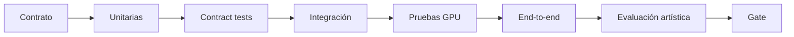
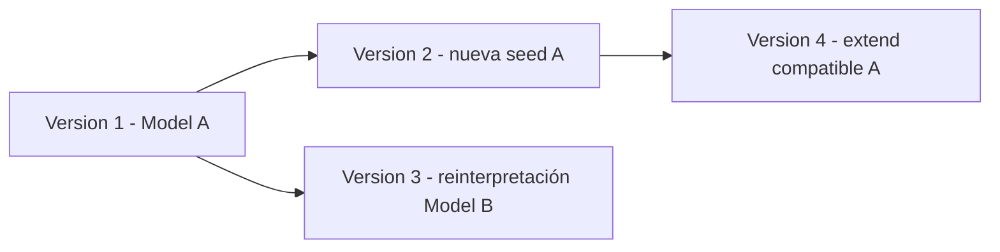
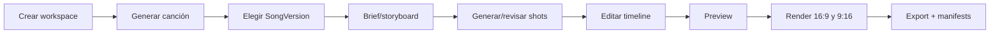

# Plan de pruebas audiovisual RTX v4

## 1. Objetivo y principios

El plan demuestra que el estudio audiovisual funciona, conserva la calidad y puede evolucionar sin mezclar modelo, resultado y hardware.

Principios:

1. **Todo empieza pendiente.** Código y tests heredados son material a revisar, no evidencia aceptada.
2. **No se seleccionan solo los mejores outputs.** El corpus y todas las semillas forman parte del resultado.
3. **Modelo y GPU se prueban por separado.** El resolver elige un release; el scheduler elige un worker.
4. **La RTX es evidencia de ejecución, no identidad de la canción.**
5. **Las pruebas generativas combinan métricas técnicas y revisión humana estructurada.**
6. **Un upgrade de modelo, adaptador, runtime, driver o GPU requiere una regresión proporcional.**
7. **Los fallbacks son explícitos.** Nunca se reduce silenciosamente calidad, duración, FPS, resolución o familia.
8. **Los manifests son parte del resultado.** Un archivo sin trazabilidad no supera el gate.



## 2. Pirámide de pruebas

### 2.1 Unitarias

Sin red, sin GPU y rápidas:

- precedencia de `ModelSelectionPolicy`;
- filtros de licencia, territorio, channel y capabilities;
- resolución de `ModelProfile` a `ModelRelease`;
- `CompatibilityContract`;
- cálculo de fingerprints/idempotencia;
- validación de timelines;
- estado de jobs y leases;
- workspace scoping;
- hashes, rutas y normalización;
- estimaciones de recursos;
- parsing de manifests.

### 2.2 Property-based / invariantes

Generar combinaciones para demostrar:

- una entidad creativa nunca obtiene `worker_id` por resolución;
- `pinned_release` nunca se cambia por una promoción;
- `blocked` jamás se resuelve para jobs nuevos;
- un retry `same_resolution` conserva releases y parámetros;
- un cambio de GPU no muta Workspace/Song/SongVersion;
- no hay timeline con duración negativa, huecos no declarados o referencias cruzadas de workspace;
- la garbage collection no borra blobs alcanzables.

### 2.3 Contract tests de adaptadores

La misma suite se ejecuta contra fake y adaptadores reales:

```text
health
capabilities
validate
estimate_resources
load
run
progress
cancel
unload
error_normalization
manifest
```

Cada capability tiene schemas de entrada/salida versionados. Un adaptador no puede declarar una capability que no pase la suite.

### 2.4 Integración sin GPU

- PostgreSQL y migraciones;
- cola/claims con concurrencia;
- CAS y publicación atómica;
- API y autorización;
- Model Manager con repositorio simulado;
- resolver con catálogo fake;
- scheduler con WorkerSnapshots simulados;
- pipelines usando fake adapters;
- backup/restore de metadatos y assets pequeños.

### 2.5 Integración GPU

En hardware real:

- visibilidad CUDA;
- dtype/TF32/Tensor Core routes cuando proceda;
- carga/descarga de cada modelo;
- cold/warm run;
- VRAM pico;
- cancelación;
- OOM y recuperación;
- estabilidad tras alternar familias;
- NVENC;
- temperaturas y límites;
- manifests con datos efectivos.

### 2.6 End-to-end

- workspace → canción → modelo → generación → SongVersion;
- importación WAV → SongVersion importada;
- canción → brief → shots → clips → timeline → render;
- cambio de modelo dentro de una canción mediante rama;
- promoción/rollback de release set;
- reinicio de API, DB y worker durante etapas distintas;
- segundo worker y sustitución de GPU;
- backup/restore y reconstrucción de manifests.

## 3. Entornos

| ID | Entorno | Objetivo |
|---|---|---|
| E0 | CI CPU, fake adapters | Dominio, API, contratos, seguridad básica |
| E1 | RTX-12: RTX 5070 desktop 12 GB | Hardware de referencia y gates del MVP |
| E2 | RTX-16, cuando exista | Modelos/perfiles superiores |
| E3 | RTX-24/32+, cuando exista | Vídeo/modelos grandes y multiworker |
| E4 | Dos workers heterogéneos | Placement, transferencia, reintento y upgrade |
| E5 | Instalación limpia | Instalador, restore, update y rollback |

Cada ejecución registra:

```yaml
environment:
  os:
  wsl_kernel:
  docker_version:
  gpu_name:
  gpu_uuid:
  compute_capability:
  vram_total_mb:
  driver_version:
  cuda_runtime:
  pytorch_version:
  container_digest:
  release_set_id:
```

## 4. Gate G0-PRODUCTO

### Pruebas documentales/estructurales

- única fuente canónica v4;
- alcance y no-objetivos;
- workspaces y versionado;
- modelo de selección independiente de hardware;
- política de licencias/supply chain;
- ADRs de control plane, workers, CAS y cola;
- schemas válidos.

### Test de arquitectura obligatorio

Inspección de schema/ORM/migrations:

```text
Workspace/Song/SongVersion/VideoProject/Shot
    no contienen FK obligatoria a Worker/GPU

ModelRun
    sí referencia WorkerSnapshot

SongVersion generada
    referencia ModelRun y ModelRelease exacto
```

### Criterio de salida

Todos los propietarios aprueban las invariantes. Cualquier contradicción entre documentos implica `rework`.

## 5. Gate G1-MODELOS-RTX12

### 5.1 Preflight

Pruebas:

- GPU visible desde WSL/container;
- identidad/UUID y VRAM correctas;
- driver/runtime compatibles;
- filesystem y disco suficientes;
- precisiones detectadas sin asumir soporte del modelo;
- NVENC disponible cuando corresponda;
- fallo claro sin GPU o con runtime incompatible.

### 5.2 Seguridad de instalación

- revisión exacta, sin `latest`;
- hashes correctos e incorrectos;
- staging atómico;
- archivo extra/no declarado;
- formato bloqueado;
- `trust_remote_code` denegado;
- egress denegado en inferencia;
- licencia/territorio faltante;
- rollback tras instalación incompleta.

### 5.3 Resolver de modelos

Matriz mínima:

| Caso | Resultado esperado |
|---|---|
| Workspace default + Song `inherit` | usa perfil del workspace |
| Song `pinned_profile` | usa ese perfil aunque cambie default |
| Generación con override permitido | override explícito |
| `pinned_release` autorizado | release exacto |
| release blocked | error de policy |
| perfil sin worker compatible | resolución posible, job espera/falla `NO_COMPATIBLE_WORKER` según política |
| profile promotion | solo nuevas resoluciones cambian |
| fallback de familia no autorizado | rechazo, no cambio silencioso |

El resultado del resolver no incluye `worker_id`.

### 5.4 Scheduler

- worker compatible/incompatible;
- modelo instalado/no instalado;
- afinidad por modelo cargado;
- worker draining/quarantined;
- VRAM insuficiente;
- lease expirado;
- prioridad y fairness;
- snapshot inmutable en claim;
- ninguna mutación de Song al cambiar placement.

### 5.5 Bake-off musical

Corpus:

```text
12 briefs × 3 seeds × cada ModelProfile candidato
```

Se evalúan todos los archivos y fallos.

#### Dimensiones humanas

Escala y rúbrica predefinidas:

- fidelidad a prompt;
- letra/pronunciación;
- coherencia musical;
- estructura;
- calidad sonora;
- voz;
- originalidad útil sin afirmar derechos;
- artefactos;
- utilidad para el producto.

#### Dimensiones técnicas

- tiempo cold/warm;
- real-time factor;
- pico VRAM;
- disco/model size;
- tasa de éxito;
- OOM/crash;
- cancelación;
- recuperación;
- determinismo esperado;
- duración real vs solicitada.

#### Sesgo y cherry-picking

- IDs aleatorizados cuando sea viable;
- no mostrar nombre del modelo en evaluación ciega;
- reportar mediana, dispersión y fallos;
- conservar outputs;
- no excluir una seed salvo corrupción técnica documentada.

### 5.6 CompatibilityContract

Probar al menos:

- extend en misma familia/release permitido;
- extend cross-family rechazado si requiere estado interno;
- reinterpretación cross-model permitida como nueva rama;
- release incompatible por adapter major;
- fuente sin artefacto requerido;
- contrato cambiado y versionado.

### Criterio de salida

Al menos un perfil musical estable para RTX-12, con licencia aprobada, suite completa, manifiesto y rollback.

## 6. Gate G2-MUSICA-WORKSPACE

### 6.1 Aislamiento

Crear workspaces A y B y demostrar:

- listados separados;
- IDs no autorizan acceso cruzado;
- assets/blobs deduplicados no filtran metadatos;
- jobs/eventos filtrados;
- export y borrado limitados;
- logs no muestran prompts/lyrics sin política.

### 6.2 Selección visible tipo Suno

E2E:

1. Workspace default `music.profile.A`.
2. Crear Song con `inherit`.
3. Previsualizar resolución.
4. Generar versión 1.
5. Cambiar Song a `pinned_profile B`.
6. Generar versión 2.
7. Comparar ambas.
8. Verificar que la UI muestra perfil/release y solo en detalles técnicos la GPU.
9. Cambiar default del workspace.
10. Verificar que ninguna versión histórica cambia.

### 6.3 Generación/importación

- prompt válido/inválido;
- letra larga, unicode y español;
- instrumental;
- seed manual/automática;
- importación WAV/FLAC;
- archivo corrupto, oversized, duración límite;
- normalización no destructiva;
- reproductor y descarga;
- manifest y hash.

### 6.4 Ramas y linaje



Comprobar parentage, operaciones, releases, workers y assets sin sobrescritura.

### 6.5 Durabilidad

- reiniciar API mientras job está queued;
- reiniciar worker durante inferencia;
- lease y retry;
- reiniciar DB/controlado;
- cancelar;
- repetir Idempotency-Key;
- fallo tras escribir tmp pero antes de publicar;
- ningún SongVersion parcial visible.

### Criterio de salida

Vertical slice musical usable y reproducible en dos workspaces, con selector de modelos y sin selector obligatorio de GPU.

## 7. Gate G3-PLANIFICACION-VISUAL

### Análisis de audio

Corpus con:

- tempos constantes/variables;
- intro silenciosa;
- cambios de sección;
- voz e instrumental;
- duraciones y formatos distintos.

Validar:

- duración;
- beats/downbeats con tolerancia declarada;
- secciones editables;
- loudness/peak;
- resultados versionados;
- corrección manual.

### Letras

- LRC válido/inválido;
- timestamps fuera de rango;
- solapes;
- alineación de confianza alta/baja;
- corrección y nueva versión;
- unicode.

### Storyboard y shot list

Invariantes:

- cobertura temporal;
- no duración negativa;
- orden y solapes permitidos explícitos;
- referencias del mismo workspace;
- aspect ratios soportados;
- capability y policy de modelo válidas;
- estimación de jobs/recursos.

### Criterio de salida

Plan visual completo y editable para una canción real, sin necesidad de generar todavía planos finales.

## 8. Gate G4-VIDEO-RTX12

### 8.1 Keyframes

Corpus fijo:

- personajes autorizados;
- interiores/exteriores;
- noche/día;
- planos generales/primeros planos;
- referencias simples/múltiples;
- estilos distintos.

Evaluar:

- fidelidad;
- identidad;
- anatomía;
- texto espurio;
- composición;
- tiempo/VRAM;
- cancelación y unload.

### 8.2 Planos de vídeo

- 10–15 prompts/shot intents;
- 4–8 s;
- keyframe idéntico entre candidatos;
- movimiento humano/objeto/cámara;
- preview y final;
- varias seeds registradas.

Métricas/revisión:

- temporalidad/flicker;
- deformaciones;
- preservación de identidad;
- movimiento y cámara;
- tasa de variantes aceptables;
- tiempo por segundo generado;
- pico VRAM;
- fallos.

### 8.3 Lip-sync

- fonemas españoles e ingleses;
- voz aislada y mezcla;
- frontal/perfil moderado;
- movimiento de cabeza;
- distintos tonos de piel/rasgos dentro del corpus autorizado;
- sincronía, identidad, dientes/parpadeo y flicker.

### 8.4 Timeline/render

Golden projects con assets fijos:

- cortes y transiciones;
- crop 16:9→9:16;
- títulos y LRC;
- still motion;
- audio master intacto;
- NVENC y fallback CPU;
- duración A/V;
- hash de receta y manifiesto.

No se exige que los bitstreams de encoders distintos sean idénticos; sí equivalencia dentro de tolerancias y parámetros registrados.

### 8.5 Campaña de fallos RTX-12

- OOM al cargar;
- OOM durante inferencia;
- cancelación durante load/run/postprocess;
- error CUDA sticky;
- disco lleno;
- asset corrupto;
- worker heartbeat perdido;
- temperatura/límite;
- alternar música→imagen→vídeo→lip-sync varias veces;
- recuperación sin reinicio manual cuando sea técnicamente seguro.

### Criterio de salida

Vertical slice de unos 60 segundos y decisión explícita por modo:

```text
visualizer/lyric: go|rework|no-go
cinematic:       go|rework|no-go
performer:       go|rework|no-go
```

## 9. Gate G5-MVP-AUDIOVISUAL

E2E principal:



Debe probarse:

- visualizer/lyric;
- cinematic cuando G4 lo permita;
- performer cuando G4/consentimiento lo permitan;
- revisión/regeneración de un único shot;
- pausa/reanudación;
- cierre/reapertura de navegador;
- reinicio controlado de servicios;
- cuotas/retención;
- actualización y rollback del release set.

## 10. Gate G6-MULTIWORKER

### 10.1 Registro y seguridad

- pairing/autenticación;
- certificados/tokens rotables;
- worker no autorizado;
- replay;
- heartbeat y quarantine;
- red y rutas permitidas.

### 10.2 Placement heterogéneo

Matriz:

| Job | RTX-12 | RTX-24/32 | Esperado |
|---|---:|---:|---|
| Música base | Sí | Sí | afinidad/carga/cola |
| Vídeo ligero | Sí | Sí | perfil elegido |
| Modelo high-VRAM | No | Sí | solo superior |
| Worker sin release | quizá | Sí | instalar permitido o elegir otro |
| Worker draining | No nuevos claims | Sí | reubicación |

### 10.3 Sustitución de GPU

Prueba canónica AV-119:

1. Crear Workspace/Song/Version en RTX-12.
2. Registrar worker superior o reemplazar GPU.
3. Ejecutar preflight y benchmark.
4. Generar una nueva versión con el mismo ModelProfile.
5. Comprobar que solo cambian `ModelRun`, `WorkerSnapshot` y métricas.
6. Verificar que las entidades creativas no se migraron.
7. Retirar/drain del worker anterior.
8. Reproducir historial.

### 10.4 Transferencia de assets

- hash antes/después;
- cache hit/miss;
- transferencia interrumpida;
- tmp y resume;
- no acceso cross-workspace;
- cifrado/autenticación según red;
- deduplicación sin fuga.

## 11. Gate G7-BETA

- instalación limpia;
- actualización app;
- actualización de modelos;
- rollback independiente de app/modelos;
- backup y restore completo;
- reconstrucción desde manifests;
- soak de duración definida;
- jobs huérfanos;
- presión de disco;
- GC y retención;
- diagnóstico exportable sin secretos;
- SBOM/scans;
- matriz de GPUs soportadas;
- runbooks ejecutados por otra persona/agente.

## 12. Matriz de regresión

Toda release set estable conserva una matriz:

| Dimensión | Valores mínimos |
|---|---|
| App | anterior estable / candidata |
| ModelProfile | music/image/video/lipsync activos |
| ModelRelease | anterior / candidato |
| GPU | RTX-12 + perfiles disponibles |
| Driver/runtime | combinación soportada y candidata |
| Precision | BF16/FP16/TF32 según adapter |
| Offload/quantization | perfiles autorizados |
| Modos | music, visualizer, cinematic, performer |
| Formatos | WAV/FLAC/MP3 y 16:9/9:16/1:1 |

No es necesario ejecutar el producto cartesiano completo siempre; se usa riesgo, pairwise y casos críticos, documentando cobertura.

## 13. Pruebas de upgrades

### Modelo

- nueva revisión misma familia;
- nueva familia;
- cambio de licencia;
- artifact hash distinto;
- perfil alias promovido;
- downgrade/rollback;
- histórica pinned release.

### Adapter/runtime

- protocolo compatible/incompatible;
- manifest schema;
- cambios de dtype;
- output schema;
- cancelación/progreso;
- rollback de contenedor.

### Driver/GPU

- preflight antes/después;
- benchmark revalidado;
- versiones antiguas intactas;
- ningún update de Songs;
- diferencias numéricas/artísticas documentadas;
- NVENC.

### Aplicación/DB

- migrations forward/back;
- manifiestos antiguos legibles;
- jobs en curso durante drain;
- API compatibility;
- restore.

## 14. Métricas y umbrales

Los umbrales exactos se fijan en R0/R1 con hardware real. Siempre se registran:

- success rate;
- OOM/crash rate;
- p50/p95 de latencia;
- cold load;
- tiempo de inferencia;
- pico VRAM;
- temperatura/potencia cuando estén disponibles;
- disco/transferencia;
- calidad humana por dimensión;
- tasa de outputs aceptados;
- tasa de regeneración;
- cancel latency;
- recovery time;
- mismatch de hashes/manifests.

No se inventan SLOs antes de obtener baseline.

## 15. Evidencia obligatoria

Cada ejecución de gate produce:

```text
artifacts/test-runs/<run-id>/
├── environment.json
├── release-set.yaml
├── corpus-manifest.json
├── results.jsonl
├── metrics.csv
├── failures/
├── outputs/ o referencias CAS
├── human-evaluation.csv
├── license-snapshot/
├── summary.md
└── decision-record.md
```

El acta incluye:

- alcance;
- cambios desde el run anterior;
- qué se probó/no se probó;
- resultados completos;
- desviaciones;
- riesgos;
- decisión `go|rework|no-go`;
- responsables y fecha.
