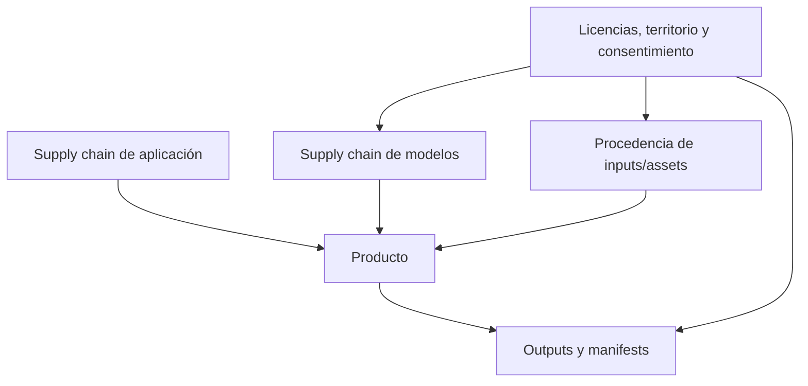
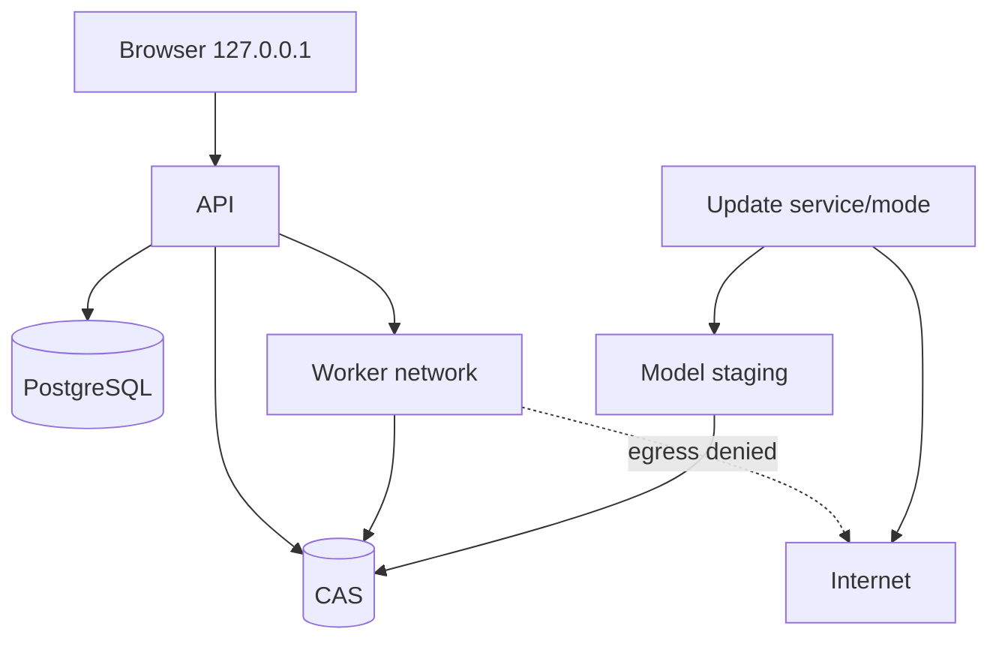

# Seguridad, licencias, consentimiento y procedencia

## 1. Alcance

Este documento define controles técnicos y operativos. No sustituye asesoramiento jurídico. Su objetivo es impedir que el sistema trate como confiable o autorizado un modelo, archivo, referencia o persona sin evidencia suficiente.

La seguridad se aplica a cuatro cadenas diferentes:



## 2. Modelo de amenazas resumido

Activos críticos:

- prompts, letras, canciones y vídeos;
- imágenes/rostros y consentimientos;
- pesos y runtimes;
- credenciales/tokens de workers;
- DB y CAS;
- manifests y hashes;
- modelos comerciales/licenciados;
- disponibilidad y seguridad térmica de las GPUs.

Amenazas:

- modelo con código remoto o pickle malicioso;
- repositorio/checkpoint comprometido;
- licencia incompatible o modificada;
- acceso entre workspaces;
- prompt/file injection y rutas del host;
- ejecución de comandos a través de parámetros;
- filtrado de secretos/logs;
- suplantación o lip-sync sin consentimiento;
- jobs duplicados/outputs inconsistentes;
- worker remoto falso;
- descarga durante inferencia;
- sobrescritura histórica por upgrade;
- denegación de servicio por VRAM, disco o archivos enormes.

## 3. Ficha obligatoria de ModelRelease

```yaml
license_record:
  model_release_id: mr_...
  code:
    identifier: MIT
    source_url: ...
    sha256_of_text: ...
  weights:
    identifier: ...
    source_url: ...
    sha256_of_text: ...
  datasets:
    declared: true|false|unknown
    references: []
  auxiliary_components:
    - name: ...
      license: ...
  output_terms:
    summary: ...
  commercial_use: allowed|conditional|not_allowed|unknown
  territories:
    allowed: [EU]
    blocked: []
  attribution_requirements: []
  verified_at: timestamp
  verified_by: ...
  evidence_assets: []
```

Nunca se hereda automáticamente la licencia:

```text
repositorio → pesos → VAE/codec/encoder → LoRA → dataset → outputs
```

Cada elemento puede tener términos diferentes.

## 4. Estados de política

| Estado | Uso |
|---|---|
| `allowed` | Puede entrar en release set para el contexto aprobado |
| `review_required` | Falta evidencia; solo laboratorio aislado si se autoriza |
| `conditional` | Requiere cumplir atribución, ingresos, uso, territorio u otras condiciones |
| `noncommercial` | Excluido de modo comercial/producción comercial |
| `territory_blocked` | No se usa en el territorio operativo |
| `prohibited` | No se descarga/ejecuta |
| `incident_blocked` | Bloqueado tras incidente o vulnerabilidad |

La decisión se evalúa en instalación, promoción y resolución de jobs. Un release puede permanecer histórico para trazabilidad sin ser ejecutable.

## 5. Cadena de suministro de modelos

```mermaid
flowchart LR
    SRC[Fuente oficial permitida] --> PIN[Pin revisión]
    PIN --> DL[Descarga en staging]
    DL --> HASH[Verificar hashes/tamaños]
    HASH --> FMT[Inspeccionar formatos]
    FMT --> LIC[Licencia/policy]
    LIC --> SCAN[Scan + inventario]
    SCAN --> RT[Runtime aislado]
    RT --> SM[Smoke test]
    SM --> BENCH[Benchmark/evaluación]
    BENCH --> PROM[Promoción]
```



### 5.1 Fuentes

- allowlist de dominios/repositorios;
- URL/revisión exacta;
- no `latest`, `main`, `master` en release estable;
- copia de metadatos y licencia;
- fecha, operador y hashes;
- gated models con credenciales fuera del contenedor de inferencia.

### 5.2 Formatos

Preferir formatos de datos sin ejecución, como `safetensors`, cuando el ecosistema lo permita. Bloquear por defecto:

- pickle/objetos Python arbitrarios;
- scripts post-install no declarados;
- binarios desconocidos;
- archivos con path traversal;
- symlinks fuera del package root;
- artefactos extra no presentes en manifest.

Una excepción requiere revisión, sandbox y ADR.

### 5.3 Código remoto

`trust_remote_code=false` por defecto. Cuando sea indispensable:

1. fijar commit;
2. vendorizar o inspeccionar el código;
3. ejecutar análisis estático y dependencias;
4. construir runtime propio;
5. firmar/hashear imagen;
6. no permitir descarga/código dinámico en inferencia;
7. documentar propietario y expiración de excepción.

## 6. Separación de red y modos



- UI/API local por defecto.
- DB, CAS y workers no exponen puertos públicos innecesarios.
- inferencia sin egress por defecto;
- actualización separada y auditable;
- DNS/HTTP bloqueados en adapters de inferencia;
- workers remotos autenticados y autorizados;
- secrets inyectados temporalmente, nunca en manifests/logs.

## 7. Sandbox de adapters

Controles mínimos:

- usuario no root;
- filesystem root read-only;
- modelo montado read-only;
- directorio temporal limitado;
- sin socket Docker;
- sin rutas arbitrarias del host;
- capabilities Linux mínimas;
- seccomp/AppArmor/controles equivalentes cuando estén disponibles;
- límites CPU/RAM/PIDs/disco;
- timeout y cancelación;
- output solo en directorio asignado;
- parámetros serializados, no shell concatenada.

Los adapters nunca reciben credenciales de administración ni acceso general a otros workspaces.

## 8. Aislamiento por workspace

### 8.1 Autorización

Toda consulta mutante/lectora parte de `workspace_id` autorizado. No se acepta confiar en IDs opacos.

### 8.2 Assets deduplicados

Un mismo Blob puede respaldar Assets de varios workspaces, pero:

- no se revela que otro workspace lo posee;
- no se reutiliza su metadata/procedencia;
- el acceso se comprueba en `Asset`/referencia;
- GC considera todas las referencias y retención.

### 8.3 Logs y telemetría

- redactar prompts, letras, nombres y rutas según política;
- no registrar tokens/headers;
- IDs pseudónimos en métricas;
- bundle de diagnóstico con preview de contenido y consentimiento del usuario;
- retención definida.

### 8.4 Export y borrado

- export explícito y verificable;
- borrado lógico inmediato en producto;
- borrado físico según retención, reachability y backups;
- no prometer eliminación instantánea de backups sin política real.

## 9. Seguridad de archivos y media

Para audio, imagen y vídeo importados:

- tamaño/duración/resolución límites;
- detección de MIME real, no solo extensión;
- nombre generado internamente;
- path canonicalization;
- decodificación en sandbox;
- timeouts y límites;
- rechazar streams/attachments inesperados;
- conservar original read-only;
- derivados con receta y hash;
- antivirus/scan cuando el entorno lo requiera.

No se pasa una URL del usuario directamente a FFmpeg/modelos. Se descarga por servicio controlado, valida y registra primero.

## 10. Personas, voz, performer y lip-sync

### 10.1 ConsentRecord

```yaml
ConsentRecord:
  id: uuid
  workspace_id: uuid
  subject_type: real_person|fictional_character|owner
  subject_name: string|null
  permitted_uses:
    - image_reference
    - video_generation
    - lipsync
  source_evidence_asset_ids: []
  territory: [EU]
  valid_from: date
  valid_until: date|null
  revoked_at: timestamp|null
  notes: string
```

### 10.2 Reglas

- una persona real requiere evidencia/autoridad adecuada para el uso;
- revocación bloquea nuevos jobs, sin falsificar la historia de outputs previos;
- no se interpreta una imagen pública como consentimiento;
- el sistema distingue personaje ficticio de persona real;
- los assets de referencia guardan procedencia;
- los modelos de voz/clonación quedan fuera del MVP y requieren plan específico;
- el usuario debe revisar el performer output antes de export final.

### 10.3 Riesgo de suplantación

Aplicar controles de política para usos engañosos o no consentidos. Los manifests técnicos pueden indicar generación/lip-sync, pero no sustituyen revisión de uso ni consentimiento.

## 11. Música, letras y audio importado

Registrar declaración de procedencia:

```yaml
input_provenance:
  source_type: user_owned|licensed|public_domain|generated_in_app|unknown
  rights_basis: ...
  evidence_asset_ids: []
  restrictions: []
```

- no afirmar propiedad por el simple hecho de subir un WAV;
- conservar fuente y transformaciones;
- letras y referencias pueden tener derechos independientes;
- samples/stems requieren sus propios registros cuando corresponda;
- una generación de IA no garantiza ausencia de similitud ni derechos exclusivos.

## 12. Prompt/content safety

Controles:

- límites de tamaño;
- validación/normalización Unicode;
- no interpolación en shell/SQL;
- reglas para contenido prohibido según contexto de despliegue;
- avisos y revisión para identidades reales;
- no pasar secretos ni instrucciones del sistema al modelo;
- no confiar en texto generado para ejecutar acciones;
- sanitización de HTML/Markdown en UI.

## 13. Hardware y workers

### 13.1 Identidad

- worker ID + credencial rotatoria/certificado;
- GPU UUID en snapshots, no como clave de Song;
- pairing explícito;
- heartbeat firmado/autenticado;
- revocación y quarantine.

### 13.2 Scheduler seguro

- solo claims compatibles y autorizados;
- no confiar ciegamente en capacidades anunciadas: validar con preflight/attestation operativa posible;
- leases;
- límites de concurrencia;
- drain antes de actualizar;
- temperatura/disco/VRAM como guards;
- un worker no elige arbitrariamente otro ModelRelease.

### 13.3 Cambio de GPU

Se registra un nuevo `WorkerSnapshot` y se repiten benchmarks relevantes. No se migran canciones ni se sobrescriben runs antiguos.

## 14. Procedencia técnica y manifests

Manifiesto mínimo de generación:

```yaml
manifest:
  schema_version: "1.0"
  workspace_id: ws_...
  operation: music.generate
  source_asset_hashes: []
  requested_model_selection:
    policy: pinned_profile
    profile_id: music.acestep15.balanced
  resolution:
    model_release_id: mr_...
    adapter_release_id: ar_...
    runtime_release_id: rr_...
    execution_profile_id: ep_...
  execution:
    worker_snapshot_id: wsnap_...
    gpu_name: NVIDIA GeForce RTX 5070
    gpu_uuid: GPU-...
    driver_version: ...
    cuda_runtime: ...
    precision: bf16
    quantization: null
    offload_mode: ...
  parameters_hash: sha256:...
  seed: "..."
  output_assets:
    - asset_id: ...
      sha256: ...
  metrics:
    peak_vram_mb: ...
    duration_ms: ...
```

La identidad de la GPU aparece en `execution`, no en Workspace/Song.

## 15. Firmas y verificabilidad

Fases iniciales:

1. hash de manifests y assets;
2. almacenamiento append-only/auditoría de cambios de policy;
3. firma de release sets/manifests con clave protegida cuando sea necesario;
4. export bundle verificable;
5. C2PA opcional en pista posterior si aporta valor y se implementa correctamente.

C2PA u otra firma demuestra integridad/procedencia declarada, no derechos o veracidad total.

## 16. Secretos

- `.env` solo para desarrollo y fuera de Git;
- secretos en almacén del host/servicio apropiado;
- scopes mínimos;
- rotación;
- no secretos en imágenes, manifests, ZIPs o bundles;
- token Hugging Face/GitHub solo en update mode;
- limpiar entorno antes de lanzar adapters cuando no necesiten credenciales.

## 17. Vulnerabilidades y actualizaciones


Inventarios:

- SBOM de aplicación/runtime;
- model package manifest;
- license snapshot;
- release set activo;
- workers y versiones instaladas;
- qué outputs usaron cada release.

Un incidente crítico puede bloquear nuevas ejecuciones sin borrar el historial.

## 18. Respuesta ante incidente

Runbook mínimo:

1. identificar alcance;
2. bloquear ModelRelease/Runtime/Worker afectado;
3. pausar claims y poner workers en drain/quarantine;
4. preservar logs/manifests/evidencias;
5. rotar secretos;
6. verificar integridad de CAS/DB;
7. crear release corregido;
8. probar y hacer canary;
9. restaurar servicio;
10. documentar outputs potencialmente afectados y acciones.

## 19. Checklist de promoción

- [ ] revisión y hashes fijados;
- [ ] licencia de código/pesos/auxiliares archivada;
- [ ] territorio/uso aprobados;
- [ ] formatos y código remoto revisados;
- [ ] runtime no root/read-only;
- [ ] egress denegado en inferencia;
- [ ] tests de contrato;
- [ ] benchmark por perfil;
- [ ] evaluación de calidad;
- [ ] rollback;
- [ ] manifests completos;
- [ ] consentimiento/procedencia de corpus;
- [ ] operator decision record.
