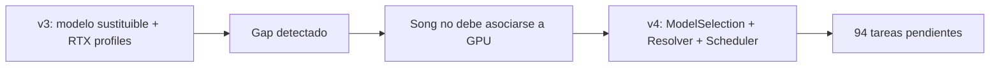

# Migración del roadmap audiovisual v3 a v4

Fecha: **2026-09-18**  
Origen: `suno-sondo-roadmap-audiovisual-rtx-v3`  
Destino: `suno-sondo-roadmap-audiovisual-rtx-v4`

## 1. Regla de migración

Esta migración preserva intención y trazabilidad, **no progreso**. Todas las tareas del v3 vuelven a estado `pendiente` y deben demostrarse contra criterios v4. Ningún código o check anterior cuenta como evidencia automática.

## 2. Diferencia arquitectónica

| v3 | v4 |
|---|---|
| Una política de modelos modular pero no totalmente formalizada | `ModelFamily`, `ModelRelease`, `ModelProfile`, `ExecutionProfile` y `ModelSelectionPolicy` explícitos |
| Scheduler podía interpretarse como selector global | Resolver elige release; scheduler elige worker |
| Workspaces con defaults generales | Precedencia Workspace → Song → generación/Shot |
| Versiones registraban modelo/run | Contrato obligatorio: versión fija release; run fija GPU/runtime |
| Evolución multiworker | Prueba formal de sustitución de GPU sin migración de proyectos |

## 3. Tareas nuevas

| Tarea v4 | Fase | Propósito |
|---|---|---|
| AV-008 | R0 | Contrato de selección de modelos independiente del hardware |
| AV-022 | R1 | Registro de ModelProfiles y resolver explicable |
| AV-023 | R1 | CompatibilityContracts para operaciones derivadas |
| AV-042 | R2 | Selector tipo Suno y políticas por Workspace/Song/generación |
| AV-043 | R2 | Ramas cross-model, linaje y comparación |
| AV-119 | R6 | Sustitución de GPU sin migrar proyectos |

## 4. Crosswalk completo de tareas v3

| Tarea v3 | Título v3 | Destino v4 | Acción |
|---|---|---|---|
| AV-001 | Declarar v3 canónico y archivar roadmaps anteriores | AV-001 | **AMPLIAR** — v4 sustituye v3 y actualiza índices sin heredar progreso. |
| AV-002 | Fijar visión, usuarios y modos del estudio audiovisual | AV-002 | **AMPLIAR** — explicita selección de modelo tipo Suno y evolución de hardware. |
| AV-003 | Contrato de hardware y runtime Windows/WSL2/Docker/RTX | AV-003 | **AMPLIAR** — separa perfil hardware de identidad de producto. |
| AV-004 | Política de modelos, licencias y territorios | AV-004 | **AMPLIAR** — aplica policy también al resolver de perfiles y upgrades. |
| AV-005 | Política de cadena de suministro y ejecución segura | AV-005 | **CONSERVAR/REVALIDAR** — mismo propósito, evidencia nueva bajo invariantes v4. |
| AV-006 | Contrato de dominio, workspaces y versionado inmutable | AV-006 | **AMPLIAR** — elimina cualquier vínculo creativo a Worker/GPU y añade ModelSelection/ModelRun. |
| AV-007 | ADR de arquitectura y cierre G0-PRODUCTO | AV-007 | **AMPLIAR** — ADR debe aprobar AV-008 y nueva separación resolver/scheduler. |
| AV-010 | Herramienta de preflight RTX/CUDA | AV-010 | **CONSERVAR/REVALIDAR** — mismo propósito, evidencia nueva bajo invariantes v4. |
| AV-011 | Protocolo y agente de worker GPU | AV-011 | **CONSERVAR/REVALIDAR** — mismo propósito, evidencia nueva bajo invariantes v4. |
| AV-012 | Resolver de capacidades y scheduler inicial | AV-012 | **AMPLIAR** — scheduler recibe un release ya resuelto; no decide preferencia de usuario. |
| AV-013 | Esquema de Model Package y Adapter Manifest | AV-013 | **AMPLIAR** — schemas incluyen ModelProfile y ModelSelection. |
| AV-014 | Descargador seguro, caché global y montaje read-only | AV-014 | **CONSERVAR/REVALIDAR** — mismo propósito, evidencia nueva bajo invariantes v4. |
| AV-015 | SDK y contrato de adaptadores por capability | AV-015 | **AMPLIAR** — contratos declaran compatibilidad de operaciones derivadas. |
| AV-016 | Registro de modelos y release sets reproducibles | AV-016 | **AMPLIAR** — release sets y catálogo separan perfiles de releases. |
| AV-017 | Ciclo instalar–verificar–benchmark–promover–rollback | AV-017 | **CONSERVAR/REVALIDAR** — mismo propósito, evidencia nueva bajo invariantes v4. |
| AV-018 | Telemetría GPU y guardas de recursos | AV-018 | **CONSERVAR/REVALIDAR** — mismo propósito, evidencia nueva bajo invariantes v4. |
| AV-019 | Adaptador musical ACE-Step fijado | AV-019 | **CONSERVAR/REVALIDAR** — mismo propósito, evidencia nueva bajo invariantes v4. |
| AV-020 | Spikes musicales HeartMuLa y DiffRhythm2 | AV-020 | **CONSERVAR/REVALIDAR** — mismo propósito, evidencia nueva bajo invariantes v4. |
| AV-021 | Bake-off musical y cierre G1-MODELOS-RTX12 | AV-021 | **AMPLIAR** — gate incluye resolver y compatibility contracts. |
| AV-030 | Persistencia de workspaces y aislamiento lógico | AV-030 | **AMPLIAR** — defaults de modelos por workspace. |
| AV-031 | Almacén CAS de assets y referencias por workspace | AV-031 | **CONSERVAR/REVALIDAR** — mismo propósito, evidencia nueva bajo invariantes v4. |
| AV-032 | Songs y SongVersions inmutables | AV-032 | **AMPLIAR** — Song policy y versiones cross-model inmutables. |
| AV-033 | Motor de trabajos durable sobre PostgreSQL | AV-033 | **CONSERVAR/REVALIDAR** — mismo propósito, evidencia nueva bajo invariantes v4. |
| AV-034 | API de workspaces, canciones y generaciones | AV-034 | **AMPLIAR** — API de selector, preview de resolución y override. |
| AV-035 | Ejecución musical end-to-end en worker | AV-035 | **AMPLIAR** — ejecución usa ModelResolution y placement posterior. |
| AV-036 | UI musical del workspace | AV-036 | **AMPLIAR** — selector visible y detalles de modelo; GPU solo en diagnóstico. |
| AV-037 | Editor de letra, estilo, presets y modo instrumental | AV-037 | **CONSERVAR/REVALIDAR** — mismo propósito, evidencia nueva bajo invariantes v4. |
| AV-038 | Reproductor, postproceso y exportación de audio | AV-038 | **CONSERVAR/REVALIDAR** — mismo propósito, evidencia nueva bajo invariantes v4. |
| AV-039 | Linaje y manifiesto técnico de generación | AV-039 | **AMPLIAR** — manifiesto separa selección, resolución y ejecución. |
| AV-040 | Cancelación, reintento y recuperación musical | AV-040 | **CONSERVAR/REVALIDAR** — mismo propósito, evidencia nueva bajo invariantes v4. |
| AV-041 | Vertical slice musical y cierre G2-MUSICA-WORKSPACE | AV-041 | **AMPLIAR** — gate incluye AV-042 y AV-043. |
| AV-050 | Importación segura de WAV/FLAC y vínculo a SongVersion | AV-050 | **CONSERVAR/REVALIDAR** — mismo propósito, evidencia nueva bajo invariantes v4. |
| AV-051 | Análisis temporal de audio | AV-051 | **CONSERVAR/REVALIDAR** — mismo propósito, evidencia nueva bajo invariantes v4. |
| AV-052 | Letras sincronizadas y alineación temporal | AV-052 | **CONSERVAR/REVALIDAR** — mismo propósito, evidencia nueva bajo invariantes v4. |
| AV-053 | VisualBrief y VisualBible por workspace | AV-053 | **CONSERVAR/REVALIDAR** — mismo propósito, evidencia nueva bajo invariantes v4. |
| AV-054 | Personajes, localizaciones y assets de referencia | AV-054 | **CONSERVAR/REVALIDAR** — mismo propósito, evidencia nueva bajo invariantes v4. |
| AV-055 | Storyboard versionado | AV-055 | **CONSERVAR/REVALIDAR** — mismo propósito, evidencia nueva bajo invariantes v4. |
| AV-056 | Shot list sincronizada con la canción | AV-056 | **CONSERVAR/REVALIDAR** — mismo propósito, evidencia nueva bajo invariantes v4. |
| AV-057 | Timeline determinista y grafo de composición | AV-057 | **CONSERVAR/REVALIDAR** — mismo propósito, evidencia nueva bajo invariantes v4. |
| AV-058 | UI de brief, storyboard, shots y timeline | AV-058 | **CONSERVAR/REVALIDAR** — mismo propósito, evidencia nueva bajo invariantes v4. |
| AV-059 | Cierre G3-PLANIFICACION-VISUAL | AV-059 | **CONSERVAR/REVALIDAR** — mismo propósito, evidencia nueva bajo invariantes v4. |
| AV-070 | Adaptador de imagen y keyframes FLUX.2 Klein 4B | AV-070 | **CONSERVAR/REVALIDAR** — mismo propósito, evidencia nueva bajo invariantes v4. |
| AV-071 | Benchmark de consistencia visual e identidad | AV-071 | **CONSERVAR/REVALIDAR** — mismo propósito, evidencia nueva bajo invariantes v4. |
| AV-072 | Adaptador de vídeo ligero LTX-Video 2B | AV-072 | **CONSERVAR/REVALIDAR** — mismo propósito, evidencia nueva bajo invariantes v4. |
| AV-073 | Pipeline de generación de planos cortos | AV-073 | **CONSERVAR/REVALIDAR** — mismo propósito, evidencia nueva bajo invariantes v4. |
| AV-074 | Adaptadores de lip-sync MuseTalk y LatentSync 1.5 | AV-074 | **CONSERVAR/REVALIDAR** — mismo propósito, evidencia nueva bajo invariantes v4. |
| AV-075 | Renderer determinista FFmpeg/NVENC | AV-075 | **CONSERVAR/REVALIDAR** — mismo propósito, evidencia nueva bajo invariantes v4. |
| AV-076 | Modo visualizer y lyric video | AV-076 | **CONSERVAR/REVALIDAR** — mismo propósito, evidencia nueva bajo invariantes v4. |
| AV-077 | Pipeline de preview de baja resolución | AV-077 | **CONSERVAR/REVALIDAR** — mismo propósito, evidencia nueva bajo invariantes v4. |
| AV-078 | Variantes, selección y regeneración por plano | AV-078 | **CONSERVAR/REVALIDAR** — mismo propósito, evidencia nueva bajo invariantes v4. |
| AV-079 | Residencia de modelos y descarga de VRAM | AV-079 | **CONSERVAR/REVALIDAR** — mismo propósito, evidencia nueva bajo invariantes v4. |
| AV-080 | Benchmark visual, temporal y lip-sync | AV-080 | **CONSERVAR/REVALIDAR** — mismo propósito, evidencia nueva bajo invariantes v4. |
| AV-081 | Campaña OOM, térmica y de recuperación de vídeo | AV-081 | **CONSERVAR/REVALIDAR** — mismo propósito, evidencia nueva bajo invariantes v4. |
| AV-082 | Cierre G4-VIDEO-RTX12 | AV-082 | **CONSERVAR/REVALIDAR** — mismo propósito, evidencia nueva bajo invariantes v4. |
| AV-090 | Navegación y panel completo de workspace | AV-090 | **AMPLIAR** — navegación expone modelos por perfil, no por hardware. |
| AV-091 | VideoProject fijado a SongVersion | AV-091 | **AMPLIAR** — VideoProject fija SongVersion, nunca GPU. |
| AV-092 | Flujo de videoclip cinematográfico | AV-092 | **CONSERVAR/REVALIDAR** — mismo propósito, evidencia nueva bajo invariantes v4. |
| AV-093 | Flujo performer/personaje con consentimiento | AV-093 | **CONSERVAR/REVALIDAR** — mismo propósito, evidencia nueva bajo invariantes v4. |
| AV-094 | Flujo visualizer/lyric de un clic revisable | AV-094 | **CONSERVAR/REVALIDAR** — mismo propósito, evidencia nueva bajo invariantes v4. |
| AV-095 | Editor básico de timeline | AV-095 | **CONSERVAR/REVALIDAR** — mismo propósito, evidencia nueva bajo invariantes v4. |
| AV-096 | Revisión y aprobación por plano | AV-096 | **CONSERVAR/REVALIDAR** — mismo propósito, evidencia nueva bajo invariantes v4. |
| AV-097 | Formatos 16:9, 9:16 y 1:1 | AV-097 | **CONSERVAR/REVALIDAR** — mismo propósito, evidencia nueva bajo invariantes v4. |
| AV-098 | Exportación final 1080p y derivados | AV-098 | **CONSERVAR/REVALIDAR** — mismo propósito, evidencia nueva bajo invariantes v4. |
| AV-099 | Versionado audiovisual y manifiesto final | AV-099 | **AMPLIAR** — manifiesto audiovisual conserva releases/workers por asset. |
| AV-100 | Pausa, reanudación y recuperación del pipeline | AV-100 | **CONSERVAR/REVALIDAR** — mismo propósito, evidencia nueva bajo invariantes v4. |
| AV-101 | Cuotas, retención y limpieza de artefactos | AV-101 | **CONSERVAR/REVALIDAR** — mismo propósito, evidencia nueva bajo invariantes v4. |
| AV-102 | Cierre G5-MVP-AUDIOVISUAL | AV-102 | **AMPLIAR** — cierre MVP verifica independencia modelo/hardware. |
| AV-110 | Emparejamiento autenticado de workers remotos | AV-110 | **AMPLIAR** — identidad de worker remota no se propaga al dominio creativo. |
| AV-111 | Transferencia verificada y cache-aware de assets | AV-111 | **AMPLIAR** — assets viajan por hash y workspace, no por rutas de GPU. |
| AV-112 | Registro de capacidades y placement remoto | AV-112 | **AMPLIAR** — capabilities/snapshots medidos. |
| AV-113 | Scheduler multiworker con afinidad y reintento | AV-113 | **AMPLIAR** — placement independiente del Model Resolver. |
| AV-114 | Perfil RTX-16 y evaluación LTX 2.5 | AV-114 | **AMPLIAR** — nuevos modelos se publican como perfiles evaluados. |
| AV-115 | Perfiles RTX-24/32+ y modelos avanzados | AV-115 | **AMPLIAR** — perfiles superiores no cambian Songs existentes. |
| AV-116 | Canary, actualización y rollback de modelos | AV-116 | **AMPLIAR** — promoción de ModelProfile/Release y rollback auditable. |
| AV-117 | Mantenimiento offline y distribución de release sets | AV-117 | **AMPLIAR** — release sets distribuidos sin resolver a revisiones flotantes. |
| AV-118 | Cierre G6-MULTIWORKER | AV-118 | **AMPLIAR** — gate incluye prueba AV-119 de sustitución de GPU. |
| AV-130 | Pruebas de aislamiento y autorización por workspace | AV-130 | **CONSERVAR/REVALIDAR** — mismo propósito, evidencia nueva bajo invariantes v4. |
| AV-131 | Validación de contenido, derechos y consentimiento | AV-131 | **CONSERVAR/REVALIDAR** — mismo propósito, evidencia nueva bajo invariantes v4. |
| AV-132 | Motor de políticas de licencia y territorio | AV-132 | **CONSERVAR/REVALIDAR** — mismo propósito, evidencia nueva bajo invariantes v4. |
| AV-133 | Sandbox, secretos y red de workers | AV-133 | **CONSERVAR/REVALIDAR** — mismo propósito, evidencia nueva bajo invariantes v4. |
| AV-134 | SBOM, escaneo y reproducibilidad de builds | AV-134 | **CONSERVAR/REVALIDAR** — mismo propósito, evidencia nueva bajo invariantes v4. |
| AV-135 | Backup, restore y reconstrucción desde manifests | AV-135 | **CONSERVAR/REVALIDAR** — mismo propósito, evidencia nueva bajo invariantes v4. |
| AV-136 | Observabilidad y bundle de diagnóstico | AV-136 | **CONSERVAR/REVALIDAR** — mismo propósito, evidencia nueva bajo invariantes v4. |
| AV-137 | Soak, rendimiento y campaña térmica | AV-137 | **CONSERVAR/REVALIDAR** — mismo propósito, evidencia nueva bajo invariantes v4. |
| AV-138 | Matriz de regresión audiovisual y de upgrades | AV-138 | **AMPLIAR** — regresión cruza modelo, adapter, runtime y hardware. |
| AV-139 | Instalador, actualizador y rollback de aplicación | AV-139 | **AMPLIAR** — app y modelos se actualizan/retroceden de forma independiente. |
| AV-140 | Documentación operativa y matriz de soporte | AV-140 | **AMPLIAR** — matriz de soporte por perfiles y releases. |
| AV-141 | Cierre G7-BETA | AV-141 | **AMPLIAR** — beta valida toda la invariante v4. |

## 5. Dependencias modificadas

- `AV-007` depende de `AV-008`.
- `AV-021` depende de `AV-022` y `AV-023`.
- `AV-035` depende de `AV-022`.
- `AV-041` depende de `AV-042` y `AV-043`.
- `AV-118` depende de `AV-119`.

## 6. Resultado agregado

- Tareas: 88 → 94.
- Horas base: 1.142 h → 1.212 h.
- MVP hasta R5: 822 h → 882 h.
- No se eliminan capacidades audiovisuales de v3.
- Se elimina la ambigüedad entre modelo elegido y GPU ejecutora.
- Los workspaces y canciones sobreviven a cambios de modelos, drivers y tarjetas.
- La UI normal no obliga al usuario a seleccionar un ordenador.
