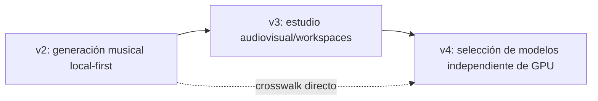

# Migración del roadmap RTX v2 al roadmap audiovisual v4

## 1. Regla

Esta tabla migra intención y trazabilidad, **no estados**. Las 49 tareas RTX v2 se consideran `superseded`; su posible código debe volver a revisarse y probarse contra v4.

## 2. Crosswalk

| Tarea v2 | Destino v4 | Acción | Motivo |
|---|---|---|---|
| RTX-001 | AV-001 | **REEMPLAZAR** | v4 pasa a ser canónico; no hereda estado. |
| RTX-002 | AV-002, AV-006, AV-008 | **AMPLIAR/DIVIDIR** | Visión audiovisual, dominio y contrato modelo-hardware. |
| RTX-003 | AV-003, AV-008, AV-119 | **AMPLIAR** | RTX 5070 como referencia, perfiles superiores y reemplazo sin migración. |
| RTX-004 | AV-004, AV-013, AV-016, AV-022 | **DIVIDIR** | Policy, packages, release sets y perfiles/resolver. |
| RTX-005 | AV-005, AV-014, AV-133 | **DIVIDIR** | Supply chain, descarga y sandbox. |
| RTX-010 | AV-010, AV-011, AV-112 | **AMPLIAR** | Preflight alimenta snapshots y workers heterogéneos. |
| RTX-011 | AV-019 | **REESCRIBIR** | ACE-Step se integra mediante package/adapter/runtime fijados. |
| RTX-012 | AV-014 | **AMPLIAR** | Caché global con staging, hashes y montaje read-only. |
| RTX-013 | AV-012, AV-018, AV-022, AV-114, AV-115 | **DIVIDIR** | Resolver, scheduler, guards y perfiles hardware/modelos superiores. |
| RTX-014 | AV-021 | **AMPLIAR** | Benchmark técnico y artístico con lifecycle. |
| RTX-015 | AV-010, AV-018, AV-021 | **DIVIDIR** | Precisión detectada y validada por modelo/hardware. |
| RTX-016 | AV-015, AV-019, AV-020, AV-022, AV-023 | **AMPLIAR** | Capabilities, adapters, resolver y compatibilidad de derivaciones. |
| RTX-017 | AV-021 | **FUSIONAR** | Gate técnico integrado en G1. |
| RTX-018 | AV-021 | **FUSIONAR** | Corpus y protocolo en bake-off. |
| RTX-019 | AV-021 | **FUSIONAR** | Evaluación musical en el mismo gate. |
| RTX-020 | AV-016, AV-021, AV-022 | **DIVIDIR** | Registry/release sets, decisión de gate y perfil visible. |
| RTX-021 | AV-007, AV-008 | **REEMPLAZAR** | Arquitectura audiovisual y separación resolver/scheduler. |
| RTX-022 | AV-006, AV-030, AV-032, AV-042, AV-043, AV-091 | **DIVIDIR** | Workspaces, versiones, políticas de modelo y VideoProject. |
| RTX-023 | AV-031 | **AMPLIAR** | CAS separa blob de autorización/referencia por workspace. |
| RTX-024 | AV-015, AV-023 | **AMPLIAR** | Contratos por capability y compatibilidad. |
| RTX-025 | AV-033 | **AMPLIAR** | Cola SQL se convierte en DAG durable. |
| RTX-026 | AV-034, AV-042 | **AMPLIAR** | API de producto y selector/resolution preview. |
| RTX-027 | AV-034, AV-035, AV-042 | **DIVIDIR** | Solicitud, resolución, ejecución y UX. |
| RTX-028 | AV-036, AV-042 | **AMPLIAR** | UI musical dentro del workspace con selector de perfil. |
| RTX-029 | AV-003, AV-007 | **FUSIONAR** | Compose dentro del runtime/arquitectura. |
| RTX-030 | AV-041, AV-042, AV-043 | **REEMPLAZAR** | Vertical slice musical incluye selección/ramas. |
| RTX-031 | AV-030, AV-037 | **DIVIDIR** | Workspace y editor separados. |
| RTX-032 | AV-036, AV-039, AV-043 | **DIVIDIR** | Historial, manifiestos, linaje cross-model. |
| RTX-033 | AV-037 | **CONSERVAR** | Instrumental validado por capability. |
| RTX-034 | AV-032, AV-036, AV-043 | **AMPLIAR** | Variantes son SongVersions inmutables. |
| RTX-035 | AV-038 | **AMPLIAR** | Reproductor y exports master/derivados. |
| RTX-036 | AV-038 | **FUSIONAR** | Postproceso centralizado. |
| RTX-037 | AV-033, AV-036 | **DIVIDIR** | Eventos durables y UI. |
| RTX-038 | AV-040 | **AMPLIAR** | Errores, cancelación, retry y restart. |
| RTX-039 | AV-039, AV-099 | **AMPLIAR** | Manifiesto musical y audiovisual. |
| RTX-040 | AV-101 | **AMPLIAR** | Retención por clases y variantes. |
| RTX-041 | AV-090, AV-140 | **REUBICAR** | Navegación/i18n y documentación. |
| RTX-042 | AV-134, AV-138 | **DIVIDIR** | Build/SBOM y regresión. |
| RTX-043 | AV-041, AV-102 | **DIVIDIR** | Cierre musical y MVP audiovisual. |
| RTX-044 | AV-139 | **AMPLIAR** | Instalador de control plane/worker con rollback. |
| RTX-045 | AV-016, AV-017, AV-022 | **DIVIDIR** | Release set, lifecycle y perfiles. |
| RTX-046 | AV-116, AV-119, AV-139 | **DIVIDIR** | Model update, cambio de GPU y app update separados. |
| RTX-047 | AV-018, AV-136 | **DIVIDIR** | Telemetría runtime y diagnóstico. |
| RTX-048 | AV-018, AV-101 | **DIVIDIR** | Guardas de recursos y almacenamiento. |
| RTX-049 | AV-135 | **AMPLIAR** | Backup/restore y reconstrucción. |
| RTX-050 | AV-138 | **AMPLIAR** | Regresión audiovisual, modelos y hardware. |
| RTX-051 | AV-137 | **AMPLIAR** | Soak multicapa y multiworker. |
| RTX-052 | AV-018, AV-081, AV-137 | **DIVIDIR** | Guardas, feasibility y soak térmico. |
| RTX-053 | AV-141 | **REEMPLAZAR** | Gate beta audiovisual v4. |

## 3. Resultado agregado

- El núcleo musical se conserva dentro de un estudio audiovisual.
- El adapter único se convierte en SDK por capabilities.
- La caché de pesos se convierte en Model Manager global.
- El proveedor local se convierte en worker extensible.
- El usuario elige modelos/perfiles; el scheduler elige GPU.
- El manifiesto recorre SongVersion, ShotVariant, TimelineVersion, VideoVersion y ModelRun.
- El gate beta ocurre tras multiworker, consentimiento, restore y regresión.
