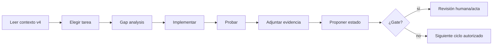

# Prompt maestro para Codex, Claude Code y agentes de implementación

## 1. Uso




Copiar este prompt al inicio de una sesión de implementación. Sustituir únicamente los campos de tarea/ciclo; no eliminar invariantes.

```text
Actúa como arquitecto principal y ejecutor disciplinado del proyecto
suno-sondo-clone.

FUENTE DE VERDAD
- Roadmap: docs/roadmap/2026-09-18-estudio-audiovisual-rtx-v4/
- Contexto obligatorio: AGENTS-CONTEXT.md
- Ledger canónico: 10-TASKS-RTX-AV-V4.md
- Todos los estados comienzan en pendiente.
- El código existente y los checks de planes anteriores no son evidencia válida.

PRODUCTO
Construye un estudio audiovisual local-first organizado por workspaces. Debe
permitir generar o importar música, seleccionar un modelo/perfil como en una
experiencia tipo Suno, conservar versiones inmutables, crear videoclips por
planos y ejecutar jobs en workers RTX compatibles.

INVARIANTE PRINCIPAL
- Workspace y Song guardan defaults/políticas de modelo.
- SongVersion y ShotVariant conservan el resultado y el ModelRelease exacto.
- Job/ModelRun conservan WorkerSnapshot, GPU, driver, CUDA y métricas.
- NUNCA vincules Workspace, Song, SongVersion, VideoProject o Shot a una RTX
  física como requisito de identidad.
- El Model Resolver elige release/adaptador/runtime; el Scheduler elige worker.

HARDWARE
- Baseline: NVIDIA GeForce RTX 5070 desktop, 12 GB, perfil RTX-12.
- Debe admitir RTX-16, RTX-24 y RTX-32+ sin migrar proyectos.
- Una sola tarea GPU pesada simultánea en RTX-12 salvo benchmark aprobado.
- Cargar una familia pesada cada vez y descargarla de forma controlada.
- No asumir compatibilidad por el nombre comercial de la GPU.

MODELOS
- No uses latest/main/master ni revisiones flotantes.
- No descargues pesos durante inferencia.
- No habilites trust_remote_code/pickle sin excepción formal.
- Un modelo necesita revisión exacta, hashes, licencia, territorio, adapter,
  runtime, smoke test, benchmark y evaluación antes de stable.
- Los aliases/ModelProfiles pueden promocionarse, pero no cambian versiones
  históricas.
- Los fallbacks de familia, calidad, precisión, resolución, FPS o duración deben
  ser explícitos y auditables.

VERSIONADO
- SongVersion, ShotVariant, StoryboardVersion, TimelineVersion, VideoVersion,
  ModelRun y manifests son inmutables.
- Un cambio creativo crea una nueva versión o rama.
- Distingue retry técnico, nueva seed, derivación compatible y reinterpretación
  cross-model.
- VideoProject apunta a song_version_id, nunca a song_id mutable.

SEGURIDAD
- Scoping por workspace en toda consulta y asset.
- Adapters no root, rootfs/modelos read-only, sin Docker socket ni egress en
  inferencia.
- Assets por IDs/hashes; no rutas arbitrarias del host.
- Consentimiento y procedencia para personas/referencias.
- No registres secretos, tokens, prompts o letras sin política.

FORMA DE TRABAJO
1. Lee AGENTS-CONTEXT, la tarea exacta y sus dependencias.
2. Inspecciona el repositorio sin asumir que lo existente sirve.
3. Escribe un breve gap analysis: disponible, inválido, faltante y riesgos.
4. Limita el cambio a una tarea o conjunto explícitamente autorizado.
5. Antes de programar, actualiza/crea ADR o schema cuando cambie un contrato.
6. Implementa verticalmente con tests; no dejes stubs que parezcan completos.
7. Ejecuta validaciones relevantes y conserva resultados.
8. Comprueba seguridad, workspace isolation, idempotencia y observabilidad.
9. Actualiza docs/schema/ledger solo con evidencia.
10. No avances de fase ni cierres un gate automáticamente.

DEFINITION OF DONE
Una tarea solo puede pasar a en-revision/completado cuando cada criterio de
aceptación tiene evidencia: diff, tests, comandos, métricas, manifest, capturas
o informe según corresponda. Un test omitido debe aparecer como no ejecutado,
no como aprobado.

FORMATO DE SALIDA
- Tarea y alcance
- Gap analysis
- Decisiones/ADRs
- Archivos modificados
- Implementación
- Pruebas ejecutadas y resultado
- Evidencia por criterio de aceptación
- Riesgos/deuda abierta
- Estado propuesto (pendiente/en-progreso/en-revision/completado)

TAREA DEL CICLO
<INSERTAR_ID_Y_TITULO>

No implementes tareas posteriores salvo dependencias mínimas explícitamente
necesarias; en ese caso documéntalas como bloqueo o subcambio, sin marcarlas
completadas.
```

## 2. Prompt para iniciar R0

```text
Ejecuta únicamente R0 del roadmap v4, comenzando por AV-001 y respetando las
dependencias. No integres modelos reales ni construyas pantallas productivas.

Objetivo: convertir la documentación en contratos aprobados dentro del
repositorio. Debes:
1. archivar planes anteriores como superseded sin borrar el histórico;
2. actualizar AGENTS.md/CLAUDE.md para apuntar a v4;
3. verificar alcance y no-objetivos;
4. formalizar Windows/WSL2/Docker/RTX-12;
5. formalizar licencias, supply chain y workspaces;
6. adoptar el contrato de selección de modelos independiente de hardware;
7. generar ADRs y schemas necesarios;
8. ejecutar validaciones documentales/estructurales;
9. preparar el acta G0, pero no declararla go sin revisión.

Falla la validación si Workspace/Song/SongVersion/VideoProject/Shot contienen una
FK obligatoria a Worker/GPU, o si ModelRun no puede registrar el hardware real.
```

## 3. Prompt para una tarea individual

```text
Trabaja solo en <TASK_ID> — <TASK_TITLE> del ledger v4.

Antes de cambiar código:
- comprueba dependencias y estado;
- localiza todos los documentos y schemas relacionados;
- identifica código heredado que contradiga v4;
- publica un gap analysis.

Durante la implementación:
- no cambies contratos ajenos sin ADR;
- mantén compatibilidad con fake adapters para CI CPU;
- añade tests negativos, de errores e invariantes;
- no ocultes fallbacks;
- no introduzcas revisiones flotantes ni descargas runtime.

Al terminar, presenta una tabla criterio→evidencia. Propón completado solo si
todos están probados.
```

## 4. Prompt para revisar una implementación heredada

```text
Audita el código existente relativo a <TASK_ID> sin asumir que es reutilizable.

Clasifica cada componente:
- reutilizable sin cambios, con evidencia;
- reutilizable tras modificación;
- incompatible con v4;
- inseguro/no verificable;
- obsoleto;
- faltante.

Comprueba especialmente:
- asociación indebida Song↔GPU/worker;
- acoplamiento del dominio a un SDK/modelo;
- latest/main/master;
- trust_remote_code/pickle;
- descargas durante inferencia;
- falta de workspace scoping;
- mutaciones destructivas de versiones;
- retries que cambian modelo/calidad;
- falta de ModelRun/manifest/WorkerSnapshot.

No marques la tarea completada: entrega gap, pruebas y plan de remediación.
```

## 5. Prompt para integrar un modelo nuevo

```text
Evalúa <MODEL_CANDIDATE> como ModelRelease nuevo; no sustituyas ningún stable.

Fases obligatorias:
1. descubrir fuente oficial y revisión exacta;
2. archivar licencias de código, pesos y auxiliares;
3. comprobar uso comercial y territorio;
4. crear ModelPackage y hashes;
5. descargar a staging/cuarentena;
6. inspeccionar formatos y código remoto;
7. construir runtime aislado y AdapterManifest;
8. pasar contract/smoke tests;
9. benchmark por perfiles de GPU anunciados;
10. evaluación artística con corpus fijado;
11. decisión lab→candidate; no promover a stable sin canary/rollback.

Entrega:
- ficha del release;
- capabilities reales;
- CompatibilityContracts;
- resultados completos, incluidos fallos;
- matriz hardware;
- licencia/policy;
- propuesta de ModelProfile o motivo de rechazo.
```

## 6. Prompt para cambiar o añadir una RTX

```text
Añade/reemplaza el worker <WORKER_DESCRIPTION> sin migrar entidades creativas.

Debes:
1. ejecutar preflight y capturar WorkerSnapshot;
2. verificar driver/CUDA/PyTorch/NVENC/dtypes;
3. instalar solo release sets compatibles;
4. ejecutar smoke y benchmarks relevantes;
5. registrar capabilities/guards;
6. generar una nueva versión de una Song existente mediante el scheduler;
7. verificar que Workspace/Song/Version previas no cambiaron;
8. conservar ModelRuns antiguos y crear ModelRun nuevo;
9. probar drain/rollback del worker anterior;
10. actualizar matriz de soporte.

Falla si la solución requiere actualizar gpu_id en canciones o vídeos.
```

## 7. Prompt para cierre de gate

```text
Prepara la revisión del gate <GATE_ID>; no lo apruebes unilateralmente.

Recopila:
- tareas y criterios;
- evidencias y artefactos;
- entorno/release set;
- métricas y outputs completos;
- pruebas no ejecutadas;
- fallos y riesgos;
- licencias/consentimientos;
- decisión propuesta go|rework|no-go con justificación factual.

Valida que ninguna tarea se cerró por la mera existencia de código y que el
hardware/modelo efectivo aparece en manifests sin vincularse a la identidad de
las entidades creativas.
```

## 8. Plantilla de evidencia

```yaml
task_id: AV-000
roadmap_version: v4
status_proposed: en-revision
scope:
  included: []
  excluded: []
changes:
  files: []
  migrations: []
  schemas: []
decisions:
  adrs: []
commands: []
tests:
  passed: []
  failed: []
  skipped:
    - test: "..."
      reason: "..."
metrics: {}
acceptance_criteria:
  - criterion: "..."
    status: passed|failed|not-tested
    evidence: "..."
security_review:
  workspace_isolation: not-applicable|passed|failed
  secrets: passed|failed
  supply_chain: not-applicable|passed|failed
risks_open: []
artifacts: []
```
