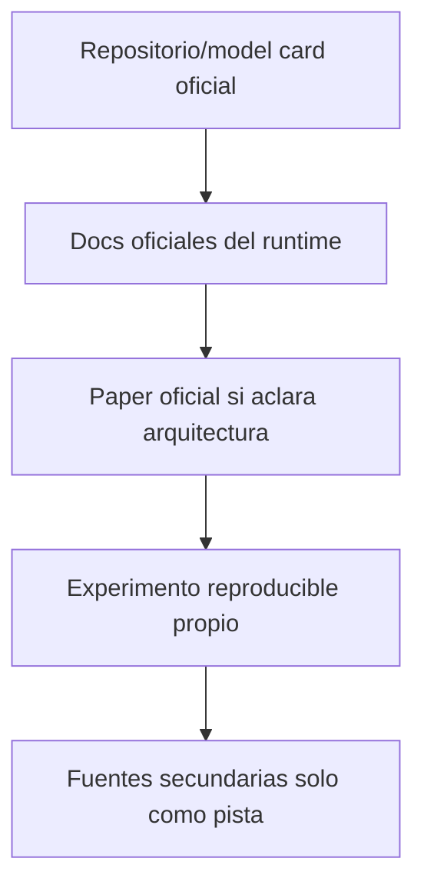
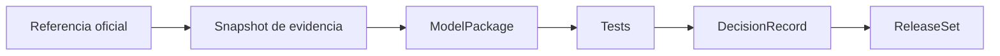

# Referencias oficiales y política de reverificación

Fecha de consulta documental: **2026-09-18**

> Las páginas, modelos, pesos, licencias y requisitos cambian. Antes de instalar o promover un release hay que fijar revisión/commit, copiar la licencia aplicable, calcular hashes, archivar la model card y registrar `verified_at`.

## 1. Jerarquía de fuentes

Para decisiones productivas se priorizan fuentes primarias y mediciones propias. Una demo, post de terceros o leaderboard no sustituye benchmark ni licencia.

## 2. Hardware y runtime

### NVIDIA RTX 5070 / Blackwell

- NVIDIA GeForce RTX 5070 family:  
  https://www.nvidia.com/en-us/geforce/graphics-cards/50-series/rtx-5070-family/
- NVIDIA CUDA GPUs / compute capability:  
  https://developer.nvidia.com/cuda-gpus

Aspectos a reverificar:

- variante desktop frente a laptop;
- VRAM exacta;
- compute capability;
- Tensor Cores/NVENC;
- driver soportado.

### CUDA sobre WSL

- CUDA on WSL User Guide:  
  https://docs.nvidia.com/cuda/wsl-user-guide/

### Contenedores NVIDIA

- NVIDIA Container Toolkit documentation:  
  https://docs.nvidia.com/datacenter/cloud-native/container-toolkit/latest/

### PyTorch CUDA

- CUDA semantics:  
  https://docs.pytorch.org/docs/stable/notes/cuda.html
- BF16 availability API:  
  https://docs.pytorch.org/docs/stable/generated/torch.cuda.is_bf16_supported.html

## 3. Música

### ACE-Step 1.5

- Repositorio oficial:  
  https://github.com/ace-step/ACE-Step-1.5
- Instalación/perfiles:  
  https://github.com/ace-step/ACE-Step-1.5/blob/main/docs/en/INSTALL.md
- Compatibilidad GPU:  
  https://github.com/ace-step/ACE-Step-1.5/blob/main/docs/en/GPU_COMPATIBILITY.md

Verificar por release:

- nombres/tamaños de modelos y LM;
- requisitos de VRAM;
- capabilities efectivas;
- API/CLI;
- licencia de código/pesos/auxiliares;
- cuantización/offload;
- cambios incompatibles.

### HeartMuLa / heartlib

- Repositorio oficial:  
  https://github.com/HeartMuLa/heartlib
- Organización/modelos oficiales:  
  https://huggingface.co/HeartMuLa

### DiffRhythm / DiffRhythm2

- Repositorio oficial DiffRhythm:  
  https://github.com/ASLP-lab/DiffRhythm
- Model card DiffRhythm2:  
  https://huggingface.co/ASLP-lab/DiffRhythm2

### YuE / YuE2

- Proyecto oficial YuE:  
  https://github.com/multimodal-art-projection/YuE
- Model card YuE2-3B:  
  https://huggingface.co/m-a-p/YuE2-3B

La licencia del código y la de los pesos deben revisarse por separado; no asumir autorización comercial.

### SongGeneration / LeVo

- Repositorio oficial:  
  https://github.com/tencent-ailab/SongGeneration

## 4. Imagen/keyframes

### FLUX.2

- Repositorio oficial:  
  https://github.com/black-forest-labs/flux2
- Organización oficial:  
  https://huggingface.co/black-forest-labs

Cada variante puede tener tamaño/licencia/requisitos diferentes. No aplicar automáticamente lo declarado para Klein 4B a variantes 9B/dev/pro.

## 5. Vídeo

### LTX-Video

- Repositorio oficial:  
  https://github.com/Lightricks/LTX-Video
- Organización/modelos oficiales:  
  https://huggingface.co/Lightricks

### LTX-2 / LTX-2.5

- Repositorio oficial LTX-2:  
  https://github.com/Lightricks/LTX-2
- Model card LTX-2.5:  
  https://huggingface.co/Lightricks/LTX-2.5
- Desktop oficial/requisitos locales:  
  https://github.com/Lightricks/LTX-Desktop

Reverificar licencia comunitaria, componentes, tamaño de descarga, VRAM, cuantizaciones y uso comercial.

### Wan2.2

- Repositorio oficial:  
  https://github.com/Wan-Video/Wan2.2
- Organización oficial:  
  https://huggingface.co/Wan-AI
- TI2V-5B:  
  https://huggingface.co/Wan-AI/Wan2.2-TI2V-5B
- S2V-14B:  
  https://huggingface.co/Wan-AI/Wan2.2-S2V-14B

### HunyuanVideo

- Repositorio/licencia oficial de HunyuanVideo 1.5:  
  https://github.com/Tencent-Hunyuan/HunyuanVideo-1.5

Revisar restricciones territoriales antes de cualquier descarga/uso.

## 6. Lip-sync

### MuseTalk

- Repositorio oficial:  
  https://github.com/TMElyralab/MuseTalk

Revisar por separado código, pesos y dependencias/modelos auxiliares.

### LatentSync

- Repositorio oficial:  
  https://github.com/bytedance/LatentSync

Reverificar requisitos de cada versión/checkpoint y licencia.

## 7. Audio, vídeo y estándares

- FFmpeg: https://ffmpeg.org/documentation.html
- ffprobe: https://ffmpeg.org/ffprobe.html
- NVIDIA Video Codec SDK: https://developer.nvidia.com/video-codec-sdk
- C2PA specifications: https://spec.c2pa.org/
- SPDX license list: https://spdx.org/licenses/
- CycloneDX: https://cyclonedx.org/

## 8. Producto de referencia funcional

Sondo se usa como referencia de experiencia “audio/canción a videoclip”, no como fuente de arquitectura ni como objetivo de copia exacta:

- https://www.sondo.ai/

Suno se usa como referencia conceptual para un selector de modelo/perfil por canción. La implementación debe definir su propio dominio, interfaz y contratos.

## 9. Checklist de reverificación

Antes de registrar/promover un `ModelRelease`:

1. abrir la fuente oficial;
2. fijar commit/revisión y lista de archivos;
3. comprobar que el uploader/organización es oficial;
4. archivar model card y licencias;
5. separar código, pesos, dataset y auxiliares;
6. revisar territorio/uso comercial/atribución;
7. comprobar requisitos y formatos;
8. calcular SHA-256/tamaño;
9. revisar código remoto/scripts;
10. construir runtime fijado;
11. ejecutar smoke/benchmark/evaluación;
12. registrar fecha, responsable y evidencia.

