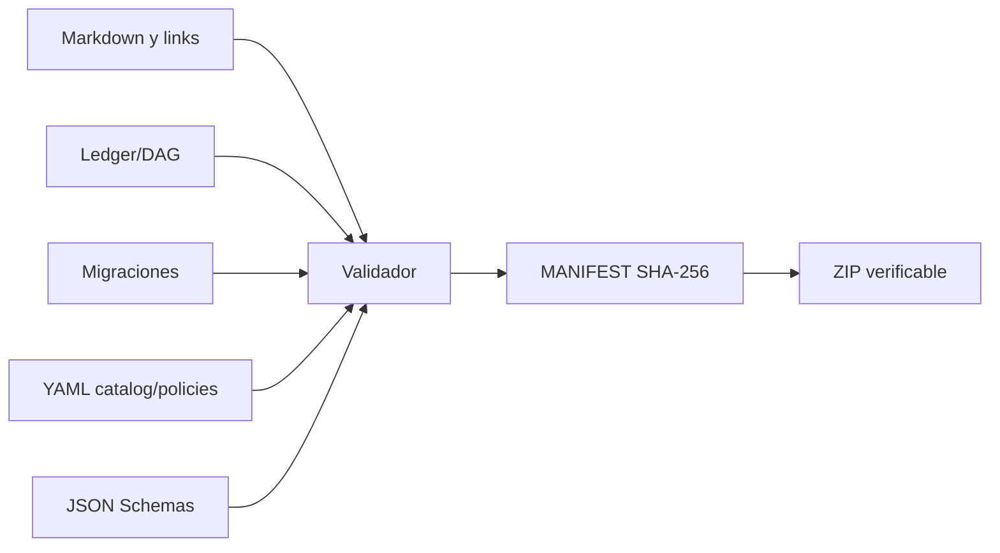

# Validación del paquete v4

Fecha: **2026-09-18**  
Ámbito: consistencia documental, schemas, dependencias y empaquetado.  
No sustituye pruebas del repositorio, modelos ni hardware real.

## 1. Resultado

```text
VALIDACIÓN DOCUMENTAL/ESTRUCTURAL: APROBADA
```

Resumen del último run antes de generar el manifiesto/ZIP:

| Comprobación | Resultado |
|---|---:|
| Markdown | 22 ficheros |
| Documentos con Mermaid | 22 |
| Diagramas Mermaid | 103 |
| Tareas canónicas | 94 |
| Estados iniciales | 94 `pendiente` |
| Criterios marcados | 0 |
| Dependencias | 288 |
| Dependencias rotas | 0 |
| Ciclos del DAG | 0 |
| Horas base | 1.212 h |
| Tareas v3 trazadas | 88/88 |
| Tareas v2 trazadas | 49/49 |
| Tareas legacy trazadas | 86/86 |
| YAML | 5 válidos |
| JSON Schema | 4 válidos antes de `MANIFEST.json` |
| Familias del catálogo | 12 |
| Releases candidatos | 16 |
| ModelProfiles | 7 |
| Enlaces relativos rotos | 0 |



## 2. Validaciones del ledger

El script comprueba:

1. IDs `AV-*` únicos.
2. 94 tareas exactas.
3. estado `pendiente` en todas.
4. ausencia de `[x]`/`[X]` en criterios.
5. estimación, dependencias, criterios y evidencia en cada tarea.
6. todos los destinos de dependencias existentes.
7. grafo dirigido acíclico mediante orden topológico.
8. conteos y horas por fase.
9. total 1.212 h y MVP R0–R5 de 882 h.

Distribución:

| Fase | Tareas | Horas |
|---|---:|---:|
| R0 | 8 | 52 h |
| R1 | 14 | 166 h |
| R2 | 14 | 166 h |
| R3 | 10 | 122 h |
| R4 | 13 | 194 h |
| R5 | 13 | 182 h |
| R6 | 10 | 152 h |
| R7 | 12 | 178 h |

## 3. Validaciones de migración

- Cada una de las 88 tareas v3 aparece en `13-MIGRACION-V3-A-V4.md`.
- Las 49 tareas RTX v2 aparecen en `14-MIGRACION-V2-A-V4.md`.
- `T-01` a `T-86` aparecen exactamente una vez en el crosswalk legacy.
- Las seis tareas nuevas v4 están documentadas.
- Ningún documento de migración hereda estados.

## 4. Validaciones de Markdown y Mermaid

Por documento:

- fences Markdown balanceados;
- enlaces relativos existentes;
- bloques Mermaid no vacíos;
- directiva inicial conocida (`flowchart`, `sequenceDiagram`, `classDiagram`, `stateDiagram-v2`, `mindmap`, C4, etc.);
- presencia de diagramas en los 22 Markdown.

### Límite importante

La validación Mermaid incluida es **estática**, no un render con `mermaid-cli`. Comprueba fences y directivas, pero el renderer exacto de GitHub/IDE puede tener diferencias de versión. Durante integración debe ejecutarse un render/lint Mermaid fijado en CI y corregir cualquier incompatibilidad del renderer elegido.

## 5. Validaciones YAML/JSON

YAML parseados:

- `model-catalog.example.yaml`
- `gpu-profiles.example.yaml`
- `release-set.example.yaml`
- `model-selection-policy.example.yaml`
- `model-selection.example.yaml`

JSON Schemas verificados contra Draft 2020-12:

- `model-package.schema.json`
- `adapter-manifest.schema.json`
- `model-profile.schema.json`
- `model-selection.schema.json`

Cruces realizados:

- cada `ModelRelease.family_id` existe;
- los releases preferidos por perfiles existen;
- las familias permitidas existen;
- cada binding del release set corresponde a un ModelProfile;
- cada release del release set existe en catálogo;
- los siete perfiles del catálogo validan contra `model-profile.schema.json`;
- `model-selection.example.yaml` valida contra su schema;
- el perfil solicitado del ejemplo existe.

## 6. Invariante modelo–hardware

La validación revisa la presencia de la regla en los documentos canónicos y los schemas prohíben campos de hardware en `ModelProfile`/`ModelSelection`.


Pruebas que deberán añadirse en el repositorio:

- inspección de migraciones/ORM para impedir FK `Song → Worker/GPU`;
- resolver sin `worker_id`;
- scheduler sin mutar selección/resolución;
- sustitución de GPU sin updates masivos de entidades creativas;
- manifests históricos con snapshots distintos.

## 7. Manifiesto de integridad

`MANIFEST.json` se genera al final con:

```yaml
algorithm: sha256
scope: todos los ficheros del paquete salvo MANIFEST.json
fields:
  - path
  - bytes
  - sha256
```

El ZIP se genera después del manifiesto y se valida abriéndolo y ejecutando `testzip()`.

## 8. Lo que no está validado todavía

Solo puede validarse al implementar R0–R7 en el repositorio/hardware:

- preflight real de la RTX 5070;
- compatibilidad de driver, WSL2, Docker, CUDA y PyTorch;
- VRAM y estabilidad de cada modelo;
- calidad musical/visual;
- licencias en la revisión exacta seleccionada;
- downloads/hashes reales de pesos;
- aislamiento real de contenedores/red;
- NVENC;
- tiempos, temperatura, OOM y recovery;
- segundo worker;
- instalación, backup, restore y rollback.

Por ello los estados del ledger permanecen `pendiente`, aunque este paquete documental sea coherente.

## 9. Reproducción orientativa

El paquete final incluye resultados, no el script temporal usado para construirlo. En el repositorio se recomienda crear una utilidad equivalente que:

```text
parse markdown
→ validate links/fences/Mermaid
→ parse ledger and DAG
→ validate migrations
→ parse YAML/JSON Schemas
→ validate catalog cross-references
→ build SHA-256 manifest
→ build and test ZIP/release artifact
```

Esta utilidad debe ejecutarse en CI cuando cambie `docs/roadmap/...`.
