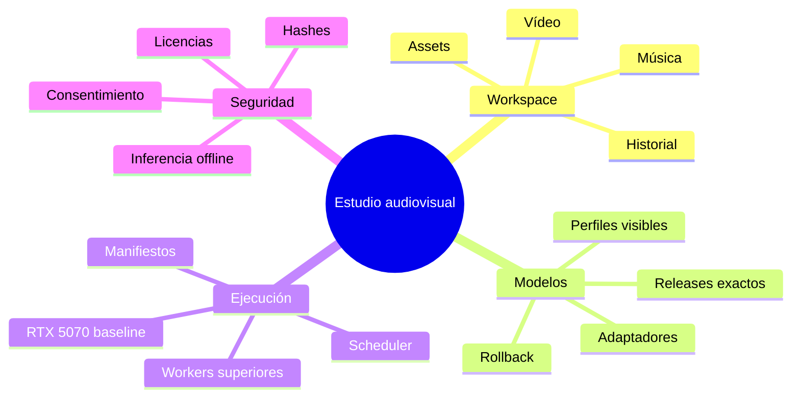
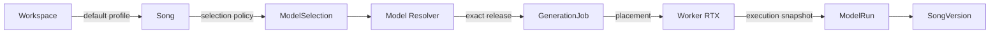
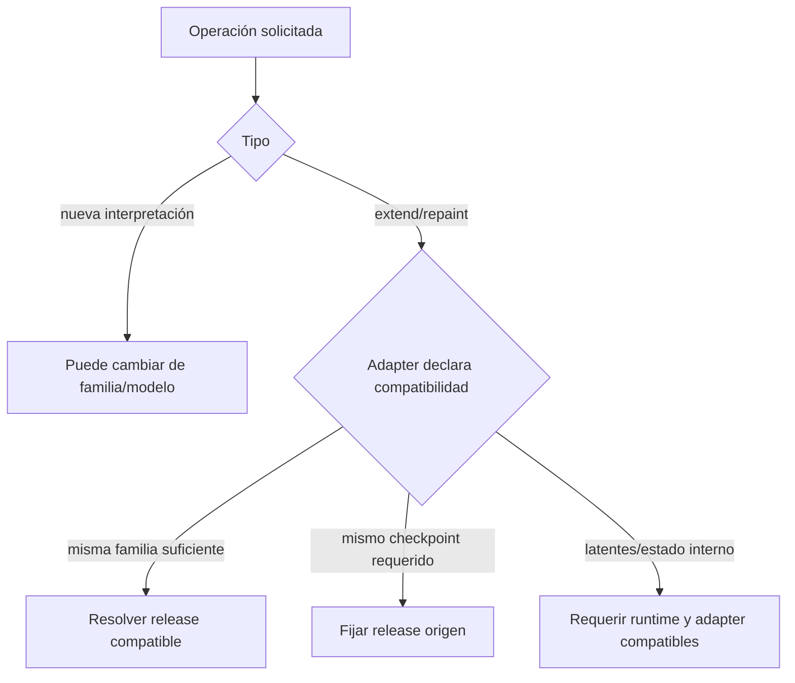
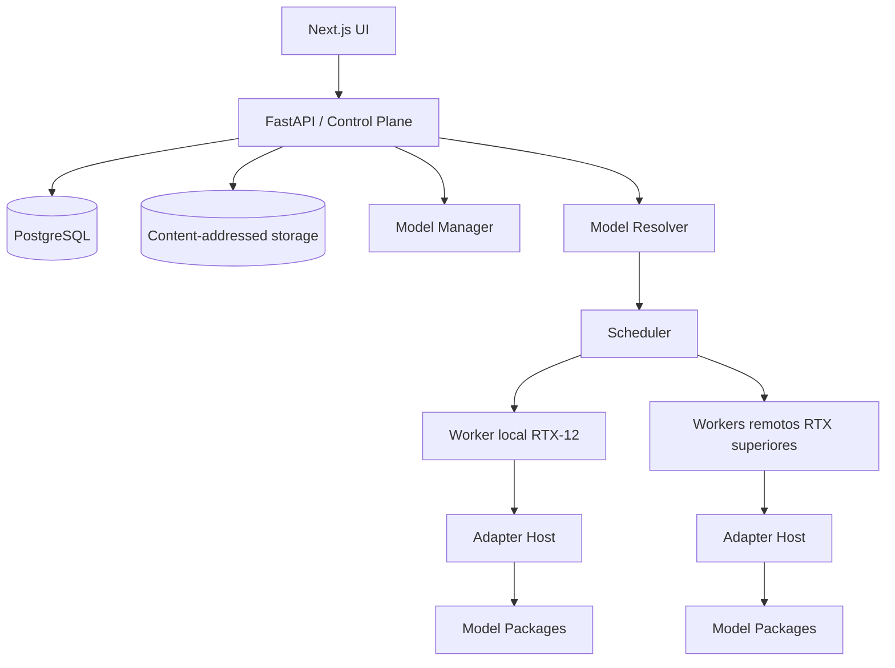
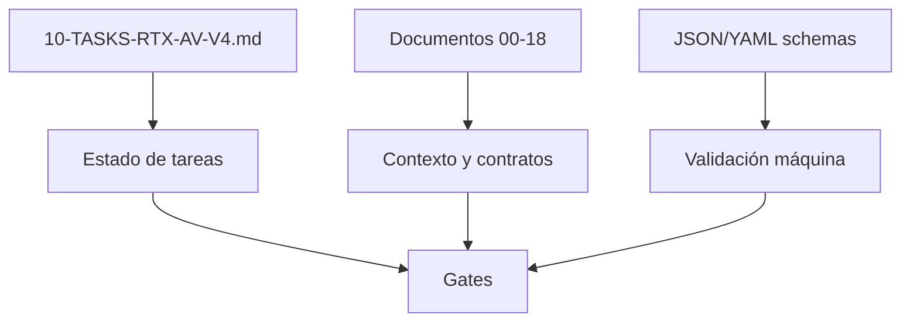

# Contexto operativo obligatorio para agentes

Este documento es la entrada mínima para Codex, Claude Code u otros agentes que trabajen en `suno-sondo-clone`. No sustituye el ledger; establece el modelo mental que debe aplicarse antes de leer una tarea.

## Misión

Construir un **estudio audiovisual local-first por workspaces** que permita:

1. generar o importar una canción;
2. conservar versiones inmutables;
3. seleccionar el modelo musical de forma similar a Suno;
4. crear un videoclip desde una `SongVersion`/WAV;
5. regenerar planos individualmente;
6. exportar vídeo y audio con trazabilidad;
7. evolucionar modelos y GPUs sin migrar proyectos.



## Invariante principal

> **Song y Workspace no se asocian a una RTX.**

La relación correcta es:



### Qué decide cada capa

| Capa | Decide |
|---|---|
| Usuario/UI | modelo visible o perfil: Auto, ACE-Step, HeartMuLa, etc. |
| Workspace | valores predeterminados para nuevas entidades |
| Song | política preferida para futuras versiones |
| Model Resolver | release exacto compatible con capability, política y licencia |
| Scheduler | worker compatible por VRAM, runtime, disponibilidad y benchmark |
| Adapter | traducción del contrato normalizado al upstream |
| ModelRun | registro de lo que realmente ocurrió |

## Políticas de selección permitidas

```text
inherit          hereda el perfil del workspace
Auto             elige el mejor perfil stable compatible
pinned_profile   fija una experiencia visible, no un checkpoint exacto
pinned_release   fija un release exacto para reproducibilidad estricta
```

`pinned_release` es una función avanzada. Para usuarios normales, `pinned_profile` es la opción equivalente a elegir una versión de modelo en Suno.

## Entidades inmutables

- `SongVersion`
- `ShotVariant`
- `StoryboardVersion`
- `TimelineVersion`
- `VideoVersion`
- `ModelRun`
- `RenderManifest`

Modificar contenido crea una nueva versión. No se actualizan destructivamente outputs aprobados.

## Operaciones y compatibilidad



Un agente no debe asumir que todas las operaciones pueden cambiar de modelo. La matriz de compatibilidad pertenece al `ModelProfile`/`AdapterManifest`.

## Hardware

Baseline:

```yaml
profile: RTX-12
reference_gpu: NVIDIA GeForce RTX 5070 desktop
vram: 12 GB
concurrency:
  heavy_gpu_jobs: 1
model_residency: one_heavy_model_at_a_time
```

La GPU concreta solo aparece en `WorkerSnapshot` y `ModelRun`. La aplicación debe seguir funcionando al añadir RTX-16, RTX-24 o RTX-32+.

## Arquitectura resumida



## Prohibiciones

Un agente no puede:

- vincular `Song`, `Workspace` o `VideoProject` a `worker_id`/`gpu_id`;
- usar un nombre de GPU para decidir compatibilidad sin preflight y benchmark;
- introducir un SDK upstream en entidades de dominio;
- descargar pesos durante una generación;
- usar `latest`, `main` o revisiones flotantes en producción;
- sobrescribir una versión histórica cuando cambia un modelo;
- promover un modelo por demos o popularidad;
- ocultar un fallback de precisión, cuantización o modelo;
- marcar una tarea completada sin evidencia verificable;
- heredar estados de roadmaps anteriores.

## Evidencia mínima por tarea

```yaml
task_id: AV-...
status: en-revision
files_changed: []
decisions: []
commands_executed: []
tests:
  passed: []
  failed: []
metrics: {}
acceptance_criteria:
  - criterion: "..."
    evidence: "..."
risks_open: []
```

## Fuente de verdad



En caso de conflicto:

1. ADR aprobado y más reciente;
2. ledger canónico v4;
3. contratos máquina-legibles v4;
4. documentos v4;
5. código existente;
6. roadmaps anteriores.

## Primera acción de cualquier agente

1. Confirmar que está trabajando contra v4.
2. Identificar fase y tarea exactas.
3. Comprobar dependencias.
4. Leer criterios de aceptación.
5. Inspeccionar código sin asumir que es válido.
6. Proponer o ejecutar solo el alcance de la tarea.
7. Adjuntar evidencia y no avanzar de gate automáticamente.
