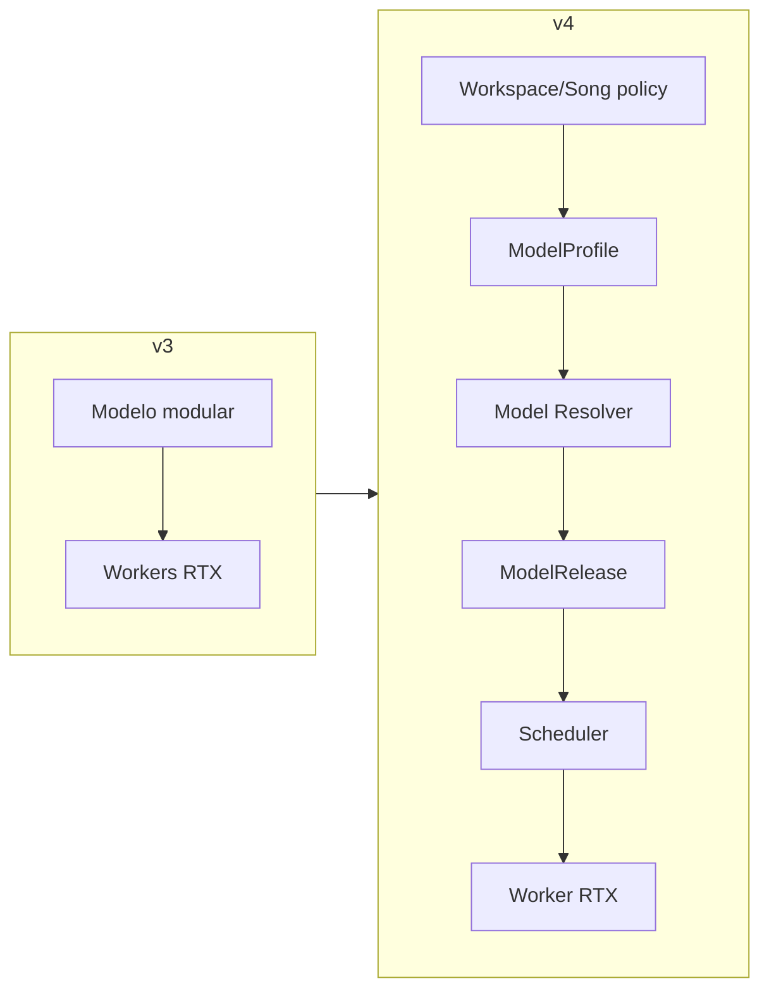

# Changelog — roadmap audiovisual RTX v3 → v4

Fecha: **2026-09-18**

## Cambio principal

La v4 elimina una ambigüedad de la v3: **una canción no pertenece a una RTX**. La experiencia de producto permite elegir un modelo/perfil; la infraestructura resuelve el release y asigna una GPU compatible.

## Añadido

- `AGENTS-CONTEXT.md` reforzado como entrada obligatoria.
- `04-SELECCION-MODELOS-CANCION-Y-HARDWARE.md` como contrato canónico.
- `ModelSelectionPolicy`: `inherit`, `auto`, `pinned_profile`, `pinned_release`.
- `ModelProfile`, `ModelResolution` y `CompatibilityContract`.
- separación formal entre Model Resolver y Scheduler.
- selector tipo Suno por Workspace/Song/generación.
- ramas cross-model y comparación de versiones.
- prueba de sustitución de GPU sin migración de proyectos.
- schemas `model-profile` y `model-selection`.
- Mermaid en arquitectura, datos, pipelines, gates, seguridad y migraciones.
- seis tareas: AV-008, AV-022, AV-023, AV-042, AV-043 y AV-119.

## Modificado

- 88 → 94 tareas.
- 1.142 h → 1.212 h base.
- MVP R0–R5: 822 h → 882 h.
- Catálogo actualizado a estructura Family/Release/Profile/Runtime/Adapter.
- API de modelos con preview explicable de resolución.
- manifests separados en solicitud, resolución y ejecución.
- tests estructurales que prohíben FK creativa a GPU/worker.
- multiworker basado en capabilities y WorkerSnapshots.

## Conservado

- RTX 5070 desktop 12 GB como baseline.
- workspaces, versionado inmutable y CAS.
- música + pipeline WAV a vídeo.
- generación por planos, visualizer/lyric/cinematic/performer.
- Model Manager, release sets, promoción y rollback.
- seguridad, licencias, consentimiento y procedencia.
- planes v2/legacy como trazabilidad sin heredar estado.

## Eliminado como supuesto

- que una canción quede atada a la máquina donde se creó;
- que el usuario normal deba elegir un hostname/GPU;
- que “modelo” sea un checkpoint sin perfil/versionado;
- que retry pueda cambiar de modelo o calidad silenciosamente;
- que una nueva GPU obligue a migrar workspaces.
