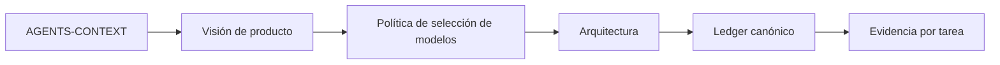
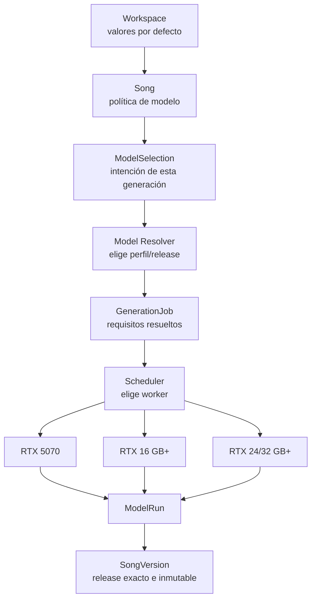
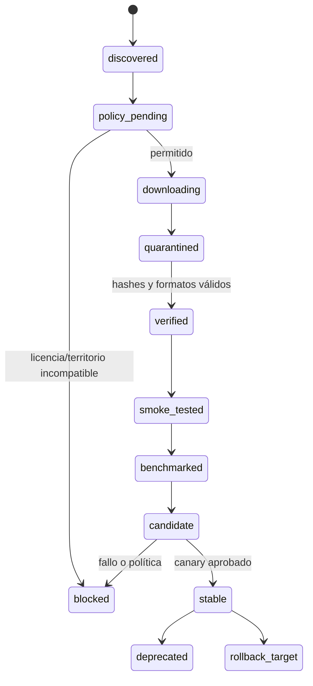
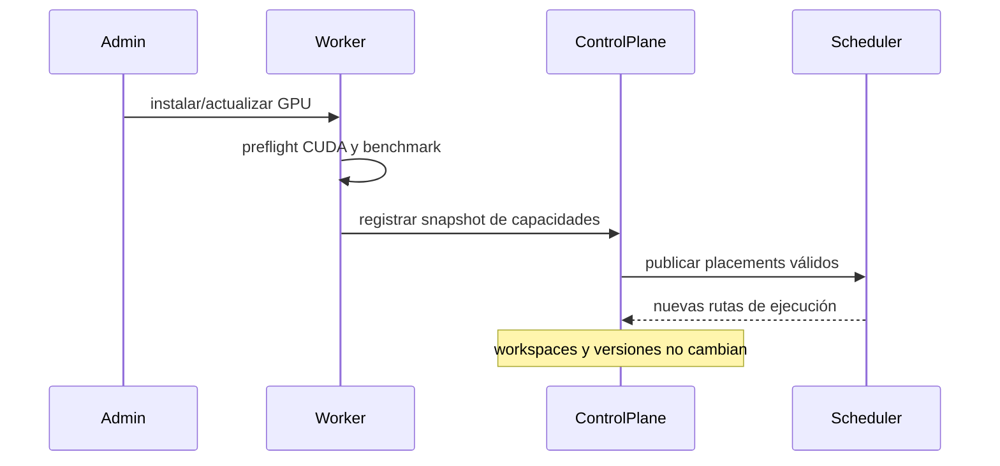

# Roadmap audiovisual RTX v4 — paquete canónico

Fecha de revisión: **2026-09-18**  
Estado inicial: **todas las tareas `pendiente`**  
Hardware de referencia inicial: **NVIDIA GeForce RTX 5070 desktop, 12 GB VRAM**  
Ledger canónico: **`10-TASKS-RTX-AV-V4.md`**

Este paquete sustituye al roadmap original, al roadmap RTX v2 y al roadmap audiovisual v3. Define una aplicación local-first organizada por **workspaces**, capaz de generar o importar música, conservar versiones inmutables, diseñar videoclips por planos, ejecutar modelos intercambiables y utilizar automáticamente cualquier worker RTX compatible.

> Regla central de v4: **una canción se asocia a una política o perfil de modelo; nunca se asocia a una GPU física**. La GPU es un recurso de ejecución elegido por el scheduler y registrado después en el manifiesto.

## Lectura obligatoria para agentes

Antes de modificar código, un agente debe leer en este orden:

1. `AGENTS-CONTEXT.md` — contexto compacto, invariantes y prohibiciones.
2. `00-AUDITORIA-Y-REDEFINICION.md` — por qué v4 reemplaza planes anteriores.
3. `01-VISION-PRODUCTO-Y-WORKSPACES.md` — producto y experiencia de usuario.
4. `04-SELECCION-MODELOS-CANCION-Y-HARDWARE.md` — semántica modelo/canción/GPU.
5. `02-ARQUITECTURA-AUDIOVISUAL-MODULAR.md` — arquitectura técnica.
6. `10-TASKS-RTX-AV-V4.md` — única fuente de estado y ejecución.



## Qué construye el proyecto

```mermaid
flowchart LR
    W[Workspace] --> S[Song]
    S --> SV[SongVersion inmutable]
    SV --> A[WAV/FLAC]
    A --> VB[Visual Brief y Visual Bible]
    VB --> ST[Storyboard]
    ST --> SH[Shots y variantes]
    SH --> TL[Timeline versionado]
    TL --> VV[VideoVersion]
    VV --> EX[Export 1080p / social]
```



El producto admite dos entradas equivalentes:

- generar una canción dentro de la aplicación;
- importar WAV/FLAC y registrarlo como una `SongVersion` externa.

Los modos de salida iniciales son:

- visualizer y lyric video;
- videoclip cinematográfico por planos;
- videoclip performer/personaje con lip-sync selectivo y consentimiento verificable.

## Separación canónica: producto, modelo y hardware



| Nivel | Puede guardar | No debe guardar |
|---|---|---|
| Workspace | perfiles predeterminados de música, imagen y vídeo | una GPU obligatoria |
| Song | `inherit`, `auto`, `pinned_profile` o `pinned_release` | `gpu_id`, hostname o VRAM |
| SongVersion | release resuelto, adaptador, runtime, parámetros y seed | un modelo mutable o flotante |
| GenerationJob | requisitos, decisión del resolver y placement | identidad artística de la canción |
| ModelRun | worker/GPU usados, métricas y configuración efectiva | preferencias futuras del usuario |

## Evolución de modelos sin migrar proyectos



Un modelo nuevo se instala como una versión paralela. Nunca sobrescribe el release anterior ni modifica `SongVersion`, `ShotVariant` o `VideoVersion` existentes.

## Evolución de hardware sin migrar workspaces



La RTX 5070 de 12 GB es el baseline de validación, no una clave foránea del dominio.

## Reglas no negociables

1. Ningún progreso anterior se hereda.
2. El código existente no se considera válido hasta superar criterios v4.
3. Las entidades de producto no dependen de una GPU física.
4. La UI selecciona modelos/perfiles; el scheduler selecciona workers.
5. No se usan `latest`, ramas flotantes ni descargas silenciosas.
6. Todo output conserva release, adaptador, runtime, seed, inputs, hashes y worker efectivos.
7. No se promociona un modelo sin licencia, integridad, smoke test y benchmark en el perfil objetivo.
8. Un cambio de modelo crea una nueva versión o rama; nunca sobrescribe una versión aprobada.
9. Las operaciones `extend`, `repaint`, continuidad latente o LoRA pueden imponer compatibilidad estricta con el release origen.
10. En RTX-12 se ejecuta una sola tarea GPU pesada simultánea salvo benchmark aprobado.

## Índice documental

| Orden | Fichero | Propósito |
|---:|---|---|
| 0 | `AGENTS-CONTEXT.md` | Resumen operativo para agentes, invariantes y lectura mínima. |
| 1 | `00-AUDITORIA-Y-REDEFINICION.md` | Cambios y decisiones que justifican v4. |
| 2 | `01-VISION-PRODUCTO-Y-WORKSPACES.md` | Producto, flujos, workspaces y versionado. |
| 3 | `02-ARQUITECTURA-AUDIOVISUAL-MODULAR.md` | Control plane, dominio, jobs, workers y almacenamiento. |
| 4 | `03-MODEL-MANAGER-Y-ADAPTADORES.md` | Paquetes, adaptadores, perfiles, releases, promoción y rollback. |
| 5 | `04-SELECCION-MODELOS-CANCION-Y-HARDWARE.md` | Contrato completo entre selección del usuario, resolución y GPU. |
| 6 | `05-PERFILES-RTX-Y-MULTIWORKER.md` | RTX-12/16/24/32+, scheduling y cambio de gráfica. |
| 7 | `06-CATALOGO-MODELOS-2026-09.md` | Candidatos actuales y su estado de evaluación. |
| 8 | `07-PIPELINE-WAV-A-VIDEO.md` | Pipeline de canción/WAV a videoclip por planos. |
| 9 | `08-MODELO-DATOS-Y-API.md` | Entidades, invariantes, API y eventos. |
| 10 | `09-ROADMAP-RTX-AUDIOVISUAL.md` | Fases, gates, ruta crítica y estimaciones. |
| 11 | `10-TASKS-RTX-AV-V4.md` | Ledger canónico de tareas, todas pendientes. |
| 12 | `11-TEST-PLAN-AUDIOVISUAL.md` | Matrices de prueba de producto, modelos, GPU y upgrades. |
| 13 | `12-SEGURIDAD-LICENCIAS-Y-PROCEDENCIA.md` | Supply chain, permisos, consentimiento y manifiestos. |
| 14 | `13-MIGRACION-V3-A-V4.md` | Qué cambia exactamente desde v3. |
| 15 | `14-MIGRACION-V2-A-V4.md` | Correspondencia de las tareas RTX v2. |
| 16 | `15-MIGRACION-LEGACY-T01-T86.md` | Trazabilidad del roadmap original. |
| 17 | `16-PROMPT-CODEX-CLAUDE.md` | Prompt maestro y plantillas de ejecución para agentes. |
| 18 | `17-REFERENCIAS-OFICIALES.md` | Fuentes primarias y política de reverificación. |
| 19 | `18-VALIDACION-DEL-PAQUETE.md` | Validaciones automáticas y límites de la validación documental. |
| 20 | `CHANGELOG-V3-A-V4.md` | Resumen ejecutivo de cambios frente a v3. |

## Artefactos máquina-legibles

- `model-catalog.example.yaml`
- `gpu-profiles.example.yaml`
- `release-set.example.yaml`
- `model-selection-policy.example.yaml`
- `model-selection.example.yaml`
- `model-package.schema.json`
- `adapter-manifest.schema.json`
- `model-profile.schema.json`
- `model-selection.schema.json`
- `MANIFEST.json`

## Instalación manual recomendada

Copiar la carpeta como:

```text
docs/roadmap/2026-09-18-estudio-audiovisual-rtx-v4/
```

Añadir a `AGENTS.md` y/o `CLAUDE.md`:

```text
Contexto obligatorio: docs/roadmap/2026-09-18-estudio-audiovisual-rtx-v4/AGENTS-CONTEXT.md
Ledger canónico: docs/roadmap/2026-09-18-estudio-audiovisual-rtx-v4/10-TASKS-RTX-AV-V4.md
```

El primer ciclo ejecuta únicamente **R0** y no empieza implementación de modelos reales hasta cerrar `G0-PRODUCTO`.
